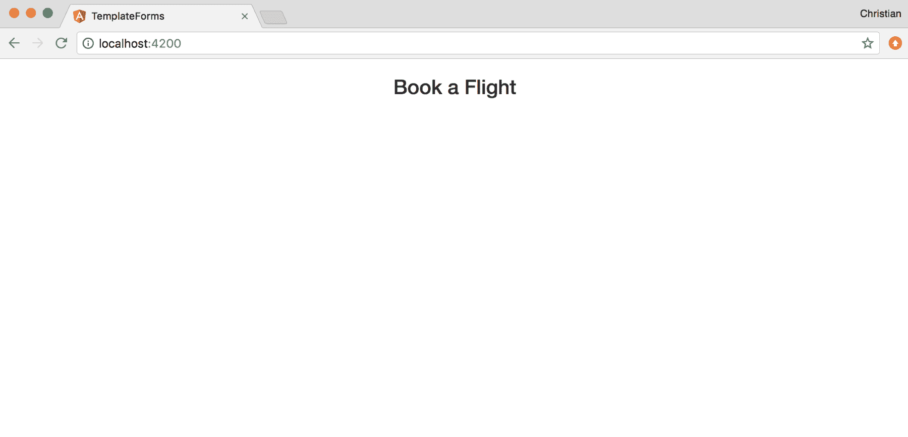
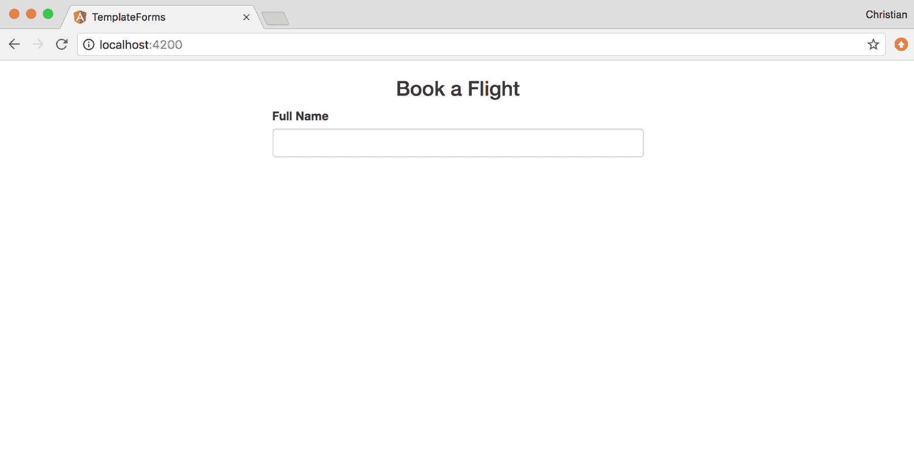
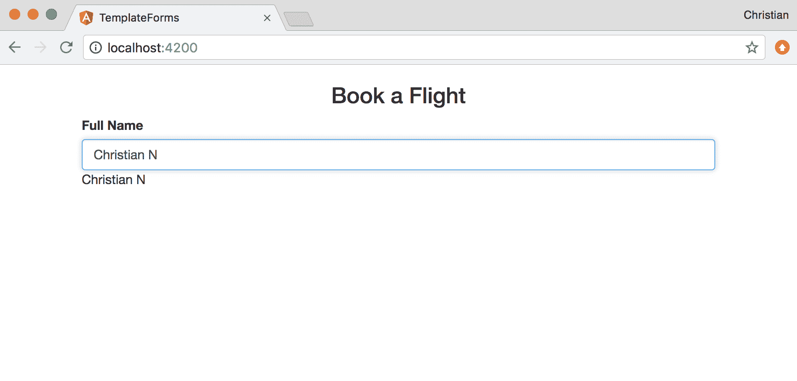
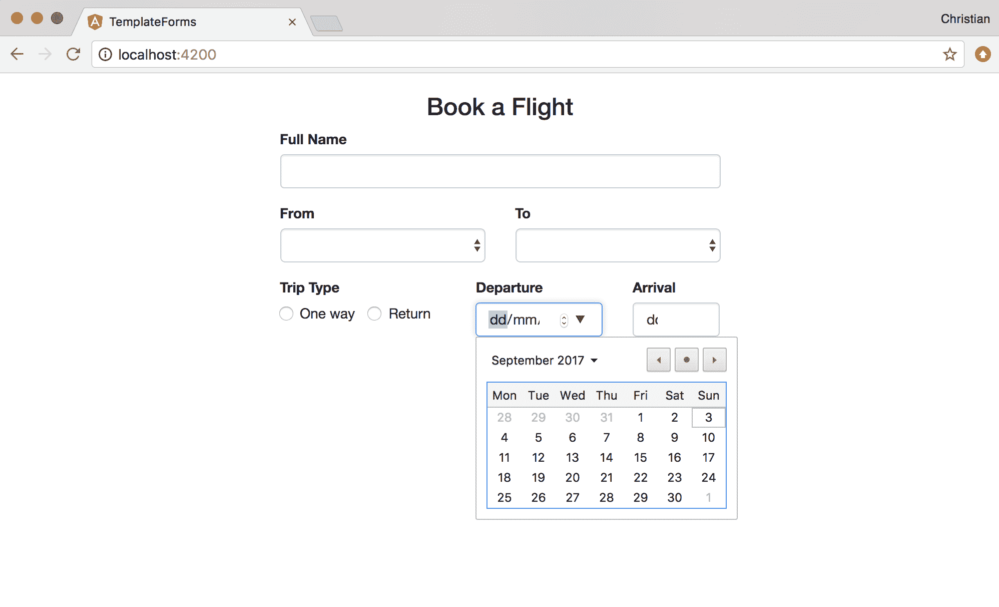
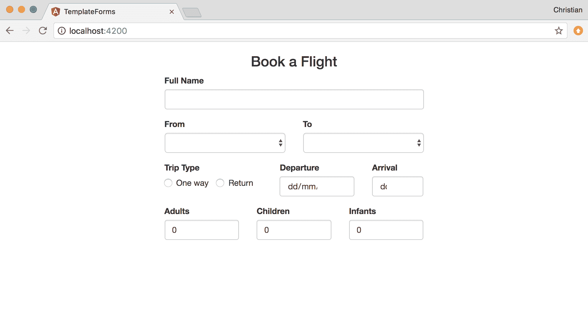
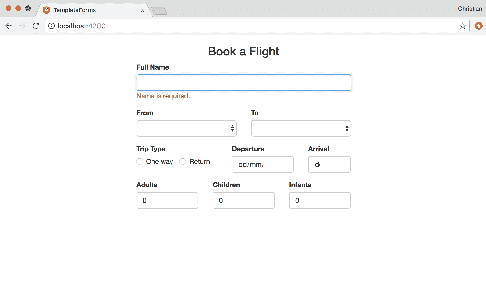
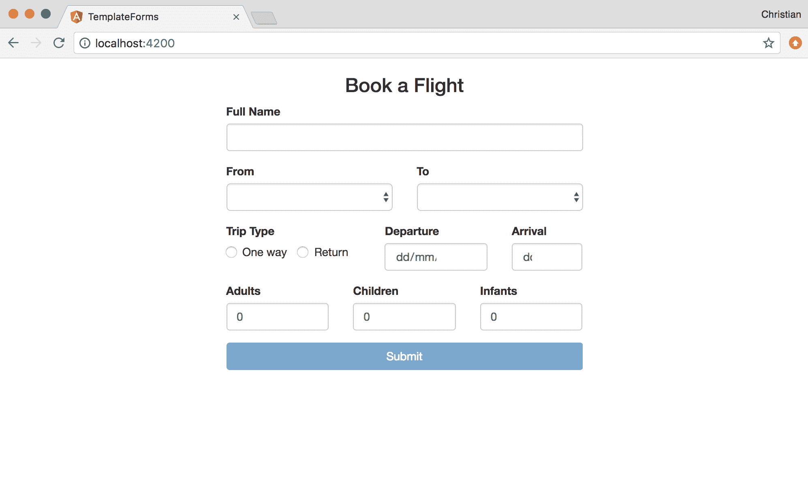
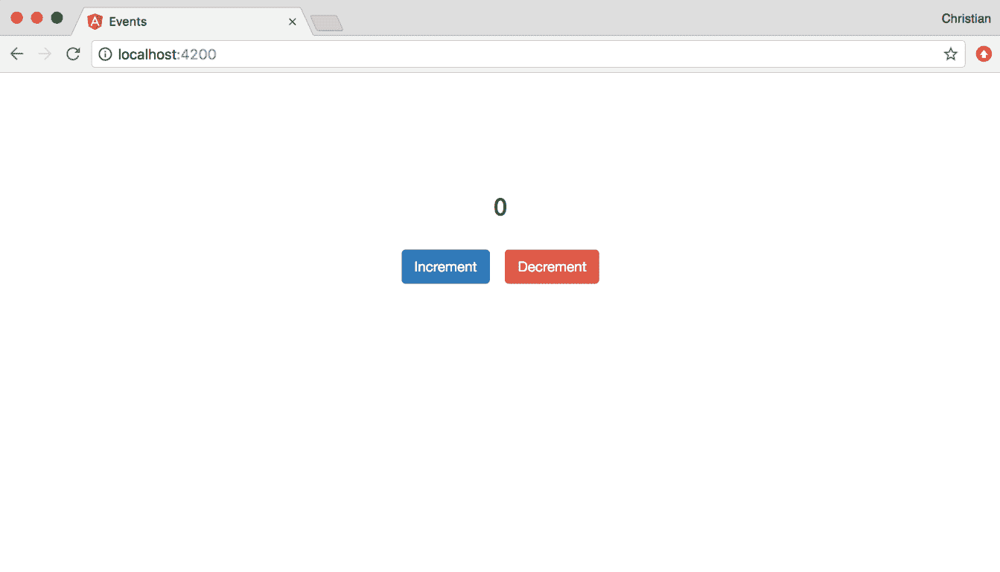

# 使用 TypeScript 更好地处理表单和事件

让我们谈谈形式。从本书一开始，我们就在示例中避免表单输入。这是因为我想把这一整章都用在形式上。我们将尽可能多地介绍构建收集用户信息的业务应用程序。以下是本章中您应该期望的内容：

*   键入表单输入和输出
*   窗体控件
*   验证
*   表格提交及处理
*   事件处理
*   控制状态

# 为表单创建类型

我们希望尽可能多地利用 TypeScript，因为它简化了我们的开发过程，并使我们的应用程序行为更加可预测。因此，我们将创建一个简单的数据类作为表单值的类型。

首先，创建一个新的角度项目，并附上示例。然后，使用以下命令创建新类：

```ts
ng g class flight
```

该类在`app`文件夹中生成；将其内容替换为以下数据类：

```ts
export class Flight {
  constructor(
    public fullName: string,
    public from: string,
    public to: string,
    public type: string,
    public adults: number,
    public departure: Date,
    public children?: number,
    public infants?: number,
    public arrival?: Date,
  ) {}
}
```

此类表示表单（尚未创建）将具有的所有值。后面带有问号（`?`的属性是可选的，这意味着当未提供相应的值时，TypeScript 不会抛出错误。

在开始创建表单之前，让我们从头开始。将`app.component.html`文件替换为以下内容：

```ts
<div class="container">
  <h3 class="text-center">Book a Flight</h3>
  <div class="col-md-offset-3 col-md-6">
    <!-- TODO: Form here -->
  </div>
</div>
```

运行应用程序并使其保持运行状态。您应该在 localhost 的端口`4200`处看到以下内容（请记住包括引导）：



# 表单模块

现在我们有了希望表单遵循的合同，现在让我们生成表单的组件：

```ts
ng  g component flight-form
```

该命令还将组件作为声明添加到我们的`App`模块：

```ts
import { BrowserModule } from '@angular/platform-browser';
import { NgModule } from '@angular/core';

import { AppComponent } from './app.component';
import { FlightFormComponent } from './flight-form/flight-form.component';

@NgModule({
  declarations: [
    AppComponent,
    // Component added after
    // being generated
    FlightFormComponent
  ],
  imports: [
    BrowserModule
  ],
  providers: [],
  bootstrap: [AppComponent]
})
export class AppModule { }
```

使棱角形状特殊且易于使用的是开箱即用的功能，如`NgForm`指令。这些功能在核心浏览器模块中不可用，但在表单模块中可用。因此，我们需要进口：

```ts
import { BrowserModule } from '@angular/platform-browser';
import { NgModule } from '@angular/core';

// Import the form module
import { FormsModule } from '@angular/forms';

import { AppComponent } from './app.component';
import { FlightFormComponent } from './flight-form/flight-form.component';

@NgModule({
  declarations: [
    AppComponent,
    FlightFormComponent
  ],
  imports: [
    BrowserModule,
    // Add the form module 
    // to imports array
    FormsModule
  ],
  providers: [],
  bootstrap: [AppComponent]
})
export class AppModule { }
```

我们只需要简单地导入`FormModule`并将其添加到`imports`数组中。

# 双向装订

现在正是开始在浏览器中使用表单组件显示某些表单控件的最佳时机。保持数据层（模型）和视图之间的状态同步可能非常困难，但对于 Angular，只需使用`FormModule`中公开的一条指令即可：

```ts
<!-- ./app/flight-form/flight-form.component.html -->
<form>
  <div class="form-group">
    <label for="fullName">Full Name</label>
    <input 
      type="text" 
      class="form-control" 
      [(ngModel)]="flightModel.fullName"
      name="fullName"
    >
  </div>
</form>
```

Angular relies on the `name` attribute internally to carry out binding. For this reason, the `name` attribute is required.

关注`[(ngModel)]="flightModel.fullName"`；它试图将组件类上的属性绑定到窗体。此模型将为`Flight`类型，这是我们之前创建的类：

```ts
// ./app/flight-form/flight-form.component.ts

import { Component, OnInit } from '@angular/core';
import { Flight } from '../flight';

@Component({
  selector: 'app-flight-form',
  templateUrl: './flight-form.component.html',
  styleUrls: ['./flight-form.component.css']
})
export class FlightFormComponent implements OnInit {
  flightModel: Flight;
  constructor() {
    this.flightModel = new Flight('', '', '', '', 0, '', 0, 0, '');
  }

  ngOnInit() {}
}
```

`flightModel`属性作为`Flight`类型添加到组件中，并使用一些默认值初始化。

将组件包括在应用程序 HTML 中，以便可以在浏览器中显示：

```ts
<div class="container">
  <h3 class="text-center">Book a Flight</h3>
  <div class="col-md-offset-3 col-md-6">
    <app-flight-form></app-flight-form>
  </div>
</div>
```

这是您在浏览器中应该具备的功能：



要查看双向绑定的作用，请使用插值显示`flightModel.fullName`的值。然后，输入一个值并查看实时更新：

```ts
<form>
  <div class="form-group">
    <label for="fullName">Full Name</label>
    <input 
      type="text" 
      class="form-control" 
      [(ngModel)]="flightModel.fullName"
      name="fullName"
    >
    {{flightModel.fullName}}
  </div>
</form>
```

下面是它的外观：



# 更多表单字段

让我们动手并添加剩余的表单字段。毕竟，我们不能只提供自己的姓名就预订航班。

`from`和`to`字段将是*选择框*，其中包含我们可以飞入和飞出的城市列表。此城市列表将存储在我们的组件类中，然后我们可以在模板中对其进行迭代，并将其呈现为选择框：

```ts
export class FlightFormComponent implements OnInit {
  flightModel: Flight;
  // Array of cities
  cities:Array<string> = [
    'Lagos',
    'Mumbai',
    'New York',
    'London',
    'Nairobi'
  ];
  constructor() {
    this.flightModel = new Flight('', '', '', '', 0, '', 0, 0, '');
  }
}
```

该数组以字符串形式存储来自世界各地的几个城市。现在，让我们使用`ngFor`指令遍历城市，并使用选择框在表单上显示它们：

```ts
<div class="row">
    <div class="col-md-6">
      <label for="from">From</label>
      <select type="text" id="from" class="form-control" [(ngModel)]="flightModel.from" name="from">
        <option *ngFor="let city of cities" value="{{city}}">{{city}}</option>
      </select>
    </div>
    <div class="col-md-6">
      <label for="to">To</label>
      <select type="text" id="to" class="form-control" [(ngModel)]="flightModel.to" name="to">
        <option *ngFor="let city of cities" value="{{city}}">{{city}}</option>
      </select>
    </div>
  </div>
```

干净整洁！您可以打开浏览器并在那里看到它：


单击“选择”下拉列表时，会显示城市列表，如预期的那样：


接下来，让我们添加 trip type 字段（单选按钮）、出发日期字段（日期控件）和到达日期字段（日期控件）：

```ts
<div class="row" style="margin-top: 15px">
    <div class="col-md-5">
      <label for="" style="display: block">Trip Type</label>
      <label class="radio-inline">
        <input type="radio" name="type" [(ngModel)]="flightModel.type" value="One Way"> One way
      </label>
      <label class="radio-inline">
        <input type="radio" name="type" [(ngModel)]="flightModel.type" value="Return"> Return
      </label>
    </div>
    <div class="col-md-4">
      <label for="departure">Departure</label>
      <input type="date" id="departure" class="form-control" [(ngModel)]="flightModel.departure" name="departure">
    </div>
    <div class="col-md-3">
      <label for="arrival">Arrival</label>
      <input type="date" id="arrival" class="form-control" [(ngModel)]="flightModel.arrival" name="arrival">
    </div>
  </div>
```

数据绑定到控件的方式与我们之前创建的文本和选择字段非常相似。主要区别在于控件的类型（单选按钮和日期）：



最后，添加乘客数量（成人、儿童和婴儿）：

```ts
<div class="row" style="margin-top: 15px">
    <div class="col-md-4">
      <label for="adults">Adults</label>
      <input type="number" id="adults" class="form-control" [(ngModel)]="flightModel.adults" name="adults">
    </div>
    <div class="col-md-4">
      <label for="children">Children</label>
      <input type="number" id="children" class="form-control" [(ngModel)]="flightModel.children" name="children">
    </div>
    <div class="col-md-4">
      <label for="infants">Infants</label>
      <input type="number" id="infants" class="form-control" [(ngModel)]="flightModel.infants" name="infants">
    </div>
  </div>
```

乘客部分都是数字类型，因为我们只希望从每个类别中挑选登机乘客的数量：



# 验证表单和表单字段

Angular 通过使用其内置的指令和状态属性大大简化了表单验证。您可以使用 state 属性检查表单字段是否已被触摸。如果它被触摸但违反了验证规则，您可以使用`ngIf`指令显示相关错误。

让我们看一个验证全名字段的示例：

```ts
<div class="form-group">
    <label for="fullName">Full Name</label>
    <input 
      type="text" 
      id="fullName" 
      class="form-control" 
      [(ngModel)]="flightModel.fullName" 
      name="fullName"

      #name="ngModel"
      required
      minlength="6">
  </div>
```

我们刚刚在表单的全名字段中添加了三个额外的重要属性：`#name`、`required`和`minlength`。`#name`属性与`name`属性完全不同，前者是一个模板变量，通过`ngModel`值保存关于给定字段的信息，而后者是常用的表单输入名称属性。

在 Angular 中，验证规则作为属性传递，这就是`required`和`minlength`存在的原因。

是的，这些字段经过验证，但是没有向用户反馈哪些地方出了问题。让我们添加一些在违反表单字段时显示的错误消息：

```ts
<div *ngIf="name.invalid && (name.dirty || name.touched)" class="text-danger">
      <div *ngIf="name.errors.required">
        Name is required.
      </div>
      <div *ngIf="name.errors.minlength">
        Name must be at least 6 characters long.
      </div>
    </div>
```

`ngIf`指令有条件地显示了这些`div`元素：

*   如果已触摸表单字段，但其中没有值，则会显示名称为必填错误
*   触摸字段时，名称必须至少 6 个字符长，但内容长度小于*6*。

以下两个屏幕截图显示了浏览器中的这些错误输出：



当输入值但值文本计数不超过 6 时，会显示不同的错误：


# 提交表格

在提交表格之前，我们需要考虑几个因素：

*   表格有效吗？
*   提交前是否有表单处理程序？

为了确保表单有效，我们可以禁用“提交”按钮：

```ts
<form #flightForm="ngForm">
  <div class="form-group" style="margin-top: 15px">
    <button class="btn btn-primary btn-block" [disabled]="!flightForm.form.valid">
      Submit
    </button>
  </div>
</form>
```

首先，我们在表单中添加一个名为`flightForm`的模板变量，然后使用该变量检查表单是否有效。如果表单无效，我们将禁止单击按钮：



要处理提交，请在表单中添加一个`ngSubmit`事件。单击按钮时将调用此事件：

```ts
<form #flightForm="ngForm" (ngSubmit)="handleSubmit()">
    ...
</form>
```

您现在可以添加一个类方法`handleSubmit`来处理表单提交。对于此示例，控制台的简单日志可能就足够了：

```ts
export class FlightFormComponent implements OnInit {
  flightModel: Flight;
  cities:Array<string> = [
    ...
  ];
  constructor() {
    this.flightModel = new Flight('', '', '', '', 0, '', 0, 0, '');
  }

  // Handle for submission
  handleSubmit() {
    console.log(this.flightModel);
  }
}
```

# 处理事件

表单并不是我们从用户那里获得价值的唯一方式。简单的 DOM 交互、鼠标单击和键盘交互可以引发可能导致用户请求的事件。当然，我们必须以这样或那样的方式处理他们的请求。在这本书中有许多我们不能谈论的事件。我们可以做的是查看基本的键盘和鼠标事件。

# 鼠标事件

要演示两个流行的鼠标事件，请单击并双击，创建一个新的角度项目，然后添加以下自动生成的`app.component.html`：

```ts
<div class="container">
  <div class="row">
    <h3 class="text-center">
      {{counter}}
    </h3>
    <div class="buttons">
      <div class="btn btn-primary">
        Increment
      </div>
      <div class="btn btn-danger">
        Decrement
      </div>
    </div>
  </div>
</div>
```

`counter`属性使用插值和递增和递减按钮绑定到视图。该属性在应用程序组件上可用，并初始化为零：

```ts
import { Component } from '@angular/core';

@Component({
  selector: 'app-root',
  templateUrl: './app.component.html',
  styleUrls: ['./app.component.css']
})
export class AppComponent {
  counter = 0;
}
```

下面是它的外观：



点击按钮完全没有任何作用。让我们向“增量”按钮添加一个单击事件，这样每次单击时计数器属性都会添加 1：

```ts
export class AppComponent {
  counter = 0;
  increment() {
    this.counter++
  }
}
```

我们需要将此事件处理程序绑定到模板中的按钮，以便在单击按钮时实际增加计数器：

```ts
<div class="btn btn-primary" (click)="increment()">
   Increment
</div>
```

事件使用属性绑定到模板，但将属性括在括号中。属性值成为将用作事件处理程序的组件类上的方法。

我们需要相同的减量功能。假设递减是要确保用户打算执行的操作，则可以附加双击事件：

```ts
<div class="btn btn-danger" (dblclick)="decrement()">
  Decrement
</div>
```

如您所见，我们没有使用`click`，而是使用`dblclick`事件，然后将递减事件处理程序绑定到它。该处理程序只是增量处理程序的逆处理程序，并检查是否已达到零：

```ts
decrement() {
  this.counter <= 0 ? (this.counter = 0) : this.counter--;
}
```

以下显示了正在运行的新事件：


# 键盘事件

您可以通过收听各种键盘事件来跟踪键盘交互。`keypress`事件告诉您一个按钮被点击；如果有一个侦听器连接到它，则会触发该侦听器。您可以使用与附加鼠标事件相同的方式附加键盘事件：

```ts
<div class="container" (keypress)="showKey($event)" tabindex="1">
  ...
  <div class="key-bg" *ngIf="keyPressed">
    <h1>{{key}}</h1>
  </div>
<div>
```

按键时显示`key-bg`类元素；它显示我们按下的确切键，该键位于`key`属性中。`keyPressed`属性是一个布尔值，我们在按下键时将其设置为`true`。

事件触发`showKey`侦听器；让我们实施它：

```ts
import { Component } from '@angular/core';

@Component({
  selector: 'app-root',
  templateUrl: './app.component.html',
  styleUrls: ['./app.component.css']
})
export class AppComponent {
  keyPressed = false;
  key = '';
  // ....
  showKey($event) {
    this.keyPressed = true;
    this.key = $event.key.toUpperCase();
    setTimeout(() => {
      this.keyPressed = false;
    }, 500)
  }
}
```

`showKey`处理程序执行以下操作：

*   它使用按下的键的值设置`key`属性
*   按下的键表示为小写字符串，因此我们使用`toUpperCase`方法将其转换为大写
*   `keyPressed`属性设置为`true`，显示按下的键，500 毫秒后设置为`false`，显示的键隐藏

当您按下一个键（并且`container`div 有焦点）时，下面的屏幕截图显示了发生的情况：

>

# 总结

现在，您已经掌握了大量有关通过表单或事件收集用户输入的知识。我们还讨论了表单的重要特性，如类型化输入、验证、双向绑定、提交等。我们看到的事件示例包括鼠标和键盘事件以及如何处理它们。所有这些有趣的经历为您构建业务应用程序做好了准备。