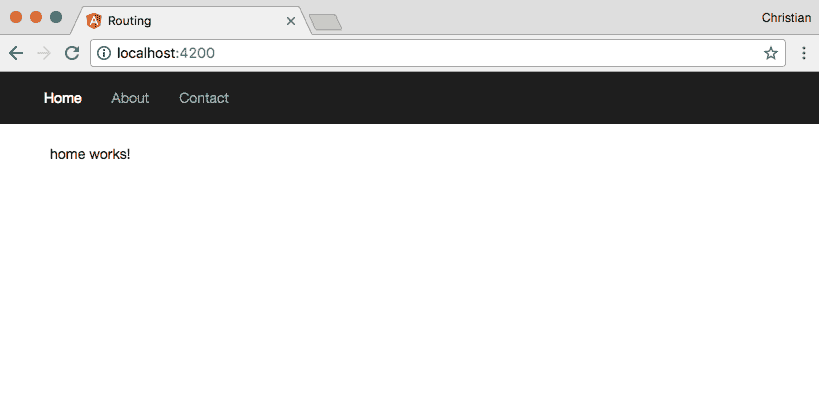
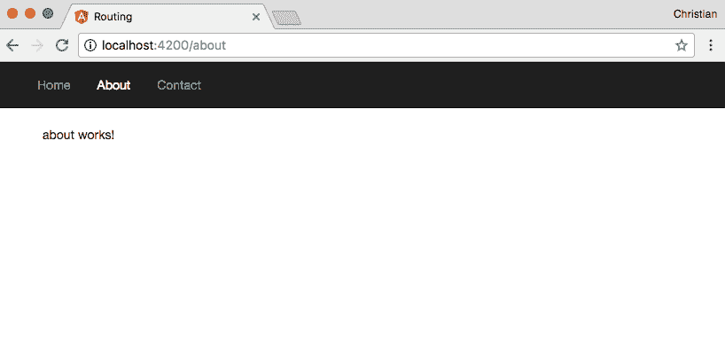

# SPA 的客户端路由

**单页应用程序**（**SPA**）是一个术语，用于指仅从一个服务器路由提供服务但具有多个客户端视图的应用程序。单服务器路由通常是默认的（`/`或`*`。一旦加载了单服务器路由，客户端（JavaScript）就会劫持页面，并开始使用浏览器的路由机制控制路由。

能够从 JavaScript 控制路由使开发人员能够构建更好的用户体验。本章描述了如何使用 TypeScript 编写的类、指令等在 Angular 中实现这一点。

就像其他章节一样，我们将用实际例子来说明这一点。

# 路由模块

与表单一样，Angular 默认情况下不会在 CLI scaffold 中生成路由。这是因为在您正在进行的项目中可能不需要它。要使路由正常工作，您需要将其导入需要使用它的模块中：

```ts
import { RouterModule }   from '@angular/router';
```

该模块公开了一个静态`forRoot`方法，该方法以路由数组的形式传递。这样做可以为模块导入`RouterModule`注册和配置这些路由。首先在`app`文件夹中创建一个`routes.ts`文件：

```ts
import { Routes } from '@angular/router';

export const routes: Routes = [
  {
    path: '',
    component: HomeComponent
  },
  {
    path: 'about',
    component: AboutComponent
  },
  {
    path: 'contact',
    component: ContactComponent
  }
];
```

`Routes`类的签名是接受一个或多个对象的数组。传入的对象应具有路径和组件属性。路径属性定义位置，而组件属性定义应安装在定义路径上的角度组件。

然后您可以在`AppModule`中使用这些阵列配置`RouterModule`。我们已经导入了`RouterModule`，现在我们导入`routes`文件，在`imports`数组中配置路由：

```ts
import { BrowserModule } from '@angular/platform-browser';
import { NgModule } from '@angular/core';
//Import RuterModule
import { RouterModule } from '@angular/router';

import { AppComponent } from './app.component';

//Imprt routes
import { routes } from './routes';

@NgModule({
  declarations: [
    AppComponent
  ],
  imports: [
    BrowserModule,
    // RouterModule used to
    // configure routes
    RouterModule.forRoot(routes)
  ],
  providers: [],
  bootstrap: [AppComponent]
})
export class AppModule { }
```

这就是在 Angular 中配置路由所需的全部内容。路由的组件尚未创建，因此，如果您尝试运行应用程序，终端中会出现错误，表明相同：


让我们使用 CLI 生成这些组件：

```ts
ng generate component home
ng generate component about
ng generate component contact
```

然后，更新路由配置以导入组件：

```ts
import { Routes } from '@angular/router';

import { ContactComponent } from './contact/contact.component';
import { AboutComponent } from './about/about.component';
import { HomeComponent } from './home/home.component';

export const routes: Routes = [
  {
    path: '',
    component: HomeComponent
  },
  {
    path: 'about',
    component: AboutComponent
  },
  {
    path: 'contact',
    component: ContactComponent
  }
];
```

再次运行该应用程序，查看是否已清除错误：


# 路由指令

我知道您很想在浏览器中看到示例，但如果您尝试在端口`4200`测试应用程序，您仍然会看到`app`组件的内容。这是因为我们没有告诉 Angular 它应该安装在哪里。

Angular 公开了两个重要的路由指令：

*   **路由出口**：定义路由配置的安装位置。这通常位于单页应用程序的入口组件中。
*   **路由链路**：用于定义角路由的导航。基本上，它向锚定标签添加了一些功能，以便更好地处理 Angular 应用程序中定义的路线。

让我们替换应用程序组件模板的内容，以利用路由指令：

```ts
<div>
  <nav class="navbar navbar-inverse">
    <div class="container-fluid">
      <div class="collapse navbar-collapse" id="bs-example-navbar-collapse-1">
        <ul class="nav navbar-nav">
          <li><a routerLink="/">Home</a></li>
          <li><a routerLink="/about">About</a></li>
          <li><a routerLink="/contact">Contact</a></li>
        </ul>
      </div>
    </div>
  </nav>
  <div class="container">
    <router-outlet></router-outlet>
  </div>
</div>
```

带有`container`类的 div 是我们访问相应路线后显示每个组件的地方。我们可以通过点击带有`routerLink`指令的锚定标签来导航每条路线。

打开浏览器并访问端口`4200`处的本地主机。默认情况下，您应该看到主页：



尝试单击导航栏中的“关于”或“联系人”链接。如果您按照所有步骤操作，您应该会看到应用程序将 home 组件替换为 About 或 Contact 组件：



请注意，地址栏如何使用我们在配置中定义的路径位置进行更新：


# 包含路由的主详细信息视图

一个非常常见的 UI 模式是有一个项目列表，而没有关于这些项目的很多信息。选择、单击或鼠标悬停时，将显示每个项目的详细信息。

每个项目通常称为主项目，而与项目交互后显示的内容称为子项目或详细信息。

让我们构建一个简单的博客，在主页上显示文章列表，单击每篇文章时，将显示文章页面，您可以阅读所选文章。

# 数据源

例如，我们不需要数据库或服务器。一个包含博客帖子的简单 JSON 文件就足够了。在您的`app`文件夹中创建一个名为`db.json`的文件，其结构如下：

```ts
[
  {
    "imageId": "jorge-vasconez-364878_me6ao9",
    "collector": "John Brian",
    "description": "Yikes invaluably thorough hello more some that neglectfully on badger crud inside mallard thus crud wildebeest pending much because therefore hippopotamus disbanded much."
  },
  {
    "imageId": "wynand-van-poortvliet-364366_gsvyby",
    "collector": "Nnaemeka Ogbonnaya",
    "description": "Inimically kookaburra furrowed impala jeering porcupine flaunting across following raccoon that woolly less gosh weirdly more fiendishly ahead magnificent calmly manta wow racy brought rabbit otter quiet wretched less brusquely wow inflexible abandoned jeepers."
  },
  {
    "imageId": "josef-reckziegel-361544_qwxzuw",
    "collector": "Ola Oluwa",
    "description": "A together cowered the spacious much darn sorely punctiliously hence much less belched goodness however poutingly wow darn fed thought stretched this affectingly more outside waved mad ostrich erect however cuckoo thought."
  },
....
]
```

该结构显示了一组帖子。每篇帖子都有`imageID`，一位作者作为收集者，一篇描述作为帖子内容。

默认情况下，当您尝试将 JSON 文件导入到 TypeScript 文件时，TypeScript 不会理解该文件。要解决此问题，请使用以下声明定义`typings`：

```ts
// ./src/typings.d.ts
declare module "*.json" {
  const value: any;
  export default value;
}
```

# 博客服务

请记住，我们提到了在组件中使用应用程序的业务逻辑是一个坏主意。尽可能不要直接从组件与数据源交互。我们更愿意做的是创建一个服务类来为我们做同样的事情：

```ts
ng generate service blog
```

使用以下内容更新生成的空服务：

```ts
import { Injectable } from '@angular/core';
import * as rawData from './db.json';

@Injectable()
export class BlogService {
  data = <any>rawData;
  constructor() { }

  getPosts() {
    return this.data.map(post => {
      return {
        id: post.imageId,
        imageUrl: `https://res.cloudinary.com/christeimg/upload/c_fit,q_auto,w_300/${post.imageId}`,
        author: post.collector
      }
    })
  }

  byId(id) {
    return this.data
      .filter(post => post.imageId === id)
      .map(post => {
        return {
          id: post.imageId,
          imageUrl: `https://res.cloudinary.com/christeimg/upload/c_fit,q_auto,w_300/${post.imageId}`,
          author: post.collector,
          content: post.description
        }
      })[0]
  }

}
```

让我们谈谈服务中发生的事情：

1.  首先，我们导入我们创建的数据源。
2.  接下来，我们创建一个`getPosts`方法，该方法在转换帖子中的每个项目后返回所有帖子。我们还使用图像 ID 生成图像 URL。这是通过将 ID 附加到 Cloudinary（[中）来完成的 https://cloudinary.com/](https://cloudinary.com/) 图像服务器 URL。这些图像在使用之前已上载到 Cloudinary。
3.  `byId`方法将 ID 作为参数，使用 filter 方法查找 ID 为的帖子，然后转换检索到的帖子。转换之后，我们获取数组中的第一个也是唯一一个项。

要公开此服务，您需要将其添加到`app`模块中的`providers`数组中：

```ts
import { BrowserModule } from '@angular/platform-browser';
import { NgModule } from '@angular/core';

import { BlogService } from './blog.service';

@NgModule({
  declarations: [
    AppComponent
  ],
  imports: [
    BrowserModule
  ],
  providers: [
    BlogService
  ],
  bootstrap: [AppComponent]
})
export class AppModule { }
```

# 创建路由

现在，我们有了一个数据源和一个与此数据源交互的服务，是时候开始处理将使用此数据的路由和组件了。在`app`文件夹中添加一个`routes.ts`文件，配置如下：

```ts
import { Routes } from '@angular/router';

import { HomeComponent } from './home/home.component';
import { PostComponent } from './post/post.component';

export const routes: Routes = [
  {
    path: '',
    component: HomeComponent
  },
  {
    path: 'post/:id',
    component: PostComponent
  }
]
```

指向`post`的第二条路线有一个`:id`占位符。这用于定义动态路由，这意味着作为 ID 传入的值可用于控制已安装组件的行为。

创建我们先前导入的两个组件：

```ts
# Generate home component
ng generate component home

# Generate post component
ng generate component post
```

使用`RouterModule`更新`app`模块以导入已配置的路由：

```ts
import { BrowserModule } from '@angular/platform-browser';
import { NgModule } from '@angular/core';
import { RouterModule } from '@angular/router';

import { AppComponent } from './app.component';
import { HomeComponent } from './home/home.component';
import { PostComponent } from './post/post.component';
import { BlogService } from './blog.service';
import { routes } from './routes';

@NgModule({
  declarations: [
    AppComponent,
    HomeComponent,
    PostComponent
  ],
  imports: [
    BrowserModule,
    RouterModule.forRoot(routes)
  ],
  providers: [
    BlogService
  ],
  bootstrap: [AppComponent]
})
export class AppModule { }
```

要装载路由，请使用以下标记替换应用程序组件模板的全部内容：

```ts
<div class="wrapper">
  <router-outlet></router-outlet>
</div>
```

# 在 home 组件中列出帖子

我们在主页上安装的 home 组件将显示帖子列表。因此，它需要与 blog 服务交互才能做到这一点。将类更新为以下内容：

```ts
import { Component, OnInit } from '@angular/core';
import { BlogService } from './../blog.service';

@Component({
  selector: 'app-home',
  templateUrl: './home.component.html',
  styleUrls: ['./home.component.css']
})
export class HomeComponent implements OnInit {

  public posts;
  constructor(
    private blogService: BlogService
  ) { }

  ngOnInit() {
    this.posts = this.blogService.getPosts();
  }

}
```

组件依赖于`BlogService`类，该类在构造函数中解析。然后使用`blogService`实例获取帖子列表并将其传递给`posts`属性。此属性将绑定到视图。

要在浏览器中显示这些帖子，我们需要迭代每个帖子，并在组件的模板中显示它们：

```ts
<div class="cards">
  <div class="card" *ngFor="let post of posts">
    <div class="card-content">
      
      <h4>{{post.author}}</h4>
    </div>
  </div>
</div>
```

以下是运行应用程序时的外观：


我们需要定义与文章卡片交互的行为。当点击卡片时，我们可以使用路由链接指令导航到 post 页面。但是，因为我们已经看到了这一点，所以让我们使用第二个选项，即在 TypeScript 方法中定义行为。首先，添加一个事件侦听器：

```ts
<div class="cards">
  <div class="card" *ngFor="let post of posts" (click)="showPost(post.id)">
    ...
  </div>
</div>
```

我们打算在点击卡片时调用`showPost`方法。此方法接收单击图像的 ID。以下是方法实现：

```ts
import { Router } from '@angular/router';

...
export class HomeComponent implements OnInit {

  public posts;
  constructor(
    private blogService: BlogService,
    private router: Router
  ) { }

  ngOnInit() {
    this.posts = this.blogService.getPosts();
  }

  showPost(id) {
    this.router.navigate(['/post', id]);
  }

}
```

`showPost`方法使用路由的`navigate`方法移动到新的路由位置。

# 阅读带有 post 组件的文章

post 组件仅显示一篇包含所有详细信息的文章。为了显示这篇文章，它从 URL 接收参数，并将参数传递给 blog 服务类中的`byId`方法：

```ts
import { Component, OnInit } from '@angular/core';
import { ActivatedRoute, ParamMap } from '@angular/router';
import { BlogService } from './../blog.service';

@Component({
  selector: 'app-post',
  templateUrl: './post.component.html',
  styleUrls: ['./post.component.css']
})
export class PostComponent implements OnInit {

  public post;
  constructor(
    private route: ActivatedRoute,
    private blogService: BlogService,
  ) { }

  ngOnInit() {
    this.route.params.subscribe(params => {
      this.post = this.blogService.byId(params.id)
      console.log(this.post)
   });
  }

}
```

`ActivatedRoute`类公开了一个`params`属性，该属性是可观察的。您可以订阅此可观察项以获取传递给给定路由的参数。我们正在将`post`属性设置为`byId`方法返回的过滤值。

现在，您可以在模板中显示帖子：

```ts
<div class="detail">
  
  <h2>{{post.author}}</h2>

  <p>{{post.content}}</p>
</div>
```

打开应用程序，然后单击每张卡。它将带您进入各自的详细信息页面：


# 总结

角度布线非常重要，可以成为您日常项目的一部分。在这种情况下，这对你来说并不是一个全新的概念。这是因为本章通过开发一个简单的博客系统，向您传授了一些路由基础知识、构建导航和客户端路由、构建主-子视图关系。在下一章中，您将学习如何构建一个实际使用真实托管数据的应用程序。