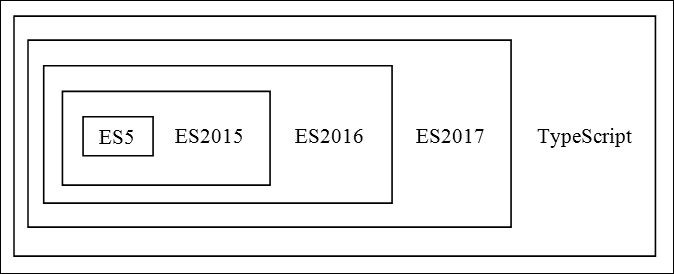

# 一、打个招呼

让我们按照几个步骤为最简单的应用程序建立一个开发环境，向您展示使用 Angular 2 和 Bootstrap 4 启动和运行 web 应用程序是多么容易。在本章末尾，您将对以下内容有一个坚实的理解：

*   如何设置开发环境
*   TypeScript 如何改变您的开发生命
*   Angular和自举的核心概念
*   如何使用Bootstrap创建简单的Angular组件
*   如何通过它显示一些数据

# 建立发展环境

让我们来设置您的开发环境。这个过程是学习编程过程中最容易被忽视、最令人沮丧的部分之一，因为开发人员不想去考虑它。在开始真正的开发之前，开发人员必须知道如何安装和配置许多不同程序的细微差别。每个人的电脑都不一样；因此，相同的设置可能无法在您的计算机上运行。我们将通过定义需要设置的各种环境来暴露和消除所有这些问题。

## 定义外壳

**shell**是您的软件开发环境所必需的一部分。我们将使用 shell 安装软件并运行命令来构建和启动 web 服务器，从而为您的 web 项目带来活力。如果您的计算机安装了 Linux 操作系统，那么您将使用名为**终端**的外壳。有许多基于 Linux 的发行版使用不同的桌面环境，但大多数都使用等效的键盘快捷键打开终端。

### 注

使用键盘快捷键*Ctrl*+*Alt*+*T*在 Ubuntu、Kali 和 Linux Mint 中打开终端。如果它不适合您，请检查您的 Linux 版本的文档。

如果您有一台安装了 OSX 的 Mac 电脑，那么您也将使用终端外壳。

### 注

使用键盘快捷键*命令*+*空格*打开**聚光灯**，输入终端进行搜索运行。

如果您的电脑安装了 Windows 操作系统，您可以使用标准的**命令提示符**，但我们可以做得更好。稍后，我将向您展示如何在您的计算机上安装 Git，您将获得免费的 Git Bash。

### 注

您可以在 Windows 上使用`Git Bash`shell 程序打开终端。

每当我需要在 Terminal 中工作时，我将在本书中的所有练习中使用 bashshell。

## 安装 Node.js

**Node.js**是我们将作为跨平台运行环境来运行服务器端 web 应用程序的技术。它是一个基于谷歌 v8javascript 引擎的本地、独立于平台的运行时和大量用 JavaScript 编写的模块的组合。Node.js 附带不同的连接器和库，可帮助您使用 HTTP、TLS、压缩、文件系统访问、原始 TCP 和 UDP 等。作为开发人员，您可以在 JavaScript 上编写自己的模块，并在 Node.js 引擎中运行它们。js 运行时使构建网络事件驱动应用程序服务器变得简单。

### 注

术语*包*和*库*在 JavaScript 中是同义词，因此我们将互换使用它们。

Node.js 在服务器端和客户端之间的数据交换中广泛使用了**JavaScript 对象表示法**（**JSON**格式），因为它可以很容易地用几个解析图表示，尤其是没有 XML、SOAP 和其他数据交换格式的复杂性。

您可以使用 Node.js 开发面向服务的应用程序，执行与 web 服务器不同的操作。最流行的面向服务的应用程序之一是**节点包管理器**（**npm**），我们将使用它来管理库依赖关系和部署系统，它是 node.js 的许多**平台即服务**（**PaaS**提供程序的基础。

如果您的计算机上没有安装 Node.js，您应该从[下载预构建安装程序 https://nodejs.org/en/download](https://nodejs.org/en/download) ，或者您可以使用[中的非官方包管理器 https://nodejs.org/en/download/package-manager](https://nodejs.org/en/download/package-manager) 。您可以在安装后立即开始使用 Node.js。开放式终端和类型：

```ts
node --version

```

Node.js 将响应已安装运行时的版本号：

```ts
v4.4.3

```

请记住，安装在我的计算机上的 Node.js 版本可能与您的不同。如果这些命令给您一个版本号，您就可以开始 Node.js 开发了。

## 建立 npm

npm 是 JavaScript 的包管理器。您可以使用它查找、共享和重用来自世界各地许多开发人员的代码包。软件包的数量每天都在急剧增长，现在已超过 25 万个。npm 是一个 Node.js 包管理器，并利用它来运行自己。npm 包含在 Node.js 的安装包中，安装后即可使用。开放式终端和类型：

```ts
npm --version

```

npm 必须使用版本号响应您的命令：

```ts
2.15.1

```

My Node.js 附带了特定版本的 npm。npm 更新非常频繁，因此您需要使用以下命令移动到最新版本：

```ts
npm install npm@latest -g

```

使用 npm 搜索或安装软件包时可能会遇到权限问题。如果是这种情况，我建议遵循[中的说明 https://docs.npmjs.com/getting-started/fixing-npm-permissions](https://docs.npmjs.com/getting-started/fixing-npm-permissions) 并且不要使用超级用户权限来修复它们。

以下命令为我们提供了有关 Node.js 和 npm 安装的信息：

```ts
npm config list

```

安装 npm 软件包有两种方法：本地安装或全局安装。如果您想将该软件包用作工具，最好在全球范围内安装：

```ts
npm install -g <package_name>

```

如果需要查找包含全局安装的软件包的文件夹，可以使用下一个命令：

```ts
npm config get prefix

```

安装全局包很重要，但如果不需要，最好避免。大多数情况下，您将在本地安装软件包。

```ts
npm i <package_name>

```

您可以在项目的`node_modules`文件夹中找到本地安装的软件包。

## 安装 Git

如果你不熟悉 Git，那么你真的错过了！Git 是一个分布式版本控制系统，每个 Git 工作目录都是一个完整的存储库。它保存完整的更改历史记录，并具有完整的版本跟踪功能。每个存储库完全独立于网络访问或中央服务器。你们可以在你们的计算机上保存 Git 存储库并和你们的伙伴共享，或者你们也可以利用许多在线 VCS 提供商。你应该密切关注的大人物是 GitHub、Bitbucket 和 Gitlab.com。根据您的需求和项目类型，每个项目都有自己的好处。

Mac 电脑的操作系统中已经安装了 Git，但 Git 的版本通常与最新版本不同。您可以通过官方网站[上提供的一组预构建安装程序在您的计算机上更新或安装 Githttps://git-scm.com/downloads](https://git-scm.com/downloads) 。安装后，您可以打开终端并键入：

```ts
git -version

```

Git 必须以版本号响应：

```ts
git version 2.8.1.windows.1

```

正如我所说的，对于使用安装了 Windows 操作系统的计算机的开发人员来说，现在您的系统上有了 Git Bash free。

## 代码编辑器

您可以想象有多少用于代码编辑的程序存在，但今天我们只讨论免费、开源、随处运行的 Microsoft Visual Studio 代码。您可以使用任何您喜欢的程序进行开发，但在我们未来的练习中，我将只使用 Visual Studio 代码，因此请从[开始安装 http://code.visualstudio.com/Download](http://code.visualstudio.com/Download) 。

# 打字速成班

TypeScript 是一种由 Microsoft 开发和维护的开源编程语言。它的首次公开发布于 2012 年 10 月，由 C#的首席架构师、Delphi 和 Turbo Pascal 的创建者 Anders Hejlsberg 提交。

TypeScript 是 JavaScript 的类型化超集，可编译为纯 JavaScript。任何现有 JavaScript 也是有效的 TypeScript。它为您提供了类型检查、显式接口和更简单的模块导出。目前，它包括**ES5**、**ES2015**、**ES2016**，事实上，这有点像提前获得一些明天的 ECMAScript，以便我们今天可以使用其中的一些功能。

以下是 ECMAScript 和 TypeScript 之间的关系：



如果您已经有 JavaScript 语言的背景，那么使用 TypeScript 编写代码相对简单。试试打字游戏[http://www.typescriptlang.org/play](http://www.typescriptlang.org/play) 直接从浏览器中使用 IntelliSense、查找引用等。

## 类型

TypeScript 提供了一个静态类型检查操作，允许尽早发现开发周期中的许多 bug。TypeScript 通过类型注释在编译时启用类型检查。TypeScript 中的类型始终是可选的，因此如果您喜欢 JavaScript 的常规动态类型，可以忽略它们。它支持原语类型的`number`、`boolean`和`string`类型注释，支持动态类型结构的`any`。在下面的示例中，我为`return`添加了类型注释，并为`function`添加了参数：

```ts
function add(first: number, second: number): number { 
  return first + second; 
} 

```

在编译的一瞬间，TypeScript 编译器可以生成一个声明文件，其中只包含导出类型的签名。生成的扩展名为`.d.ts`的声明文件以及 JavaScript 库或模块可以稍后由第三方开发人员使用。您可以在以下位置找到许多流行 JavaScript 库的大量声明文件：

*   **明确输入**（[https://github.com/DefinitelyTyped/DefinitelyTyped](https://github.com/DefinitelyTyped/DefinitelyTyped)
*   **打字**注册表（[https://github.com/typings/registry](https://github.com/typings/registry)

## 箭头功能

JavaScript 中的函数是一等公民，这意味着它们可以像任何其他值一样传递：

```ts
var result = [1, 2, 3] 
  .reduce(function (total, current) {   
    return total + current; 
  }, 0); // 6 

```

`reduce`中的第一个参数是匿名函数。匿名函数在许多情况下非常有用，但过于冗长。TypeScript 引入了新的、不太详细的语法来定义匿名函数，称为**箭头函数**语法：

```ts
var result = [1, 2, 3] 
  .reduce( (total, current) => {   
    return total + current; 
  }, 0); // 6 

```

或无事件：

```ts
var result = [1, 2, 3] 
  .reduce( (total, current) => total + current, 0); // 6 

```

定义参数时，如果参数只是一个标识符，甚至可以省略括号。所以常规的`map`数组方法：

```ts
var result = [1, 2, 3].map(function (x) {  
  return x * x  
}); 

```

可以更加简洁：

```ts
var result = [1, 2, 3].map(x => x * x); 

```

语法`(x) => x * x`和`x => x * x`都是允许的。

arrow 函数的另一个重要特性是它不会对`this`进行阴影处理，也不会从词汇范围中提取`this`。假设我们有一个构造函数`Counter`，它在超时时增加内部变量`age`的值，并将其打印出来：

```ts
function Counter() { 
  this.age = 30; 
  setTimeout(() => { 
    this.age += 1; 
    console.log(this.age); 
  }, 100); 
} 
new Counter(); // 31 

```

由于使用了 arrow 函数，`Counter`范围内的`age`在`setTimeout`的回调函数中可用。以下是转换为 JavaScript 的 ECMAScript 5 代码：

```ts
function Counter() { 
    var _this = this; 
    this.age = 30; 
    setTimeout(function () { 
        _this.age += 1; 
        console.log(_this.age); 
    }, 100); 
} 

```

以下变量均为 arrow 函数中的词法变量：

*   `arguments`
*   `super`
*   `this`
*   `new.target`

## 块作用域变量

ES5 中使用`var`语句声明的所有变量都是函数作用域，它们的作用域属于封闭函数。以下代码的结果可能会令人困惑，因为它返回`undefined`：

```ts
var x = 3; 
function random(randomize) { 
    if (randomize) { 
        // x initialized as reference on function 
        var x = Math.random();  
        return x; 
    } 
    return x; // x is not defined 
} 
random(false); // undefined 

```

`x`是`random`函数的内部变量，与第一行定义的变量没有任何关系。最后一行调用`random`函数的结果返回`undefined`，因为 JavaScript 对`random`函数中的代码解释如下：

```ts
function random(randomize) { 
    var x; // x is undefined 
    if (randomize) { 
        // x initialized as reference on function 
        x = Math.random(); 
        return x; 
    } 
    return x; // x is not defined 
} 

```

可以使用新的块作用域变量声明在 TypeScript 中修复此混乱代码：

*   `let`是`var`的块范围版本
*   `const`与`let`类似，但只允许初始化变量一次

TypeScript 编译器使用新的块作用域变量声明抛出更多错误，并防止编写复杂和损坏的代码。在前面的示例中，我们将`var`更改为`let`：

```ts
let x = 3; 
function random(randomize) { 
    if (randomize) { 
        let x = Math.random(); 
        return x; 
    } 
    return x; 
} 
random(false); // 3 

```

现在我们的代码按预期工作。

### 注

我建议使用`const`和`let`使代码更干净、更安全。

## 模板文本

如果我们需要字符串插值，我们通常将变量值和字符串片段组合在一起，例如：

```ts
let out: string = '(' + x + ', ' + y + ')'; 

```

TypeScript 支持模板文本——允许嵌入表达式的字符串文本。您可以直接使用模板文字的字符串插值功能：

```ts
let out: string = `(${x}, ${y})`; 

```

如果您需要多行字符串，模板文字也可以提供帮助：

```ts
Let x = 1, y = 2; 
let out: string = ` 
Coordinates 
 x: ${x},  
 y: ${y}`; 
console.log(out); 

```

最后一行按如下方式打印结果：

```ts
Coordinates 
 x: 1,  
 y: 2 

```

### 注

我建议使用模板文本作为更安全的字符串插值方法。

## 环路的 for

我们通常使用`for`语句或`Array`的`forEach`方法来迭代 JavaScript ES5 中的元素：

```ts
let arr = [1, 2, 3]; 
// The for statement usage 
for (let i = 0; i < arr.length; i++) { 
    let element = arr[i]; 
    console.log(element); 
} 
// The usage of forEach method 
arr.forEach(element => console.log(element)); 

```

每种方法都有其优点：

*   我们可以通过`break`或`continue`中断`for`语句
*   `forEach`方法不那么冗长

TypeScript 将`for-of`循环作为两者的组合：

```ts
const arr = [1, 2, 3]; 
for (const element of arr) { 
    console.log(element); 
} 

```

`for-of`环路支持`break`和`continue`，可以通过新的`Array`方式`entries`使用每个阵列的`index`和`value`：

```ts
const arr = [1, 2, 3]; 
for (const [index, element] of arr.entries()) { 
    console.log(`${index}: ${element}`); 
} 

```

## 默认值、可选和休息参数

我们经常需要检查函数的输入参数并为其指定默认值：

```ts
function square(x, y) { 
  x = x || 0; 
  y = y || 0; 
  return x * y; 
} 
let result = square(4, 5); // Out 20 

```

TypeScript 具有处理参数默认值的语法，以使以前的函数更短、更安全：

```ts
function square(x: number = 0, y: number = 0) { 
  return x * y; 
} 
let result = square(4, 5); // Out 20 

```

### 注

参数的默认值仅由其`undefined`值指定。

JavaScript ES5 中函数的每个参数都是可选的，因此省略的参数等于`undefined`。为了严格起见，TypeScript 希望在我们希望可选的参数末尾加一个问号。我们可以将`square`函数的最后一个参数标记为可选，并使用一个或两个参数调用该函数：

```ts
function square(x: number = 0, y?: number) { 
 if (y) { 
   return x * y; 
 } else { 
  return x * x; 
 } 
} 
let result = square(4); // Out 16 
let result = square(4, 5); // Out 20 

```

### 注

任何可选参数必须遵循所需参数。

在某些情况下，我们需要将多个参数作为一个组来处理，否则我们可能不知道一个函数需要多少个参数。JavaScriptES5 在函数范围内提供了`arguments`变量来处理它们。在 TypeScript 中，我们可以使用一个形式变量来保留其余的参数。编译器构建一个传入的参数数组，其名称在省略号后面，以便我们可以在函数中使用它：

```ts
function print(name: number, ...restOfName: number[]) { 
  return name + " " + restOfName.join(" "); 
} 
let name = print("Joseph", "Samuel", "Lucas"); 
// Out: Joseph Samuel Lucas 

```

## 接口

接口是在项目代码内外定义合同的方式。我们使用 TypeScript 中的接口仅描述数据的类型和形状，以帮助我们保持代码无错误。与许多其他语言相比，TypeScript 编译器不为接口生成任何代码，因此它没有运行时成本。TypeScript 通过 interface 关键字定义接口。让我们定义一个类型`Greetable`：

```ts
interface Greetable { 
  greetings(message: string): void; 
} 

```

它有一个名为`greetings`的成员函数，它接受一个字符串参数。以下是我们如何将其用作参数类型：

```ts
function hello(greeter: Greetable) { 
  greeter.greetings('Hi there'); 
} 

```

## 课程

JavaScript 有一个基于原型的、面向对象的编程模型。我们可以使用对象文字语法或构造函数实例化对象。其基于原型的继承是在原型链上实现的。如果您来自面向对象的方法，那么在尝试基于原型创建类和继承时，您可能会感到不舒服。TypeScript 允许基于面向对象的基于类的方法编写代码。编译器将该类转换为 JavaScript，并在所有主要的 web 浏览器和平台上工作。这是课程`Greeter`。它有一个名为`greeting`的属性、一个`constructor`和一个方法`greet`：

```ts
class Greeter { 
  greeting: string; 
  constructor(message: string) { 
    this.greeting = message; 
  } 
  greet() { 
    return "Hello, " + this.greeting; 
  } 
} 

```

指我们预先设计的`this`类的任何成员。要创建类的实例，我们使用`new`关键字：

```ts
let greeter = new Greeter("world"); 

```

我们可以通过继承扩展现有类以创建新类：

```ts
class EmailGreeter extends Greeter {  
  private email: string;  
  constructor(emailAddr: string, message: string) {  
    super(message); 
    this.email = emailAddr;  
  }  
  mailto() {  
    return "mailto:${this.email}?subject=${this.greet()}";  
  }  
} 

```

在`EmailGreeter`类中，我们演示了 TypeScript 中继承的几个特性：

*   我们使用`extends`创建一个子类
*   我们必须在构造函数的第一行调用`super`才能将值传递给基类
*   我们调用基类的`greet`方法为`mailto`创建主题

TypeScript 类支持`public`、`protected`和`private`修饰符来访问我们在整个程序中声明的成员。默认情况下，类的每个成员都是公共的。没有要求用该关键字标记所有`public`成员，但您可以显式标记它们。如果需要限制从外部访问类的成员，请使用受保护的修饰符，但请记住，它们仍然可以从派生类访问。您可以将构造函数标记为受保护的，这样我们就不能实例化该类，但可以扩展它。`private`修饰符仅在类级别限制对成员的访问。

如果你看一下`EmailGreeter`的构造函数，我们必须声明一个私有成员`email`和一个构造函数参数`emailAddr`。相反，我们可以使用参数属性在一个位置创建和初始化成员：

```ts
class EmailGreeter extends Greeter { 
  constructor(private email: string, message: string) { 
    super(message); 
  } 
  mailto() { 
    return "mailto:${this.email}?subject=${this.greet()}"; 
  } 
} 

```

可以在参数属性中使用任何修改器。

### 注

使用参数属性将声明和赋值合并到一个位置。

TypeScript 支持 getter 和 setter 来组织对对象成员的拦截访问。我们可以使用以下代码更改原始的`Greeter`类：

```ts
class Greeter {  
  private _greeting: string; 
  get greeting(): string { 
    return this._greeting; 
  } 
  set greeting(value: string) { 
    this._greeting = value || ""; 
  } 
  constructor(message: string) { 
    this.greeting = message; 
  } 
  greet() { 
    return "Hello, " + this.greeting; 
  } 
} 

```

我们检查`greeting`的 setter 中的`value`参数，如果需要，在将其分配给私有成员之前将其修改为空字符串。

TypeScript 还通过静态修饰符支持类成员。这里类`Types`只包含静态成员：

```ts
class Types {  
  static GENERIC: string = ""; 
  static EMAIL: string = "email"; 
} 

```

我们可以通过在类名称前加前缀来访问这些值：

```ts
console.log(Types.GENERIC); 

```

TypeScript 通过抽象类为我们提供了极大的灵活性。我们不能创建它们的实例，但我们可以使用它们来组织基类，每个不同的类都可以从基类派生。我们只需一个关键字即可将`greeting`类转换为抽象：

```ts
abstract class BaseGreeter {  
  private _greeting: string; 
  get greeting(): string { 
    return this._greeting; 
  } 
  set greeting(value: string) { 
    this._greeting = value || ""; 
  } 
  abstract greet(); 
} 

```

方法`greet`标记为`abstract`。它不包含实现，必须在派生类中实现。

## 模块

在编写代码时，我们通常将其划分为函数和这些函数中的块。一个程序的大小可以迅速增加，单个函数开始融入到背景中。如果我们把这样一个程序拆分成一个组织的大单元，比如模块，我们可以使它更具可读性。在开始编写程序时，您可能不知道如何构造它，您可以使用无结构原则。当您的代码变得稳定时，您可以将一些功能放在单独的模块中，以便于跟踪、更新和共享。我们将 TypeScript 的模块存储在文件中，每个文件正好一个模块，每个模块一个文件。

JavaScript ES5 没有内置的模块支持，我们使用 AMD 或 CommonJS 语法来处理它们。TypeScript 支持模块的概念。

范围和模块如何相互依赖？JavaScript 的全局范围无法访问执行模块的范围。它为每个单独的执行模块创建自己的作用域，因此模块内部声明的所有内容从外部都不可见。我们需要显式地导出它们以使它们可见，并导入它们以使用它们。模块之间的关系在文件级别定义，涉及导出和导入。任何文件都定义了顶层`export`或`import`并被视为一个模块。下面是一个包含导出声明的`string-validator.ts`文件：

```ts
export interface StringValidator { 
  isAcceptable(s: string): boolean; 
} 

```

我已经创建了另一个包含多个成员的文件`zip-validator.ts`，但只导出了其中一个，以从外部隐藏另一个：

```ts
const numberRegexp = /^[0-9]+$/; 
export class ZipCodeValidator implements StringValidator { 
  isAcceptable(s: string) { 
    return s.length === 5 && numberRegexp.test(s); 
  } 
} 

```

如果您的模块扩展了其他模块，则可以重新导出声明。此处`validators.ts`包含一个模块，包装其他验证程序模块，并将其所有导出合并到一个位置：

```ts
export * from "./string-validator"; 
export * from "./zip-validator"; 

```

现在，我们可以使用其中一个导入表单导入验证程序模块。以下是模块的单个导出：

```ts
import { StringValidator } from "./validators";  
let strValidator = new StringValidator(); 

```

为了防止命名冲突，我们可以重命名导入的声明：

```ts
import { ZipCodeValidator as ZCV } from "./validators"; 
let zipValidator = new ZCV(); 

```

最后，我们可以将整个模块导入单个变量，并使用它访问模块导出：

```ts
import * as validator from "./validators";  
let strValidator = new validator.StringValidator(); 
let zipValidator = new validator.ZipCodeValidator(); 

```

## 仿制药

TypeScript 的作者竭尽全力帮助我们编写可重用代码。**泛型**是帮助我们创建可以处理多种类型而不是单一类型的代码的工具之一。仿制药的好处包括：

*   允许您编写代码/使用类型安全的方法。`Array<string>`保证是字符串数组。
*   编译器可以对代码执行编译时检查以确保类型安全。任何将`number`分配到字符串数组的尝试都会导致错误。
*   使用`any`类型比参考类型更快。
*   允许您编写适用于具有相同底层行为的许多类型的代码。

下面是我创建的类，它向您展示了泛型是多么有用：

```ts
class Box<T> { 
    private _value : T;  
    set value(val : T) {  
        this._value = val;  
    }  
    get value() : T {  
        return this._value;  
    }  
} 

```

此类保留特定类型的单个值。要设置或返回它，我们可以使用相应的 getter 和 setter 方法：

```ts
var box1 = new Box<string>();  
box1.setValue("Hello World");  
console.log(box1.getValue());  
var box2 = new Box<number>();  
box2.setValue(1);  
console.log(box2.getValue()); 
var box3 = new Box<boolean>();  
box3.setValue(true);  
console.log(box3.getValue()); 
// Out: Hello World 
// Out: 1 
// Out: true 

```

# 什么是承诺？

承诺表示异步操作的最终结果。有许多库支持在 TypeScript 中使用承诺。但在开始讨论这一点之前，让我们先讨论一下执行 JavaScript 代码的浏览器环境。

## 事件循环

每个浏览器选项卡都有一个事件循环，并使用不同的任务来协调事件、用户交互、运行脚本、渲染、网络等。它有一个或多个队列来保持任务的有序列表。其他进程围绕事件循环运行，并通过向其队列中添加任务与之通信，例如：

*   计时器在给定时间段后等待，然后将任务添加到队列中
*   我们可以调用`requestAnimationFrame`函数来协调 DOM 更新
*   DOM 元素可以调用事件处理程序
*   浏览器可以请求对 HTML 页面进行解析
*   JavaScript 可以加载外部程序并对其执行计算

上面列表中的许多项都是 JavaScript 代码。它们通常足够小，但如果我们运行任何长时间运行的计算，它可能会阻止其他任务的执行，从而冻结用户界面。为了避免阻塞事件循环，我们可以：

*   使用**web worker API**在浏览器的不同进程中执行长时间运行的计算
*   不要同步等待长时间运行的计算结果，并允许任务通过事件或回调异步通知我们结果

## 通过事件的异步结果

下面的代码使用事件驱动的方法来说服我们，并添加事件侦听器来执行内部的小代码段：

```ts
var request = new XMLHttpRequest(); 
request.open('GET', url); 

request.onload = () => { 
    if (req.status == 200) { 
        processData(request.response); 
    } else { 
        console.log('ERROR', request.statusText); 
    } 
}; 

request.onerror = () => { 
    console.log('Network Error'); 
}; 

request.send(); // Add request to task queue 

```

最后一行代码中的方法`send`只是将另一个任务添加到队列中。如果您多次收到结果，这种方法非常有用，但是对于单个结果，这段代码非常冗长。

## 通过回调的异步结果

要通过回调管理异步结果，我们需要将回调函数作为参数传递到异步函数调用中：

```ts
readFileFunctional('myfile.txt', { encoding: 'utf8' }, 
    (text) => { // success 
        console.log(text); 
    }, 
    (error) => { // failure 
        // ... 
    } 
); 

```

这种方法很容易理解，但也有其缺点：

*   它混合了输入和输出参数
*   处理错误是很复杂的，尤其是在结合了许多回调的代码中
*   从组合异步函数返回结果更为复杂

## 通过承诺获得异步结果

正如我前面提到的，承诺代表了将来发生的异步操作的最终结果。承诺有以下优点：

*   您可以编写没有回调参数的更干净的代码
*   您没有为交付结果调整底层体系结构的代码
*   您的代码可以轻松地处理错误

承诺可以处于下列状态之一：

*   **挂起状态**：异步操作尚未完成
*   **解析状态**：异步操作已完成，承诺有值
*   **拒绝状态**：异步操作失败，承诺有失败原因

承诺在解决或拒绝后变得不可改变。

通常，编写代码是为了从函数或方法返回承诺：

```ts
function readFile(filename, encode){ 
  return new Promise((resolve, reject) => { 
    fs.readFile(filename, enccode, (error, result) => { 
      if (error) { 
        reject(error); 
      } else { 
        resolve(result); 
      } 
    }); 
  }); 
} 

```

我们使用`new`关键字和函数构造函数来创建承诺。我们在构造函数中添加了一个带有两个参数的工厂函数，它执行实际工作。这两个参数都是回调函数。操作成功完成后，factory 函数将调用第一个回调函数并返回结果。如果操作失败，则调用第二个函数并说明原因。

退回的承诺有`.then`和`.catch`等多种方式通知我们执行结果，以便我们采取相应行动：

```ts
function readJSON(filename){
 return readFile(filename, 'utf8').then((result) => {
 console.log(result);
 }, (error) => {
 console.log(error);
 });
} 

```

我们可以调用另一个操作来快速转换原始操作的结果：

```ts
function readJSON(filename){ 
  return readFile(filename, 'utf8').then((result) => { 
    return JSON.parse(result); 
  }, (error) => { 
    console.log(error); 
  } 
} 

```

# Angular 2 概念

**Angular 2**是一个用于构建 web、移动和桌面应用程序的开发平台。它基于 web 标准，使 web 开发更简单、更高效，与 AngularJS1.x 完全不同。Angular 2 的体系结构建立在 web 组件标准之上，因此我们可以为它们定义自定义 HTML 选择器和程序行为。Angular 团队开发 Angular 2 用于 ECMAScript 2015、TypeScript 和 Dart 语言。

## Angular 2 的构建块

基于 Angular 2 构建的任何 web 应用程序包括：

*   具有Angular特定标记的 HTML 模板
*   管理 HTML 模板的指令和组件
*   包含应用程序逻辑的服务
*   特殊的`bootstrap`功能，有助于加载和启动Angular应用程序

## 模块

Angular 2 应用程序由许多模块组成。Angular 2 本身是一组模块，其名称以`@angular`前缀开头，组合成库：

*   `@angular/core`是 Angular 2 的主要库，包含所有核心公共 API
*   `@angular/common`是将 API 限制为可重用组件、指令和表单构建的库
*   `@angular/router`是支持导航的库
*   `@angular/http`是帮助我们通过 HTTP 异步工作的库

## 元数据

元数据是我们可以通过 TypeScript 装饰器附加到底层定义的信息，告诉 Angular 如何修改它们。装饰师在 Angular 2 中扮演着重要角色。

## 指令

指令是 Angular 2 的基本构建块，允许您将行为连接到 DOM 中的元素。有三种指令：

*   属性指令
*   结构指令
*   组件

指令是一个具有指定的`@Directive`装饰符的类。

## 属性指令

attribute 指令通常会更改元素的外观或行为。我们可以更改多种样式，或者通过将文本绑定到属性来使用它来呈现粗体或斜体文本。

## 结构指令

structural 指令通过添加和删除其他元素来更改 DOM 布局。

## 组件

该组件是带有模板的指令。每个部件由两部分组成：

*   类，我们在其中定义应用程序逻辑
*   视图，由组件控制，并通过属性和方法的 API 与之交互

组件是一个具有指定的`@Component`装饰器的类。

## 模板

该组件使用模板渲染视图。它是带有自定义选择器和Angular特定标记的常规 HTML。

## 数据绑定

Angular 2 支持*数据绑定*通过组件的属性或方法更新模板的部分内容。*绑定标记*是数据绑定的一部分；我们在模板上使用它来连接两侧。

## 服务

Angular 2 没有服务的定义。任何值、函数或特性都可以是一个服务，但通常它是一个使用指定的`@Injectable`装饰器为特定目的创建的类。

## 依赖注入

依赖项注入是一种设计模式，它帮助通过外部实体配置对象并解决它们之间的依赖关系。松散耦合系统中的所有元素对彼此的定义知之甚少或一无所知。我们可以用替代实现替换几乎任何元素，而不会破坏整个系统。

# SystemJS loader 和 JSPM 包管理器

我们已经讨论了 TypeScript 模块，所以现在是时候谈谈我们可以用来在脚本中加载模块的工具了。

## SystemJS 加载器

**SystemJS**是一款通用的动态模块加载器。它在 GitHub 上的以下地址[托管源代码 https://github.com/systemjs/systemjs](https://github.com/systemjs/systemjs) 。它可以以以下格式在 web 浏览器和 Node.js 中加载模块：

*   ECMAScript 2015（ES6）或 TypeScript
*   AMD
*   普通的
*   全局脚本

SystemJS 通过模块命名系统（如 CSS、JSON 或图像）加载具有精确循环引用、绑定支持和资产的模块。开发人员可以通过插件轻松扩展加载程序的功能。

我们可以将 SystemJS loader 添加到我们未来的项目中：

*   通过直接链接到**内容交付网络**（**CDN**）
*   通过 npm 管理器安装

在这两种情况下，我们在代码中包含对 SystemJS 库的引用，并通过`config`方法进行配置：

```ts
<!DOCTYPE html> 
<html> 
  <head> 
    <script src="https://jspm.io/system.js"></script>   
    <script src="https://jspm.io/system.js"></script>

    <script>
      System.config({
      packages: {
      './': {
      defaultExtension: false
            }
         }
      });
    </script>

    <script>
    System.import('./app.js');
    </script>
  </head> 
  <body> 
    <div id="main"></div> 
  </body> 
</html> 

```

我们将在本章稍后讨论通过 npm manager 进行安装。

## JSPM 包管理器

SystemJS 的开发人员遵循单一责任原则，实现了一个只用于一件事的加载程序：加载模块。要使模块在项目中可用，我们需要使用包管理器。我们在开始时谈到了 npm 包管理器，现在我们将讨论位于 SystemJS 之上的 JSPM 包管理器。它可以：

*   从任何注册表（如 npm 和 GitHub）下载模块
*   使用单个命令将模块编译成简单、分层和自动执行的包

JSPM 包管理器看起来像 npm 包管理器，但它将浏览器加载程序放在第一位。它可以帮助您以最小的工作量组织一个无缝的工作流，以便在浏览器中安装和使用库。

# 写你的第一份申请

现在，当我们准备好所有东西后，是时候创建我们的第一个项目了，它实际上是一个 npm 模块。打开终端并创建文件夹`hello-world`。我有意遵循 npm 包命名约定：

*   包名称长度应大于零且不能超过 214
*   包名称中的所有字符必须为小写
*   包名称可以由/包括连字符组成
*   包名称必须包含任何 URL 安全字符（因为名称最终是 URL 的一部分）
*   包名称不应以点或下划线字母开头
*   包名称不应包含任何前导或尾随空格
*   包名称不能与`node.js/io.js`核心模块或`http`、流、`node_modules`等保留/黑名单名称相同。

将文件夹移入并运行命令：

```ts
npm init

```

npm 会问你几个问题来创建一个`package.json`文件。此文件以 JSON 格式保存有关包的重要信息：

*   项目信息，如名称、版本、作者和许可证
*   项目所依赖的包集
*   用于生成和测试项目的一组预配置命令

以下是`package.js`的外观：

```ts
{ 
  "name": "hello-world", 
  "version": "1.0.0", 
  "description": "The Hello World", 
  "author": " Put Your Name Here", 
  "license": "MIT" 
  "scripts": { 
    "test": "echo "Error: no test specified" && exit 1" 
  } 
} 

```

我们已经准备好配置我们的项目。

## 类型脚本编译配置

运行 Visual Studio 代码并打开项目文件夹。我们需要创建一个配置文件，指导 TypeScript 编译器在哪里找到源文件夹和所需库，以及如何编译项目。从**文件**菜单创建`tsconfig.json`文件，并复制/粘贴以下内容：

```ts
{ 
  "compilerOptions": { 
    "target": "es5", 
    "module": "commonjs", 
    "moduleResolution": "node", 
    "sourceMap": true, 
    "emitDecoratorMetadata": true, 
    "experimentalDecorators": true, 
    "removeComments": false, 
    "noImplicitAny": false 
  }, 
  "exclude": [ 
    "node_modules", 
    "typings/main", 
    "typings/main.d.ts" 
  ] 
} 

```

让我们仔细看看`compilerOptions`：

*   `target`选项指定 ECMAScript 版本，如`es3`、`es5`或`es6`。
*   `module`选项从以下选项之一指定模块代码生成器：`none`、`commojs`、`amd`、`system`、`umd`、`es6`或`es2015`。
*   `moduleResolution`选项决定如何解析模块。使用`node`进行`Node.js/io.js`风格的分辨率或`classic`。
*   `sourceMap`标志告诉编译器生成相应的`map`文件。
*   `emitDecoratorMetadata`发出源代码中修饰声明的设计类型元数据。
*   `experimentalDecorator`支持 ES7 装饰器的实验性支持，如迭代器、生成器和数组理解。
*   `removeComments`删除除版权标题注释以`/*!`开头以外的所有注释。
*   `noImplicitAny`在具有隐含的`any`类型的表达式和声明上引发错误。

您可以在此处找到编译器选项的完整列表：[https://www.typescriptlang.org/docs/handbook/compiler-options.html](https://www.typescriptlang.org/docs/handbook/compiler-options.html) 。

TypeScript 编译器需要我们项目的`node_modules`中 JavaScript 库的类型定义文件，因为它无法识别它们。我们用`typings.json`文件帮助它。您应该创建文件并复制/粘贴以下内容：

```ts
{
   "ambientDependencies": {
     "es6-shim": "registry:dt/es6-shim#0.31.2+20160317120654"
   }
} 

```

我们应向打字工具提供足够的信息，以获取任何打字文件：

*   注册表 dt 位于 DefinitelyTyped 源中。该值可以是 npm，git
*   `DefinitelyTyped`源中的包名为`es6-shim`
*   我们正在寻找`0.31.2`更新的`2016.03.17 12:06:54`版本

## 任务自动化和依赖解决

现在，是将库添加到应用程序所需的`package.json`文件中的时候了。请相应更新：

```ts
{ 
  "name": "hello-world", 
  "version": "1.0.0", 
  "description": "The Hello World", 
  "author": "Put Your Name Here", 
  "license": "MIT", 
  "scripts": { 
    "start": "tsc && concurrently "npm run tsc:w" "npm run lite" ", 
    "lite": "lite-server", 
    "postinstall": "typings install", 
    "tsc": "tsc", 
    "tsc:w": "tsc -w", 
    "typings": "typings" 
  }, 
  "dependencies": { 
    "@angular/common":  "~2.0.1", 
    "@angular/compiler":  "~2.0.1", 
    "@angular/core":  "~2.0.1", 
    "@angular/http":  "~2.0.1", 
    "@angular/platform-browser":  "~2.0.1", 
    "@angular/platform-browser-dynamic":  "~2.0.1", 
    "@angular/router":  "~3.0.1", 
    "@angular/upgrade": "~2.0.1", 

    "systemjs": "0.19.39", 
    "core-js": "^2.4.1", 
    "reflect-metadata": "^0.1.8", 
    "rxjs": "5.0.0-beta.12", 
    "zone.js": "^0.6.25", 

    "angular-in-memory-web-api": "~0.1.1", 
    "bootstrap": "4.0.0-alpha.4" 
  }, 
  "devDependencies": { 
    "concurrently": "^3.0.0", 
    "lite-server": "^2.2.2", 
    "typescript": "^2.0.3", 
    "typings":"^1.4.0" 
  } 
} 

```

我们的配置包括`scripts`以处理常见的开发任务，例如：

*   `postinstall`脚本在安装包后运行
*   `start`脚本由 npm`start`命令运行
*   任意脚本`lite`、`tsc`、`tsc:w`和`typings`由`npm run <script>`执行。

您可以在以下网页上找到更多文档：[https://docs.npmjs.com/misc/scripts](https://docs.npmjs.com/misc/scripts) 。

完成配置后，让我们运行`npm`管理器来安装所需的软件包。返回终端并输入以下命令：

```ts
npm i

```

在安装过程中，您可能会看到以红色开头的警告消息：

```ts
npm WARN

```

如果安装成功完成，则应忽略它们。安装完成后，npm 执行`postinstall`脚本运行`typings`安装。

# 创建和BootstrapAngular组件

Angular 2 应用程序必须始终具有顶级组件，所有其他组件和逻辑都位于该组件中。让我们创建它。转到 Visual Studio 代码并创建根目录的子文件夹`app`，我们将在其中保存源代码。在`app`文件夹下创建`app.component.ts`文件，并复制/粘贴以下内容：

```ts
// Import the decorator class for Component 
import { Component } from '@angular/core'; 

@Component({ 
  selector: 'my-app', 
  template: '<h1> Hello, World</h1>' 
}) 
export class AppComponent { } 

```

如您所见，我们通过`@Component`装饰器向类`AppComponent`添加了元数据。此装饰器通过以下选项告诉 Angular 如何通过配置处理该类：

*   `selector`定义了我们的组件将链接的 HTML 标记的名称
*   我们在`providers`物业内传递任何服务。在此注册的任何服务都可用于此组件及其子组件
*   我们将任意数量的样式文件分发给`styles`特定组件
*   `template`属性将保存组件的模板
*   模板`url`是指向包含视图模板的外部文件的 URL

我们需要`export`类`AppComponent`使其从其他模块可见，并且 Angular 可以实例化它。

Angular 应用程序是由多个模块组成，这些模块标有`NgModule`decorator。任何应用程序都必须至少有一个根模块，所以让我们在`app.module.ts`文件中创建`AppModule`：

```ts
import { NgModule } from '@angular/core'; 
import { BrowserModule } from '@angular/platform-browser'; 

@NgModule({ 
  imports: [ BrowserModule ] 
}) 
export class AppModule { } 

```

WebBrowser 是一组特定于 web 浏览器（如 document DomRootRenderer 等）的模块和提供程序。我们将 WebBrowser 导入到应用程序模块中，以使所有这些提供者和模块在我们的应用程序中可用，从而减少所需的样板代码编写量。Angular 包含`ServerModule`：服务器端的类似模块。

现在我们需要启动我们的应用程序。让我们在`app`文件夹下创建`main.ts`文件，并复制/粘贴以下内容：

```ts
import { platformBrowserDynamic } from  
     '@angular/platform-browser-dynamic'; 

import { AppModule } from './app.module'; 

const platform = platformBrowserDynamic(); 

platform.bootstrapModule(AppModule); 

```

最后但并非最不重要的一点是，我们依靠`bootstrap`函数来加载顶级组件。我们从`'@angular/platform-browser-dynamic'`进口。Angular 具有不同类型的`bootstrap`功能，用于：

*   网络工作者
*   移动设备的发展
*   在服务器上呈现应用程序的第一页

Angular 在实例化任何组件后执行多个任务：

*   它为它创建了一个阴影 DOM
*   它将所选模板加载到阴影 DOM 中
*   创建配置有`'providers'`和`'viewProviders'`的所有可注入对象

最后，Angular 2 根据组件实例计算所有模板表达式和语句。

现在，在根文件夹下的 Microsoft Visual Studio 代码中创建具有以下内容的`index.html`文件：

```ts
<html> 
  <head> 
    <title>Angular 2 First Project</title> 
    <meta charset="UTF-8"> 
    <meta name="viewport" content="width=device-width, initial-scale=1"> 
    <link rel="stylesheet" href="styles.css"> 

    <!-- 1\. Load libraries --> 
     <!-- Polyfill(s) for older browsers --> 
    <script src="node_modules/core-js/client/shim.min.js"> 
    </script> 

    <script src="node_modules/zone.js/dist/zone.js"></script> 
    <script src="node_modules/reflect-metadata/Reflect.js"> 
    </script> 
    <script src="node_modules/systemjs/dist/system.src.js"> 
</script> 

    <!-- 2\. Configure SystemJS --> 
    <script src="systemjs.config.js"></script> 
    <script> 
      System.import('app') 
      .catch(function(err){ console.error(err);  }); 
    </script> 
  </head> 

  <!-- 3\. Display the application --> 
  <body> 
    <my-app>Loading...</my-app> 
  </body> 
</html> 

```

因为我们正在引用`systemjs.config.js`文件，所以让我们在根文件夹中创建它，代码如下：

```ts
(function (global) { 
  System.config({ 
    paths: { 
      // paths serve as alias 
      'npm:': 'node_modules/' 
    }, 
    // map tells the System loader where to look for things 
    map: { 
      // our app is within the app folder 
      app: 'app', 
      // angular bundles 
      '@angular/core': 'npm:@angular/core/bundles/core.umd.js', 
      '@angular/common': 'npm:@angular/common/bundles/common.umd.js', 
      '@angular/compiler': 'npm:@angular/compiler/bundles/compiler.umd.js', 
      '@angular/platform-browser': 'npm:@angular/platform-browser/bundles/platform-browser.umd.js', 
      '@angular/platform-browser-dynamic': 'npm:@angular/platform-browser-dynamic/bundles/platform-browser-dynamic.umd.js', 
      '@angular/http': 'npm:@angular/http/bundles/http.umd.js', 
      '@angular/router': 'npm:@angular/router/bundles/router.umd.js', 
      '@angular/forms': 'npm:@angular/forms/bundles/forms.umd.js', 
      // other libraries 
      'rxjs':                      'npm:rxjs', 
      'angular-in-memory-web-api': 'npm:angular-in-memory-web-api', 
    }, 
    // packages tells the System loader how to load when no filename and/or no extension 
    packages: { 
      app: { 
        main: './main.js', 
        defaultExtension: 'js' 
      }, 
      rxjs: { 
        defaultExtension: 'js' 
      }, 
      'angular-in-memory-web-api': { 
        main: './index.js', 
        defaultExtension: 'js' 
      } 
    } 
  }); 
})(this); 

```

## 编译运行

我们已经准备好运行第一个应用程序。返回终端并键入：

```ts
npm start

```

此脚本运行两个并行 Node.js 进程：

*   监视模式下的 TypeScript 编译器
*   静态`lite-server`加载`index.html`并在应用程序文件更改时刷新浏览器

在浏览器中，您应该看到以下内容：


### 提示

您可以在`chapter_1/1.hello-world`文件夹中找到源代码。

## 增加用户输入

我们现在需要包括文本输入，还需要指定要使用的模型。当用户输入文本时，我们的应用程序会在标题中显示更改后的值。另外，我们应该将`FormsModule`导入`AppModule`：

```ts
import { NgModule }      from '@angular/core'; 
import { BrowserModule } from '@angular/platform-browser'; 

import { FormsModule }   from '@angular/forms';

import { AppComponent }   from './app.component'; 

@NgModule({ 
  imports:      [ BrowserModule, 
FormsModule

 ], 
  declarations: [ AppComponent ], 
  bootstrap:    [ AppComponent ] 

}) 
export class AppModule { } 

```

以下是`app.component.ts`的更新版本：

```ts
import { Component } from '@angular/core'; 

@Component({ 
  selector: 'my-app', 
  template: ` 
<h1>Hello, {{name || 'World'}}</h1>  

<input type="text" [(ngModel)]="name" placeholder="name">

`}) 
export class AppComponent {  
  name: string = 'World'; 
} 

```

`ngModel`属性在该元素上声明了一个模型绑定，我们在输入框中键入的任何内容都将通过 Angular 自动绑定到该元素。显然，这不会神奇地显示在我们的页面上；我们需要告诉框架我们希望它在哪里得到响应。要在页面上显示我们的模型，只需将其名称用双大括号括起来：

```ts
{{name}}

```

我在`<h1>`标签中弹出了这个代替世界的图标，并在浏览器中刷新了页面。如果您在输入字段中弹出您的姓名，您会注意到它会自动实时显示在您的标题中。Angular 为我们完成了所有这些，我们还没有编写一行代码：


现在，虽然这很好，但如果我们可以有一个默认设置，这样在用户输入他们的名字之前它看起来就不会被破坏，那就太好了。令人敬畏的是，这些大括号之间的所有内容都被解析为Angular表达式，因此我们可以检查并查看模型是否有值，如果没有，它可以响应`'World'`。Angular 将其称为表达式，它只是添加两个管道符号的一种情况，就像我们在 TypeScript 中所做的那样：

```ts
{{name || 'World'}}  

```

最好记住这是 TypeScript，这就是为什么我们需要在这里包含引号，让它知道这是一个字符串，而不是模型的名称。删除它们，您将注意到 Angular 将不再显示任何内容。这是因为名称和`World`模型都没有定义。

### 提示

您可以在`chapter_1/2.hello-input`中找到源代码。文件夹

# 集成Bootstrap 4

现在我们已经创建了`Hello World`应用程序，一切都按预期运行，现在是时候开始使用Bootstrap程序，并为我们的应用程序添加一些样式和结构。在撰写本书时，Bootstrap4 是 alpha 版本，因此请记住，应用程序的代码和标记可能略有不同。我们需要将 Bootstrap 4 样式表添加到`index.html`文件中：

```ts
<meta name="viewport" content="width=device-width, initial-scale=1"> 

<link rel="stylesheet" href="node_modules/bootstrap/dist/css/bootstrap.css">

<link rel="stylesheet" href="styles.css"> 

```

该应用程序目前未对齐到左侧，并且所有内容看起来都很拥挤，因此让我们先用一些脚手架来解决这个问题。Bootstrap 附带了一个很棒的*mobile first*响应网格系统，我们可以利用它，并包含一些`div`元素和类。不过，首先，让我们在内容周围放置一个容器，以便立即清理：

### 注

Mobile first 是一种先为最小屏幕设计/开发，然后添加到设计中而不是删除元素的方法。

```ts
<div class="container">  
  <h1>Hello, {{name || 'World'}}</h1>  
  <input type="text" [(ngModel)]="name">  
</div> 

```

如果调整浏览器窗口的大小，您应该开始注意到框架的一些响应，并看到它正在崩溃：


现在，我认为用 Bootstrap 称之为 Jumbotron（在 Bootstrap 的早期版本中，这是一个英雄单位）来包装它是一个好主意。这将使我们的标题更加突出。我们可以通过使用`jumbotron`类将`H1`和`input`标记包装在新的`div`中来实现这一点：

```ts
<div class="container"> 
  <div class="jumbotron"> 
    <h1>Hello, {{name || 'World'}}</h1> 
   <input type="text" ng-model="name"> 
  </div> 
</div> 

```


它开始看起来好多了，但我不太高兴我们的内容像那样触动了浏览器的顶部。我们可以使用页眉使它看起来更好，但输入字段对我来说仍然不合适。

首先，让我们整理一下页眉：

```ts
<div class="container"> 
  <div class="page-header"> 
    <h2>Chapter 1 <small>Hello, World</small></h2> 
  </div> 
  <div class="jumbotron"> 
    <h1>Hello, {{name || 'World'}}</h1> 
    <input type="text" [(ng-model)]="name"> 
  </div> 
</div> 

```


我在这里包括了章节号和标题。我们的`<h2>`标签中的`<small>`标签让我们很好地区分了章节号和标题。页眉类本身只为我们提供了一些额外的边距和填充，以及沿着底部的细微边界。

我认为我们能改进的最重要的东西就是那个输入框。Bootstrap 附带了一些很酷的输入样式，所以让我们将它们包括在内。首先，我们需要将表单控件类添加到文本输入中。这会将宽度设置为 100%，并在关注元素时呈现一些美丽的造型，例如圆角和发光：

```ts
<input type="text" [(ngModel)]="name" class="form-control"> 

```


好多了，但对我来说，和标题相比，它看起来有点小。Bootstrap 提供了两个额外的类，我们可以包括它们，它们将使元素变小或变大：`form-control-lg`和`form-control-sm`。在我们的例子中，`form-control-lg`类是我们想要的，所以继续并将其添加到输入中。

```ts
<input type="text" [(ngModel)]="name"  
       class="form-control form-control-lg"> 

```


### 提示

您可以在`chapter_1/3.hello-bootstrap`中找到源代码。

# 总结

我们的应用程序看起来很棒，并且工作正常，所以让我们回顾一下我们在第一章学到的东西。

首先，我们了解了如何设置工作环境并完成 TypeScript 速成课程。

我们创建的`Hello World`应用程序虽然非常基础，但展示了 Angular 的一些核心功能：

*   组件指令
*   应用程序Bootstrap
*   双向数据绑定

所有这些都不需要编写一行 TypeScript，因为我们创建的组件只是为了演示双向数据绑定。

在 Bootstrap 中，我们使用了许多可用组件中的一些，例如 Jumbotron 和 page header 类，为我们的应用程序提供了一些风格和内容。我们还看到了框架新的 mobile first responsive 设计的实际应用，而没有将标记与不必要的类或元素混在一起。

在[第 2 章](02.html#page "Chapter 2. Working with Bootstrap Components")中*使用Bootstrap组件*，我们将探索更多Bootstrap基础知识，并介绍我们将在本书中构建的项目。