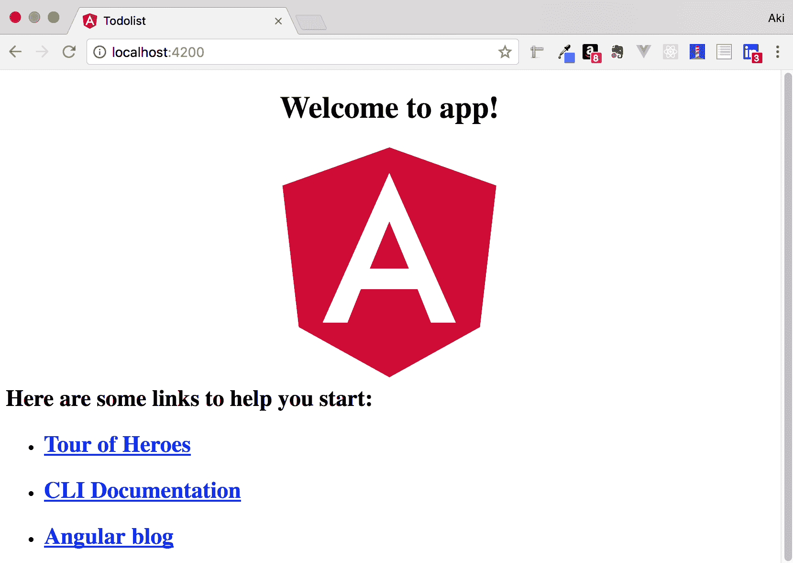
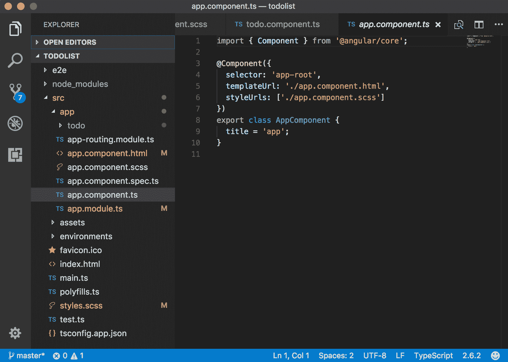
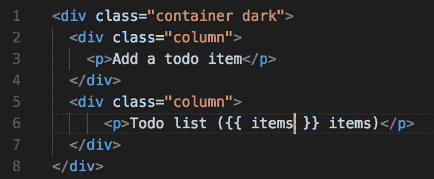
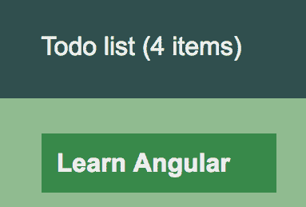
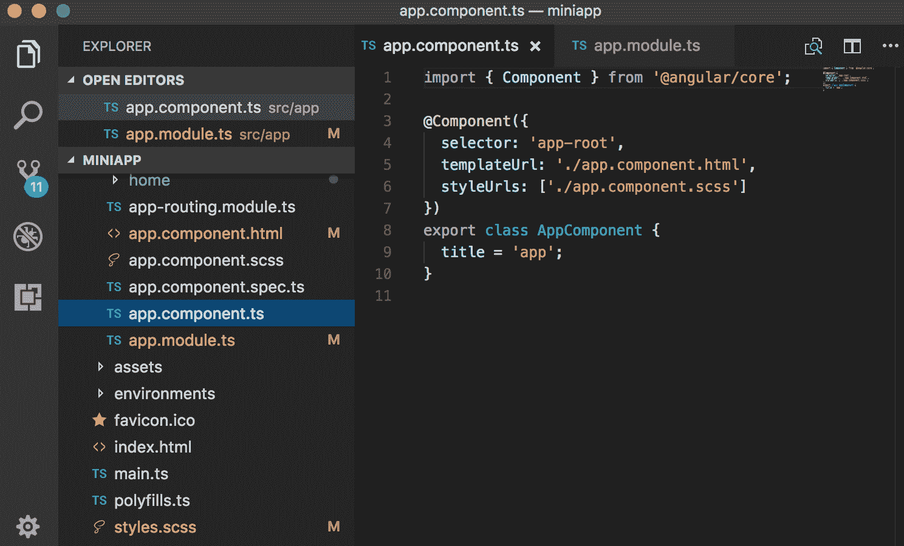
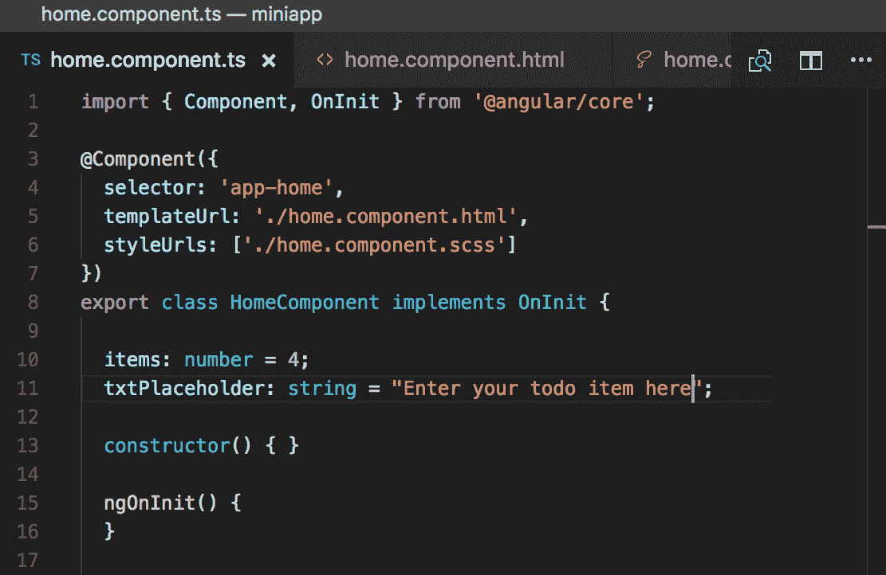
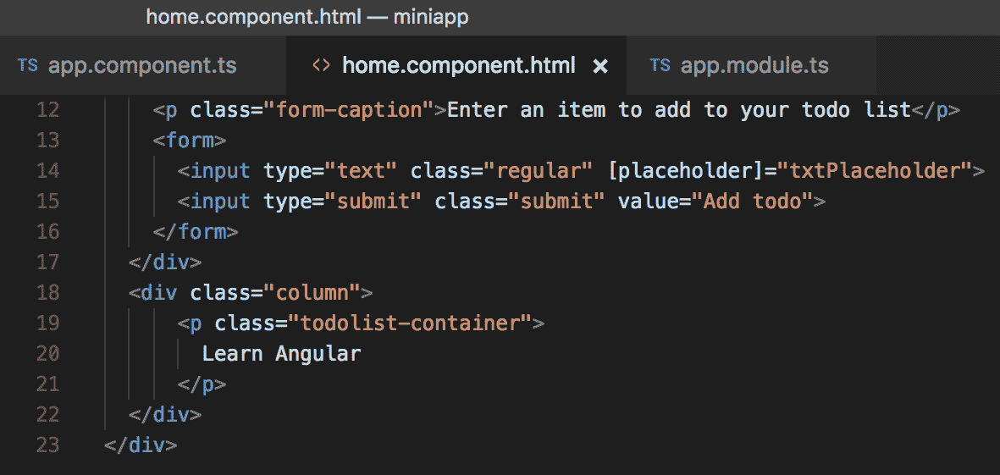
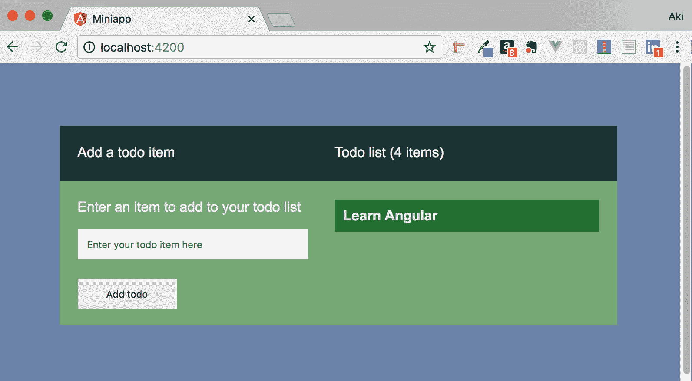
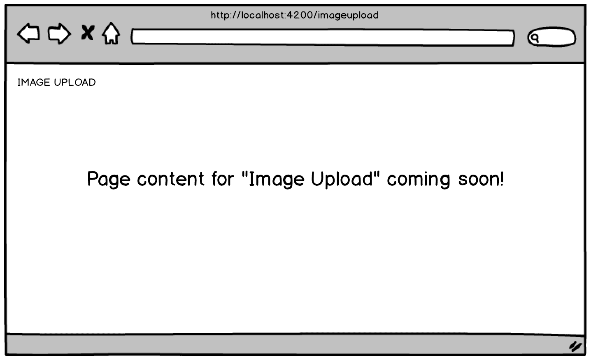
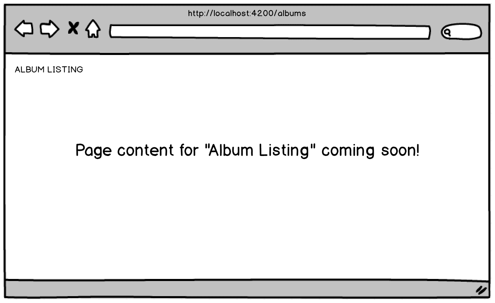

# 快速启动


你准备好用你的方法来掌握角度了吗？我猜你是的，有了这本书和你的决心，你会的。你买了这本书，我不仅感谢你，而且我想在这里，现在就向你做出承诺。事实上，有两个承诺。第一点是，如果你认真阅读材料，应用你将获得的知识，并在这些页面中与我一起构建示例应用程序，你将很好地掌握知识。

如果你和我一样，你有一个图书馆，里面有成百上千的技术书籍，你读过其中的大部分。有些书在理论和历史细节上起步极其缓慢，而另一些书起步如此之快，让读者挠头，怀疑自己是否太笨而无法理解材料。事实是，在向读者介绍可能的全新材料的同时保持平衡，而不是让他们在阅读新获得的 400 多页技术书籍时打瞌睡，这是一件棘手的事情。所以，我尊敬的、正在萌芽的、有棱角的古鲁，这就是我对你们的第二个承诺。我保证尽我最大的努力，找到所有难以捉摸的快乐媒介，介于技术上的高压手段和现实世界的实用性之间，同时尽我所能让这本书成为你的娱乐读物。

有了明确的承诺，让我们一起开始我们的角度掌握之旅，快速看一下我们将在这个轻快但非常重要的第一章中介绍的内容。

我们将立即设置您的开发环境，并构建我们的第一个 Angular 应用程序，以便立即获得成就感。我们将在写的时候略过细节，但在那之后，在结束本章之前，我们将更详细地介绍一些关键的角度基础知识。这些最初的几个基础知识是你应该熟悉的第一件事，因为在我们学习更高级的知识时，我们会在整本书中反复使用它们。

在我们介绍了这些基础知识之后，我们将从 Angular speak 开始切换，然后我们将在本书的其余部分中共同构建一个成熟的应用程序。作为奖励（我希望本书中的一些奖励会给你带来一些价值），我们还将涉及设计原则、线框和一种很少使用的设计策略，称为纸上原型，其重点是可用性测试。纸质原型大约从 1985 年开始出现，大约从 2008 年开始被精益用户体验设计所取代。尽管如此，我还是对我的许多客户从未听说过纸上原型设计感到惊讶，但当他们在尝试时发现它给他们带来的价值时，我也很高兴。

在本章末尾，我们将在高层次上介绍纸上原型制作，紧跟在线框部分之后，这是讨论纸上原型制作最合乎逻辑的地方。我们还将涉及一些用户体验设计原则，但不涉及精益用户体验过程本身，因为这将使我们远离本书的重点。然而，如果你对精益用户体验设计过程感兴趣，这里有一个很好的起点：[https://www.interaction-design.org/literature/article/a-simple-introduction-to-lean-ux](https://www.interaction-design.org/literature/article/a-simple-introduction-to-lean-ux) 。

好吧，我尊敬的萌芽天使导师，你准备好开始了吗？好的走吧！

我们将在本章中介绍的主题包括：

*   角蛋白的进化
*   中国的积木
*   设置开发环境
*   编写第一个角度应用程序
*   角度基础
*   我们的示例项目
*   纸张成型工艺


# 角蛋白的进化


Angular 是一个基于 JavaScript 的前端 web 应用程序框架，可为您提供所需的一切，包括厨房水槽，用于构建功能强大的**单页应用程序**（**SPA**。我们将共同构建的应用程序是 SPA，我们将在此过程中讨论 SPA 策略。

虽然 Angular 不是第一个基于 JavaScript 的前端 web 应用程序框架，但它很可能是其中最强大的一个。这可能是由于 Angular 以 SPA 为中心，因为构建 SPA 应用程序比在网页上提供双向数据绑定更重要。

Angular 最初发布于 2010 年秋末。从那时起，几十个相互竞争的库和框架出现了，包括一些也有大量采用和大规模生产实现的库和框架，如 Ember.js、Backbone.js 和 React.js。尽管 Angular 可能拥有最高的学习曲线（我们将看到为什么会出现这种情况），但它仍然是其中最强大的一个。

乍一看，角度命名和版本控制丛林似乎令人困惑。原因如下：

*   **Angular 的 1.x 版本**：基本上，Angular2 之前的任何版本通常被称为 AngularJS
*   AngularJS 不再处于开发模式中。它已被置于长期支持模式下。
*   Angular 框架正在积极开发中，因此开发人员在讨论这两个 Angular 框架时需要具体说明他们所指的是哪一个。幸运的是，他们有两个完全专用的网站：[https://angularjs.org/](https://angularjs.org/) 和[https://angular.io 分别为](https://angular.io)。Angular 团队采用了语义版本控制，从 2.0.0 版本开始。您可以在此处阅读有关语义版本控制的更多信息：[https://semver.org](https://semver.org) 。
*   Angular2 是 Angular1.x（即 AngularJS）的完全重写，因此不能向后兼容 AngularJS。虽然 Angular 4 不是 Angular 2 的完全重写，但它的核心库中确实有一些更改，这要求团队将其主要数量从 2 增加到 4。版本 3 作为一个发布号被跳过。
*   从 Angular 2 开始的所有释放通常称为 Angular 2+，或仅称为 Angular。
*   由于采用了语义版本控制，Angular 团队从未发布 Angular 3，因此直接从 Angular 2 升级到 Angular 4。具体来说，路由器软件包的版本存在偏差，该版本已作为 3.3.0 版发布。我们将在[第 4 章](04.html)、*路由*中详细介绍角度路由。别让这件事把你弄糊涂了。只要知道从来没有角度 3。没什么大不了的。在 Windows 操作系统的世界里，也从来没有 Windows 9。这些事情经常发生。

在阅读了前面的列表之后，您可以了解为什么在角度方面存在一些混乱。然而，如果你记住这两件事，这是非常简单的：

*   你应该只使用 AngularJS，而不是 AngularJS（除非你有非常好的理由）
*   除了没有角度 3 外，每年将有两个主要版本；它们在编号方案上应该是连续的（即 8、9 等），并且它们至少在相同的主版本号内是向后兼容的（根据语义版本控制的精神）

您可以在这里查看官方的角度发布时间表：[https://github.com/angular/angular/blob/master/docs/RELEASE_SCHEDULE.md](https://github.com/angular/angular/blob/master/docs/RELEASE_SCHEDULE.md) 。由于 AngularJS 完全是对 AngularJS 平台的重写，这与 AngularJS 截然不同，我们将跳过 AngularJS，从 AngularJS 的构建块组件开始。你和我在一起吗？太好了，让我们快速前进。


# 中国的积木


添加新功能是发布新框架的业务，但幸运的是，基本的底层架构不会经常更改。当它这样做时，通常不是一次彻底的检修。除了 Angular 2.0（它与它的前身完全不同）之外，到目前为止，所有主要版本都包含基本相同的体系结构。

现在让我们看一下框架的核心架构部分。


# 组件


组件就像小部件一样，负责在屏幕上称为视图的区域显示它们自己以及它们使用和/或操作的数据。Angular 应用程序类似于组件树，Angular 为组件提供了以双向方式（父到子和子到父）相互通信的机制。


# 模板


组件依赖其模板来呈现其数据。模板是定义组件外观的地方，您可以在样式中挂钩，以任意方式对组件进行窗口修饰。组件可以直接在其内部包含其模板（即 HTML）和样式（即 CSS），也可以在其外部引用模板和样式文件。归根结底，世界上最奇特的前端框架会生成 HTML、CSS 和 JavaScript，因为这三种东西是浏览器唯一能理解的。


# 指令


在为组件创建的模板中，Angular 使您能够使用称为指令的强大构造更改 DOM。有一些指令用于控制在屏幕上呈现内容的方式（即组件视图），例如重复 HTML 片段、基于条件逻辑显示内容、隐藏或显示内容、过滤数据数组等等。


# 模块


角度是模块化的。也就是说，它的功能被包装在模块中，称为 NgModules，它们本身就是库。模块非常适合以有组织的方式将代码集中在一起。例如，有一些模块用于帮助表单、路由和与 RESTful API 通信。许多第三方库打包为 NgModules，因此您可以将它们合并到您的 Angular 应用程序中。这方面的两个例子是 Material Design 和 AngularFire，我们将在后面的章节中介绍这两个库。


# 服务


服务本身并不是一个角度上的工件，而是一个非常普遍的概念，表示应用程序组件可能需要使用的功能、功能和特性。诸如日志记录、数据检索或几乎任何计算或查找服务等内容都可以编写为服务—这些服务可以驻留在应用程序中，也可以从应用程序外部提供。您可以将服务视为一个高度专业化的类，它提供一些*服务*（例如查找两个邮政编码之间的距离），并且做得很好。与组件一样，您不仅可以在 Angular 应用程序中使用大量第三方服务，还可以创建自己的自定义服务。我们将在[第 12 章](12.html)*中学习如何集成后端数据服务*。


# 依赖注入


**依赖注入**（**DI**）或**控制反转**（**IoC**）是一种非常有用和常见的软件设计模式。此模式用于将*对象注入依赖于它们的对象。您正在使用的依赖于其他对象的对象可以继续使用它，而无需担心它在何处加载，或者如何实例化它—您只需使用它，就好像它在您需要它的时候突然出现一样。服务非常适合注入到我们的应用程序中。我们将学习如何在 Angular 中使用 DI，以及如何使用 Angular**命令行界面**（**CLI**）生成我们自己设计的可注入服务。*

在我们开始设置开发环境之前，这里有一些关于 Angular 的有趣事情：

*   AngularJS 是使用 JavaScript 构建的，而 AngularJS 是使用 TypeScript 构建的。虽然这在编写角度应用程序时增加了一个抽象级别，但在与更大的团队构建更大的应用程序时，使用 TypeScript 提供了一些重要的优势，我们将在稍后介绍这些优势。
*   AngularJS 基于控制器，而 AngularJS 基于组件。您将在[第 6 章](06.html)、**构建角度组件中学习所有需要了解的组件。**
*   SPA 因难以实现**搜索引擎优化**（**搜索引擎优化**）而臭名昭著，但 Angular 对搜索引擎优化非常友好。
*   可以使用 Angular 构建本机移动应用程序。
*   还可以使用 Angular 构建跨平台、桌面安装的应用程序。
*   Angular 还可以使用 Angular Universal 在服务器上运行。

你必须承认，这是一个令人印象深刻和激动人心的列表。这些和更多的东西使学习角度成为一项值得努力的工作，市场正在寻求角度知识。


# 设置开发环境


为了开始使用 Angular，您需要安装**Angular CLI**；要安装它，首先需要安装 Node.js 和**npm**（**节点包管理器**）。如果您已经安装了 Node.js 和 npm，那就太好了！如果没有，请不要担心它们很容易安装，我将在本书后面的附录 A*Web 开发工具链和 Angular*中介绍安装过程。在附录 A 中，我还将介绍如何安装 Angular CLI 以及如何使用它构建 Angular 应用程序。为简洁起见，我将从现在起将 Angular CLI 工具称为 CLI。

如果您不确定是否安装了 NodeJS 和 npm，可以通过在命令行上分别键入[T0]和[T1]来快速检查。同样，您可以在命令行上键入`$ ng -v`以查看是否安装了 CLI。如果你得到了一个版本号，你就安装了这个特定的工具（如下面我截图所示）。

**Note**: Do not type `$` at the beginning of the commands. The `$` signifies the command prompt, entry point for the commands you'll type. Unix-based operating systems, such as macOS and Linux systems, commonly use `$` or `%` as their command prompt—depending on the shell being used, or if there are any custom settings specified in a configuration file on your system. Windows operating systems typically use the greater than sign, `>`, as their command prompt.


如果这些命令中有任何一个无法识别，请快速跳到附录 A，安装工具，然后跳回到这里。我会等你的。

我们还需要一个代码编辑器。现在有很多代码编辑器可用，包括一些免费的。尽管任何代码编辑器都可以，但我建议您至少在阅读本书时使用 VisualStudio 代码进行角度开发。原因是 VisualStudio 代码是免费的，它是跨平台的，并且是一个优秀的代码编辑器。它也是我在写这本书时使用的代码编辑器，因此当我建议使用扩展时，您可以轻松地安装相同的扩展。

以上是你在第一章所需要的全部内容。当我们开始构建示例项目时，需要有一个本地数据库，您还需要安装 MongoDB。MongoDB，也称为 Mongo，是一个伟大的 NoSQL 数据库，也是免费的和跨平台的。我将在附录 B*MongoDB*中介绍 Mongo 的安装过程。

此外，您还需要安装其他软件，例如 Chrome 扩展，我会在适当的时候让您知道它们是什么以及在哪里可以找到它们。现在，让我们开始编写一些角度代码。


# 编写第一个角度应用程序


当谈到使用 Angular 代码进行实验时，当您选择这个功能强大的框架时，您通常有两种选择来继续。第一种方法是使用在线代码编辑器，如 JSFIDLE、Plunker、StackBlitz 或更多。在附录 C 中，*使用 StackBlitz*时，您将了解使用 StackBlitz 的基本知识，以便您可以不时使用它来测试一些快速代码，而无需在您的开发环境中进行测试项目。您可以在此处访问 StackBlitz 网站：[https://stackblitz.com](https://stackblitz.com) 。

第二种方法是使用您自己的本地开发环境，因为我们已经在上一节中对其进行了设置，您可以创建一个项目，其唯一目的是运行一些快速示例代码，如果您愿意使用它而不是在线代码编辑器的话。我的目标是向您展示您有选择—在学习过程中，并不是只有一种方法可以尝试某些代码。

当您使用在线代码编辑器（如 StackBlitz）时，您需要安装的唯一软件是浏览器，而不是其他任何工具。虽然这让事情变得很容易，但取舍是你在你能做的事情上受到了极大的限制。话虽如此，我鼓励您尝试使用在线代码编辑器，但在本书中我们只使用我们的开发环境。所以，让我们这样做，在几分钟内一起创建一个小应用程序，我们将构建一个待办事项列表应用程序。


# 使用您的开发环境


从现在开始，我们将使用终端、CLI 和 VisualStudio 代码。前往[https://code.visualstudio.com](https://code.visualstudio.com) ，您可以在这里下载所选操作系统的 Visual Studio 代码安装包。


# 文件的位置


在设置本地环境时，您当然可以将目录和文件放在任何您喜欢的地方。如果您有一个包含 web 应用程序项目的文件夹，请立即转到该文件夹。如果你没有一个专门用于项目的地方，那么现在正是养成组织习惯的最佳时机。例如，在我的机器上，我有一个名为`dev`的文件夹，用于我所做的任何和所有开发。在我的`dev`文件夹中，我有一个名为`playground`的文件夹，其中我有一个子文件夹，用于我正在学习或使用的每种技术。我更喜欢在编写代码时使用 Mac 电脑，因此我的角度*播放内容*的完整路径名是`/Users/akii/dev/playground/angular`（如我的终端屏幕截图底部所示，后面几页）。该屏幕截图还显示了我在撰写本文时安装的 Node.js、npm 和 CLI 的版本。如果像这样的目录结构对您有效，请务必使用它。如果你已经有了组织工作的方法，那就用它吧。重要的是要严格遵守纪律，并与组织开发环境的方式保持一致。


# 生成待办事项列表应用程序


随着我们现在需要的东西的安装已经过时，这意味着我们可以使用我们的 CLI 工具，请转到您的终端，在命令提示符`$ ng new to-dolist --style=scss --routing`下键入以下内容，然后点击*输入*。

`ng`命令运行 CLI 工具，其`new`命令指示它创建新的 Angular 应用程序。本例中的应用程序名为`to-dolist`。您会注意到还有两个命令行标志，它们是`new`命令的特殊选项。样式标志告诉 CLI 我们希望使用`scss`而不是`css`，路由标志告诉 CLI 我们希望它在默认情况下为我们集成和设置路由。在本书中，我们将使用 SASS，而不是 CSS，SCSS 是 SASS 文件的文件扩展名。作为提醒，我们将在[第 3 章](03.html)*引导-网格布局和组件中有一个关于 Sass 的速成课程。*

第一次使用 CLI 创建 Angular 应用程序时，它将花费 45 秒到一分钟多的时间为您创建项目。这是因为在创建项目的文件夹结构之前，它需要为您下载并安装各种东西。但是，在创建后续的 Angular 应用程序时，CLI 不会花费那么长的时间。


# 提供待办事项列表应用程序


CLI 完成创建应用程序后，您可以通过更改到项目目录（`$ cd to-dolist`并发出`$ ng serve`命令来运行它。这将使 CLI 运行您的应用程序。默认情况下，CLI 的内置 web 服务器将在本地主机端口`4200`上侦听。顺便说一句，CLI 的 web 服务器监视您的项目文件，当它注意到您的一个文件发生更改时，它会重新加载应用程序—您无需停止服务器并再次发出 server 命令。这非常方便，因为您在开发过程中进行了大量的更改和调整。接下来，打开浏览器并访问`http://localhost:4200`，您将看到如下内容，这证明 CLI 工作正常：



现在 CLI 为您创建了待办事项列表应用程序，请在 VisualStudio 代码中打开该文件夹（注意：为简洁起见，我将 VisualStudio 代码称为 IDE）。您应该在 IDE 的左侧面板中看到待办事项列表项目的文件夹结构，类似于以下内容（除了待办事项文件夹，您还没有这个文件夹；我们将在接下来的组件小节中介绍如何使用 CLI 生成它）。

以下是 IDE 中 to dolist 项目的屏幕截图（打开[T0]文件）：



在处理角度应用程序时，绝大多数时间都花在`src | app`文件夹中。


# 角度基础


组件是 Angular 的基本构建块。事实上，您可以将一个有角度的 web 应用程序看作是一个组件树。当您使用 CLI 为 Angular 应用程序生成 shell 时，CLI 还会自动为您生成一个组件。文件名为 app.component.ts，位于`src/app`文件夹中。应用程序组件是 Angular 应用程序的引导方式，这意味着它是第一个加载的组件，所有其他组件都被拉入其中。这也意味着组件可以嵌套。上一个屏幕截图显示了我们的项目目录结构，`src/app`文件夹展开，`app.component.ts`在 IDE 的文件编辑器窗口中打开。`.ts`文件扩展名表示它是一个 TypeScript 文件。有趣的是，当您编写 Angular 应用程序时，您使用的是 TypeScript 而不是 JavaScript。事实上，Angular 团队使用 TypeScript 来编写 Angular！

在下面的*组件*部分之后，您将找到我们的 Angular 应用程序的完整代码清单。您必须编辑六个文件。其中三个已在使用 CLI 生成的应用程序中可用。当您使用 CLI 生成待办事项组件时，其他三个将在您的项目中可用，当您将项目结构与上一个屏幕截图进行比较时，当前缺少该目录。在下面的*组件*部分中，您将了解如何执行此操作，这就是为什么随后插入完整的代码清单。别担心，跟着走，相信你能掌握角度，你会没事的。如果你不相信我，就躺在地板上咕哝着这些话，*这个也会通过*，三次，慢慢地。


# 组件


本节是一个关于角度组件的高级飞越，刚好涵盖了角度组件的内容。[第 6 章](06.html)*构建角度组件*完全致力于角度组件，我们将深入探讨角度组件。考虑这一部分在组件幕后有点窥视，当我们讨论组件时，我们将拉开窗帘，好好看看 Oz To.T5 中的 To.T4 组件向导。记得在*绿野仙踪*的故事中，多萝西和那帮人被这个巫师吓呆了，但是当他最终被暴露在幕后时，他们很快就不再害怕了

如前所述，您可以将组件视为基本构建块或角度，将角度应用程序视为嵌套组件树。按钮、进度条、输入字段、整个表格、旋转木马等高级功能，甚至自定义视频播放器，这些都是组件。网页上的组件可以相互通信，Angular 有一些规则和协议来说明如何进行通信。在本书结束时，您将非常熟悉组件的内部和外部。你必须这样做，因为这只是有棱角的古鲁的方式！

当您编写一个组件文件时，如下面的代码所示，它有三个主要部分。第一个是导入部分。中间部分是组件装饰器，在这里可以指示组件的模板文件是什么（定义组件的外观），以及组件样式文件是什么（用于设置组件样式）。

**Note**: Since we used the `style=scss` flag, we get our file in SCSS as opposed to the traditional CSS type file. The export section is the last section in the component file and is where all the logic for the component will be placed. There's a lot more that can go into a component's TypeScript file than what is shown in the following code snippet, as we'll see in [Chapter 6](06.html), *Building Angular Components.*

```ts
import { Component } from '@angular/core';

@Component({
  selector: 'app-root',
  templateUrl: './app.component.html',
  styleUrls: ['./app.component.scss']
})
export class AppComponent {
  title = 'app';
}
```

CLI 在为我们创建应用程序时默认为我们创建了应用程序组件，但我们如何创建自己的组件？生成新组件的最简单方法是使用 CLI 并发出以下命令：`$ ng generate component name-of-component`。因此，要生成名为`to-doitem`的新组件，我们需要在命令提示符下键入`$ ng generate component to-doitem`。记住从`src | app`文件夹中执行此操作。CLI 将生成此组件并将其插入自己的文件夹中，新创建的文件夹的名称将与组件的名称相同。

在这个文件夹中，您将看到四个新文件，它们的名称都以`to-doitem.component`开头，因为我们组件的名称是`todoitem`，而且，它是一个组件。稍后我们将讨论以[T2]结尾的文件的用途，但您可能已经对其他三个文件的用途有了很好的猜测。让我们验证一下您可能已经在想什么；组件文件本身确实是名为`todoitem.component.ts`的文件。此文件包含对其他两个文件的引用：`todoitem.component.html`，它是组件的模板（用于定义其标记结构的 HTML 代码），以及`todoitem.component.scss`文件，它将保存组件的样式。此外，CLI 修改了名为`app.module.ts`的现有文件。稍后我们将更详细地讨论该文件，但现在，您需要知道的是，该文件充当应用程序组件的注册表。

你可能会想，*那是很多文件。他们都需要吗？*答案是否定的。在[第 5 章](05.html)中，F*lex Layout–Angular 的响应式布局引擎*中，我们将研究如何消除`.html`文件和`.scss`文件，并将所有组件*内容*（HTML 和样式）放入我们的组件文件中。然而，Angular 团队提供了将所有这些内容分开的机制，这样应用程序的代码就可以整洁有序，这是有原因的。以后你可以感谢他们。

当使用 CLI 生成组件时，一个很好的快捷语法是键入`$ ng g c name-of-component`，其中`g`是生成的缩写，`c`是组件的缩写。

除了从头开始创建我们自己的组件之外，我们将在[第 5 章](05.html)中深入了解，F*lex 布局–Angular 的响应式布局引擎*


# 待办事项列表应用程序的代码列表


现在您已经生成了待办事项组件，`todo`文件夹中有四个新文件。您将编辑其中三个，使其看起来像下面的代码清单。您还需要编辑项目中已经存在的三个文件（我们将在其中打开帷幕以迎接向导），我们还可以将其他库和框架中的组件集成到我们的应用程序中。我们将在[第 6 章](06.html)、*构建角度构件*以及[第 7 章](07.html)、*模板、指令和管道*中介绍如何使用 NG 引导实现这一点。Angular 并不缺少组件，可供您使用的组件数量只会随着时间的推移而增加。

每当我学习新技术，并跟随一本书、博客帖子或其他任何东西，我都会手工输入所有内容，即使文件可以下载。是的，手工输入可能是一个乏味的过程，但它会让你的大脑兴奋，材料和概念开始被吸收。简单地下载文件并将内容剪切粘贴到应用程序中不会产生相同的效果。我会让你决定你想走哪条路。如果您选择下载代码，本书开头有相关说明：

*   `todo.component.html`（在`src | app | todo`文件夹中）的代码列表如下所示：

```ts
<div class="container dark">
    <div class="column">
    <p>Add a todo item</p>
    </div>
    <div class="column">
    <p>Todo list ({{ itemCount }} items)</p>
    </div>
    </div>
    <div class="container light">
    <div class="column">
    <p class="form-caption">Enter an item to add to your todo list</p>
    <form>
    <input type="text" class="regular" name="item" placeholder="Todo item ..." 
      [(ngModel)]="todoItemText">
    <input type="submit" class="submit" value="Add todo" (click)="addTodoItem()">
    </form>
    </div>
    <div class="column">
    <p class="todolist-container" *ngFor="let todoItem of todoItems">
    {{ todoItem }}
    </p>
    </div>
    </div>
```

*   `todo.component.ts`（在`src | app | todo`文件夹内）的代码清单如下：

```ts
import { Component, OnInit } from '@angular/core';
@Component({
    selector: 'app-todo',
    templateUrl: './todo.component.html',
    styleUrls: ['./todo.component.scss']
})
export class TodoComponent implements OnInit {
itemCount: number;
todoItemText: string;
todoItems = [];
ngOnInit() {
this.itemCount = this.todoItems.length;
}
addTodoItem() {
this.todoItems.push(this.todoItemText);
this.todoItemText = '';
this.itemCount = this.todoItems.length;
}
}
```

*   `todo.component.scss`（在`src | app | todo`文件夹内）的代码清单如下：

```ts
.container {
    display: grid;
    grid-template-columns: 50% auto;
    }
    .column {
    padding: .4em 1.3em;
    }
    .dark {
    background: #2F4F4F;
    }
    .light {
    background: #8FBC8F;
    }
    input.regular {
    border: 0;
    padding: 1em;
    width: 80%;
    margin-bottom: 2em;
    }
    input.submit {
    border: 0;
    display: block;
    padding: 1em 3em;
    background: #eee;
    color: #333;
    margin-bottom: 1em;
    cursor: pointer;
    }
    .todolist-container {
    background: rgb(52, 138, 71);
    padding: .6em;
    font-weight: bold;
    cursor: pointer;
    }
    .form-caption {
    }
```

*   以下是`app.component.html`（在`src | app`文件夹中）。[第一章](01.html)、*快速启动*：待办事项列表（快速示例 app）的代码清单：

```ts
<br> <br>
<app-todo></app-todo>
<router-outlet></router-outlet>
```

*   `app.module.ts`（在`src | app`文件夹内）的代码清单如下：

```ts
import { BrowserModule } from '@angular/platform-browser';
import { NgModule } from '@angular/core';
import { FormsModule } from '@angular/forms';
import { AppRoutingModule } from './app-routing.module';
import { AppComponent } from './app.component';
import { TodoComponent } from './todo/todo.component';
@NgModule({
declarations: [
AppComponent,
TodoComponent
],
imports: [
BrowserModule,
AppRoutingModule,
FormsModule
],
providers: [],
bootstrap: [AppComponent]
})
export class AppModule { }
```

*   `styles.scss`（在`src`文件夹中）的代码列表如下所示：

```ts
/* You can add global styles to this file, and also import other style files */
body {
font-family: Arial, Helvetica, sans-serif;
color: #eee;
background: #869bbd;
padding: 4em;
}
a {
color: #fff;
text-decoration: none;
}
ul {
list-style-type: none;
margin: 0 0 2em 0;
padding: 0;
}
ul li {
display: inline;
margin-right: 25px;
}
ul li a {
font-size: 1.5em;
}
```

凉的现在，所有代码都准备好了。还记得如何运行 Angular 应用程序吗？在命令提示下输入`$ ng serve`，一旦出现编译成功的消息，打开浏览器并转到`http://localhost:4200`。申请有效吗？如果是这样，祝贺您构建了第一个 Angular 应用程序！如果没有，请检查拼写错误。

使用您的新应用程序。我们没有花时间添加编辑待办事项的功能，也没有花时间删除待办事项，但您只需点击浏览器的刷新按钮重新加载应用程序，即可将其清除。

为什么刷新页面时会清除内容？发生这种情况是因为我们有一个 SPA，并且没有将输入到数据库中的数据持久化。当我们构建更大的应用程序时，我们肯定会添加持久化数据的功能，本章末尾将向您介绍这一功能。


# 插值


插值是从组件类中的变量获取值以在组件模板中渲染的方式。如果您还记得，该组件的逻辑位于组件类的导出部分。这与您希望使用插值在模板中呈现变量值（即在网页上呈现）的位置相同。假设您有一个名为`items`的变量，其当前值为`4`。若要在模板中呈现值，请使用一对双大括号，其间包含变量。变量和组件逻辑写在类内部。

别担心，我们会在整本书中看到很多使用插值的代码片段，但是现在，您可以看到这个示例代码，它实际显示了插值。该代码目前没有意义，是硬编码的，但它确实演示了插值。

第一个屏幕截图是组件文件（`home.component.ts`）；变量在第 10 行声明：


第二个屏幕截图是组件的模板文件（`home.component.html`。请注意第 6 行上的一对双花括号：



最后一个屏幕截图显示了本例中的渲染值`4`。这是插值的基础。在我们制作带注释的相册时，我们将在本书中看到它的更高级用法：




# 模板和样式


在*组件*部分的最后几段中，我们已经提到了一些关于模板和样式的内容。现在我们有了一个可用的小项目，即使用 CLI 创建的项目，我们可以在代码中看到它的样子。在 IDE 中打开 Angular 项目，然后打开`app.component.ts`文件。此应用程序组件文件中的第 5 行和第 6 行分别包含对其关联模板（`.html`文件）和样式文件（`.scss`的引用。以下是我的 IDE 中打开的项目的屏幕截图，`app.component.ts`文件处于打开状态：




# 属性绑定


我们可以在 Angular 中执行两种类型的数据绑定，即单向绑定和双向绑定。插值非常类似于单向数据绑定。这是因为，在这两种情况下，数据都从组件类流向组件模板，而不是相反。属性绑定是指数据绑定到属性。

它还可以具有双向属性绑定的含义，不仅可以将组件属性的值绑定到模板，而且模板可以更改组件属性的值。这是通过`ngModel`在角度上实现的。再说一次，现在不要担心这个。稍后我们将研究双向属性绑定。只需知道单向和双向属性绑定在 Angular 中都是可能的。

实现单向属性绑定非常简单。您所需要做的就是在希望数据绑定到的 HTML 属性（在组件的模板中）周围放上方括号，并为其分配变量。要查看代码中单向属性绑定的快速示例，请查看下面三个屏幕截图。

第一个屏幕截图是组件文件（`home.component.ts`）；变量`txtPlaceholder`在第 11 行声明：



下一个屏幕截图是组件的模板文件（`home.component.html`。在第 14 行中，可以看到输入元素占位符属性周围的方括号：



最后一个屏幕截图显示了在浏览器中运行的应用程序。您可以查看文本，在此处输入 todo 项，并通过单向属性绑定作为文本框的占位符文本插入：




# 事件绑定


在 Angular 中，事件绑定仅仅意味着将在组件中的元素上注册一个事件，当该事件发生时，它将触发要调用的函数。换句话说，事件将调用函数。有很多事件你可以听，比如点击按钮，鼠标悬停在图像上，或者当光标在文本框中时用户按下一个键，等等。当然，您可以编写任何您可能想到的函数来实现其他功能，例如调用 web 服务、更改背景页面的颜色、将 Pi 值计算到 1000 位小数，或者几乎任何您想要的东西。但是我们如何在 Angular 应用程序中设置事件绑定，将我们感兴趣的事件绑定到我们感兴趣的元素上，以运行我们想要的函数呢？好吧，谢天谢地，棱角分明的团队让我们非常轻松。

假设我们希望通过单击或鼠标等事件进行一些用户交互，我们可以使用事件绑定来映射功能。

现在，这个例子不是很有趣，但是我们确实有我们的待办事项列表应用程序来查看我们已经编写的代码。如果您输入了代码清单。


# 我们的示例项目


学习一门新的编程语言，或者学习一个新的框架，都是一个亲身体验和重复的过程。即使是来自*大爆炸理论*的谢尔顿·库珀博士也不能仅仅通过阅读一本关于角度的书来学习。然而，仅仅跟随随机代码示例并不是一件很有趣的事情，最终，你没有什么东西可以使用。因此，我们将在 Angular Master 之旅中采用的方法是构建一个成熟的 web 应用程序，该应用程序构建起来既有趣又实用，因为您可以自己部署和使用它。


# 注解相册


我们将共同构建的应用程序基于我推出的一个名为 Vizcaro 的在线服务。Vizcaro 是一种照片共享服务，但您可以共享相册（照片组），而不是共享单个照片。此外，照片和相册将被注释，以便您可以添加标题和说明。我们的版本不会有我的在线服务提供的所有功能，但它将有足够的部分使其成为一个伟大的 web 应用程序，以便学习本书中的内容。


# 设计原则


通常有两种类型的设计：设计用户界面（GUI）的方式，以及设计软件组件（API 接口、服务、组件等）的方式。在本书中，我们将介绍代码的许多设计原则。Angular 是一款设计出色的软件，这对我们来说非常好，因为它提供了一个绝佳的机会，在我们学习 Angular 本身的同时，以及在构建应用程序时，讨论软件设计。在本书的其余部分中，我们还将在构建应用程序的过程中介绍用户界面设计的一般原则，特别是当我们使用线框构建模板以帮助指导我们时。

通常，在讨论用户界面设计时使用 UX 设计这一术语。借用*维基百科中的用户体验设计定义：*

*"UX design is the process of enhancing user satisfaction with a product by improving the usability, accessibility, and pleasure provided in the interaction with the pr*o*duct."*

这是一个很好的定义，不仅适用于软件产品。


# 线框图


线框从 80 年代初开始出现。他们的重点，至少在最初，是桌面应用程序中的屏幕做了什么（记住，web 应用程序还没有出现），以及它的总体布局。它们并不打算用作最终设计的外观，包括字体选择、颜色和屏幕上控件的其他属性。本质上，它们是纸上的*原型*。*纸张原型*相反，是一个使用线框的过程。值得注意的是，名词*线框*和*实体模型*可以互换使用，它们是相同的东西。在本章末尾，我将简要介绍纸张原型制作过程。


# 线框工具


您可能已经猜到，或者已经知道，在布置应用程序时，有几种工具可用于创建线框，例如 Balsamiq 实体模型、Mockflow 和 Visio。对于我的 web 应用程序，在本书中，我更喜欢使用 Balsamiq 模型。哪一个最终用于应用程序，或者已经在使用，并不重要。事实上，即使你的线框是用钢笔在你最喜欢的快餐店的餐巾纸背面手工画出来的，对我来说也很酷。说真的，重要的是你要养成在写一行代码之前创建线框的习惯。为什么？因为这是一件明智的事情，它可以为你节省很多时间。此外，它还为你提供了一个绝佳的机会来真正思考你将要建设什么。而且，您可以向用户展示它，以便获得他们对可用性的反馈，而无需编写一行代码。更有好处,；它让您了解如何为应用程序设计数据模型，以及为应用程序可能使用的服务设计 API。你会在没有商业计划的情况下创业吗？你会在没有蓝图的情况下建造你的梦想家园吗？构建 web 应用程序不应该与使用线框的页面有任何不同的规范。总是卡皮奇？


# 我们的带注释相册的线框


我们将使用 10 个线框构建我们的应用程序，每个屏幕对应一个线框。下面是它们的列表，每个屏幕截图前都有一个简短的描述。


# 主页


每个 web 应用程序都需要某种起始页。它有许多名称，通常是其中之一：主页、登录页、索引页或启动页。我们的将是直截了当的。没有闪光动画或彩虹色背景；这将是一个简单的页面，让用户知道该网站做什么，希望它能在 5 到 7 秒内做到。否则，您可能会永远失去访客：


# 仪表板


大多数 web 应用程序都没有仪表板页面，但那些有仪表板页面的应用程序通常会提供用户拥有的*内容、上次登录的时间以及公司希望引起用户注意的任何通知的摘要。如果您使用网上银行，您银行的网上银行 web 应用程序很可能有一个仪表板页面，它可能是一个帐户列表（支票、储蓄、信用卡、汽车贷款等），以及您与这些帐户的余额。*

我们将构建一个应用程序，用户将实现该应用程序来创建相册，因此我们的仪表板将包含我们上传的照片数量、相册数量、上次登录时间等信息：


# 图像上传


因为我们的应用程序应该能够让我们的用户创建相册，所以我们最好让他们能够上传他们的照片！是的，我们将使用整个网页一次上传一张照片，因为我们将在上传后使用同一页面预览照片，并*撤销*上传。你会惊讶地发现，有一个著名的照片共享网站，在你进入照片列表之前不会显示你刚刚上传的内容！立即确认您打算上传的照片实际上就是上传的照片：




# 照片准备


上传照片是我们带注释的相册应用程序的第一步。我们正在另一个网页上准备这张照片。在这里，我们将允许用户调整图像大小并对其进行注释（给它一个名称和标题）。在相册中查看照片时，将显示照片的标题：


# 创建相册


在用户可以在相册中添加照片之前，他们必须能够创建相册。以下网页将用于此目的：


# 照片列表


您始终需要考虑可用性以及如何尽可能设计最直观的用户界面。此页面将显示用户上载的所有照片的列表。此外，他们还可以编辑同一页面上任何照片的名称和标题。用户需要在页面之间跳转的次数越少，他们就会越高兴：


# 相册清单


此页面对相册的作用与上一页对照片的作用相同，它提供了用户创建的所有相册的列表，并且可以直观地编辑其名称和说明（与照片的标题相反），而无需转到其他网页：




# 工作台


工作台是用户可以将照片拖到相册上的地方。这将是我们允许用户直观地将特定照片关联到特定相册的方式。顺便说一句，我们的拖放功能不仅直观实用，还为用户增添了乐趣。从心理上讲，用户希望在网站上*玩*。拖放虽然不是令人兴奋的体验，但比起从照片下拉列表中选择照片，然后从相册下拉列表中选择相册，最后单击*连接*或*关联*按钮更有趣。前一种方法会取悦用户，后一种方法会让用户向您发送鼻音图，然后离开网站，再也不回来：


# 相册查看器


最终，用户希望以一种引人入胜的方式查看他们的相册。拖放的东西很有趣，但他们不是来这里的。他们来这里是为了看儿子生日聚会的照片，女儿高中毕业的照片，或者是他们梦想中的家的照片。这对他们来说是重要的一页；在这里，他们使用我们网站的工作将为他们带来回报。让我们不要让他们失望：


我们将在本书的其余部分、线框和本章计划涵盖的材料中构建带注释的相册，这一部分的介绍到此结束。然而，作为本章的结尾，我确实想快速讨论纸张原型，并将其与角度应用程序的规划联系起来。


# 纸上原型


正如本章开头提到的，纸张原型是一个过程。我们还提到纸质原型的核心焦点是可用性测试。我们没有提到的是，纸面原型应该是您的开发团队使用的软件开发方法的一部分，无论是瀑布式的，还是某种形式的敏捷。具体来说，纸面原型应该在需求文档交付给项目经理后立即进行。这是关于什么是纸上原型以及它在哪里的高级视图。

现在让我们来看看较低级别的流程机制，这意味着开发团队与要开发的应用程序的用户之间的交互。

纸张原型制作的机制或过程是首先创建线框并打印出来（我知道，更多的树木将被砍伐，全球变暖将成为更大的威胁，但纸张原型制作很重要）。一旦纸质版本摆在你面前，你的老板、客户或一组预期用户（如焦点小组）就会像在实际的 web 应用程序上单击鼠标一样使用纸质原型，就像它已经完成并投入生产一样。你可以让他们假装这是实际完成的应用程序。一开始听起来很傻，但人类有着难以置信的想象力，不费吹灰之力，他们就会像使用真实的东西一样使用它！这不是催眠，而是一些非常神奇的事情开始发生。如果没有你的指导，除了在一开始你向他们解释你的要求和原因时，他们会开始漫谈，大声谈论他们正在采取的行动或正在考虑采取的行动，例如，*好的，所以现在我需要填写此表并提交表格*或*我刚才做的事情的撤销按钮在哪里。我犯了一个错误。你将从参加本次练习的人那里获得的最好信息是，当他们提供如何改进的建议时，例如*如果我可以轻松导航到我。。。*。你能想象对网页进行编码，然后意识到所要求的更改将产生深远的影响，这将是一个耗时的更改吗？这种事经常发生。*

你意识到这样做有什么好处吗？你有测试用户，你还没有写一行代码！这是一个相当有力的练习！试试看，把你的故事发电子邮件给我。

因此，当我向客户解释这一点时，不是为了用户，而是如何向他们的用户和/或客户展示纸质原型制作过程，我通常会被问到，*但这是纸质的。我们如何改变屏幕？*我会以最好的方式给他们展示一个例子。我通常随身携带一组线框样本。不仅要演示纸上原型制作过程，还要展示线框的一个好例子。我把登录屏幕放在我们坐的桌子上，让他们用手指作为鼠标指针登录，然后在他们想象的键盘上打字。在他们咯咯地笑着，通过在线框下的桌子上假键盘输入用户名和密码与我一起玩之后，他们点击登录按钮，我就变成了电脑——我拿起登录线框，放下仪表板线框。他们通常停止咯咯地笑，看仪表板页面，花几秒钟，然后看着我点头说，*这很酷。我明白了。*


# 总结


我知道，这一章包含了大量的主题。这是不可避免的，因为对于所有读者来说，没有一个最好的起点。例如，一些读者知道什么是线框，并且已经使用了很多年，而其他读者可能只是刚刚听说过这个术语，或者甚至没有听说过。这是这本书的第三版，但它与前两版有很大的不同，即使基本相同，但事实并非如此，这并不意味着读者已经阅读了前两版。你可以把第一章看作是一个漏斗——一个足够宽的漏斗，它将所有经验层次和不同知识的读者带入一个共同的轨道，学习 Angular 和本书中介绍的其他共生技术。从[第 2 章](02.html)、*ECMAScript 和 TypeScript 速成班*开始，漏斗式方法已经结束。其余章节将更加关注手头的主题。所以，谢谢你和我在一起。尽管如此，我还是希望有一些事情能让你在这前几十页中费力地阅读是值得的，即使你对 Angular 并不完全陌生。

在回顾中，我们介绍了 Angular 的发展，包括它的语义版本控制和发布时间表。虽然附录 A 中介绍了 NodeJS、npm 和 CLI 的安装，但本章指导了讨论，然后我们使用 CLI 一起构建了第一个 Angular 应用程序和待办事项列表应用程序。我们将命名应用程序待办事项列表，因为我们是开发人员而不是营销人员（wink）。我们还介绍了如何在不依赖本地开发环境的情况下使用 StackBlitz 构建相同的 Angular 应用程序。然后，我们介绍了 Angular 的第一个非常基本的构建块，您需要很好地了解这些构建块，因为它们将反复用于您构建的任何 Angular 应用程序。也就是说，它们是模板、属性绑定、事件绑定和类绑定。最后，我们介绍了我们将在本书中共同构建的带注释的相册应用程序，并介绍了 UX 设计原则、线框和纸制原型。唷！妈妈，米娅！

在下一章中，我们将首先了解 JavaScript 和 TypeScript 之间的关系。正如名字所暗示的那样，我们将进行一个关于 TypeScript 及其相对于 JavaScript 的优势的速成课程