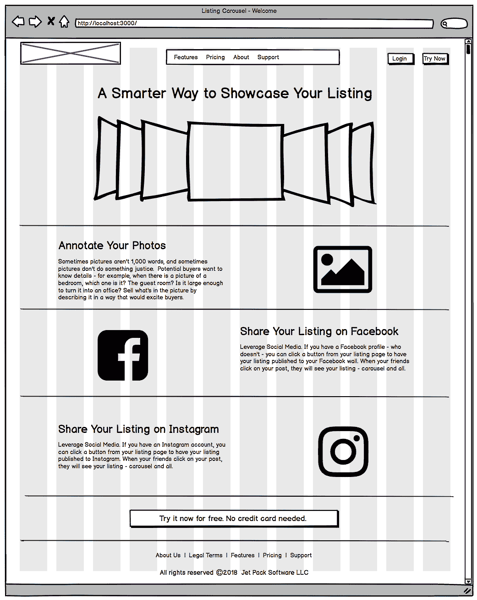
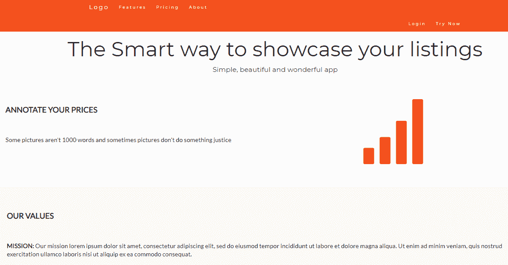
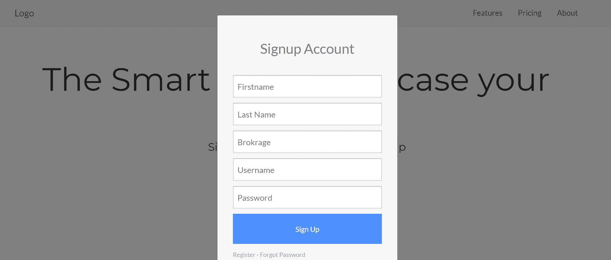
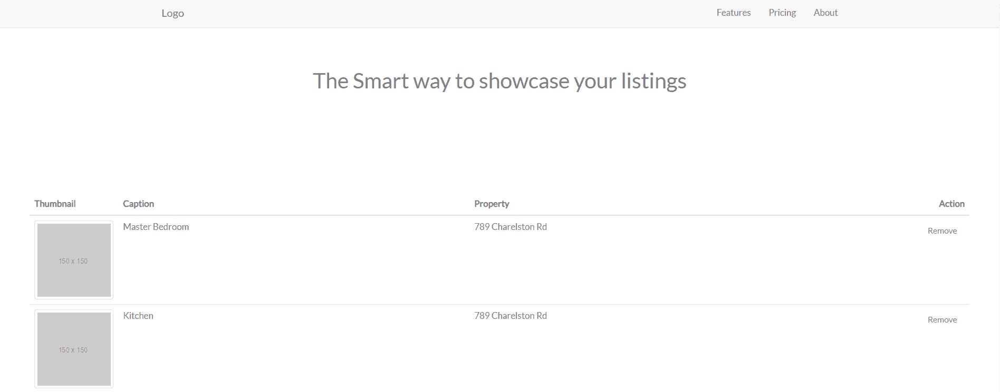
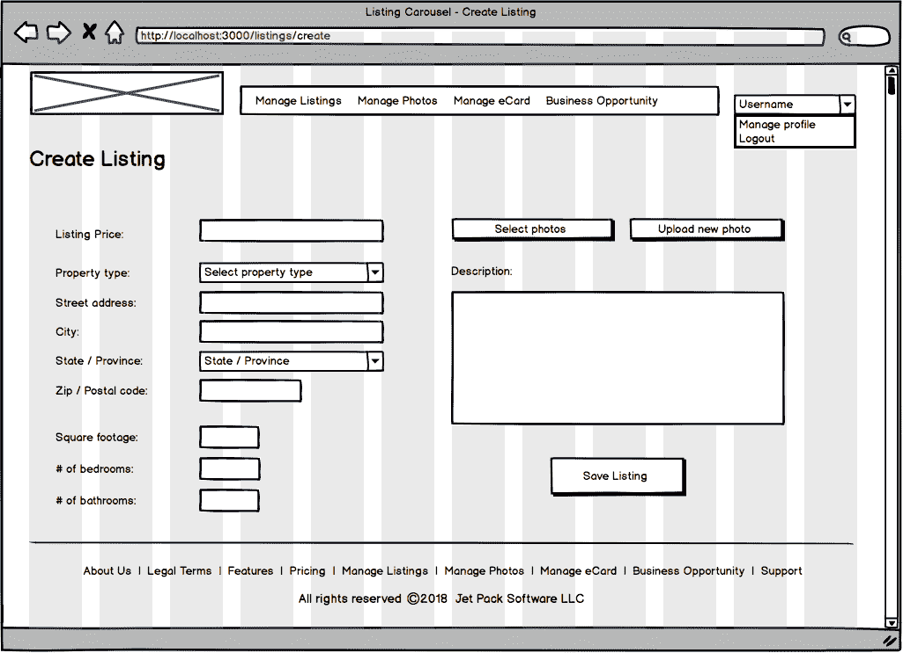
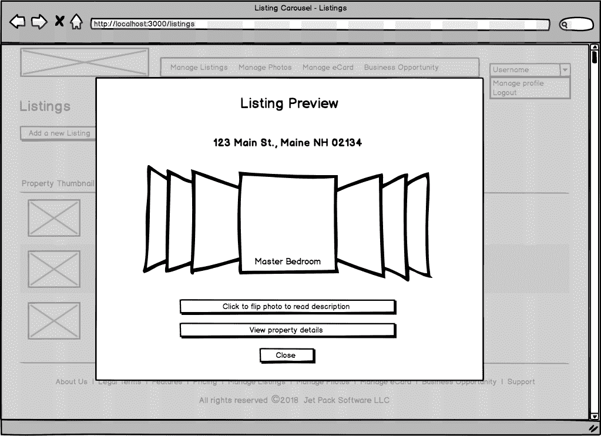
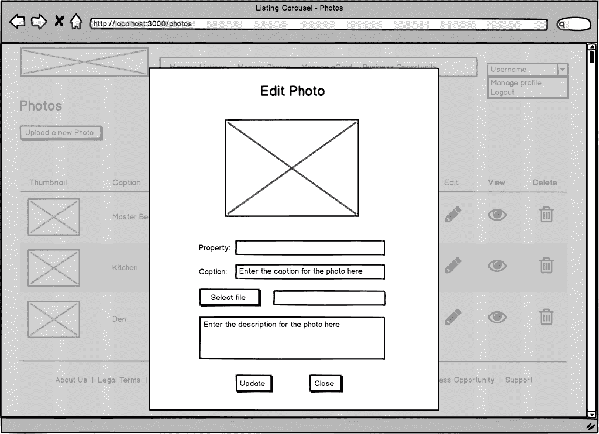

# 引导-网格布局和组件


嘿，你已经进入[第 3 章](03.html)，*引导-网格布局和组件。*太棒了！下一个议程是给自己倒一杯或一杯你最喜欢的饮料，因为这是一个大而重要的章节，所以你会想清醒过来。然而，这并不是只工作不玩耍，因为本章是我们将一起开始构建示例应用程序的地方，我们应该能够从中获得一些乐趣。在此过程中，我们还将涵盖不同领域的大量资料。下面是我们将要介绍的内容列表：

*   我们将正式介绍我们的示例应用程序，称为 Listing Carousel，其中包括一些建议，建议您如何利用此应用程序进行其他操作，您可以在本书的旁边（而不是构建 Listing Carousel）或在完成本书之后，如果你要先和我一起建立上市转盘。
*   在本书中，我们将介绍如何逐步构建我们的应用程序的游戏计划，您还将看到，我们有一些替代技术可供选择，用于构建列表传送带或您选择的应用程序，您可能会在本书末尾受到启发来构建这些应用程序
*   我们还将看一看 Sass，这是一种使为您的项目编写 CSS 变得更简单、更有条理的技术。
*   我们肯定会关注 Bootstrap 的两个主要部分：响应网格和一些组件。
*   在[第 1 章](01.html)、*快速入门*中，我们对构成示例应用程序的一些线框进行了初步的了解。好的，这一章是我们将要编写 HTML 代码的地方，利用引导，使线框变得栩栩如生。
*   作为奖励材料，我们还将使用一个真实的案例研究，列出 Carousel，来研究软件项目从开始到实现的过程。这包括项目阶段，如分析、需求收集、用例图、线框和实现。

到本章结束时，我们的网页将被硬编码，并且不会有任何角度代码。随着本书的深入，我们将通过添加路由、角度组件、模板、数据等，逐步将引导应用程序转换为成熟的角度应用程序，从而开始慢慢地将它们变为现实。


# 关于这一章不是什么的一句话


本章涵盖了很多方面，包括 Sass、Bootstrap 的响应网格及其几个组件。然而，这一章并没有全面涵盖你需要知道的关于这两件事的所有内容。原因很简单，不仅有专门介绍 Bootstrap 的书籍，而且 Bootstraps 的网站是查找 Bootstrap 文档的理想场所。复制他们的文档不会很好地利用这本书的页面，也不会很好地利用你的时间和辛苦赚来的钱。相反，更明智的做法是以一种实用的方式介绍 Bootstrap 的网格和组件，比如在本书中一起构建一个应用程序，并根据需要参考官方文档。

顺便说一句，同样的事情也适用于[第 5 章](05.html)、*Flex Layout–Angular 的响应式布局引擎*、[第 8 章](08.html)、*使用 NG Bootstrap*、[第 9 章](09.html)、*使用 Angular 材料*、*因为每种技术都有自己的官方文档*

 *我的工作是做以下几点：

*   向您介绍这些技术（并向您介绍它们的官方文档）
*   演示如何以实用、有趣且有希望的方式应用它们
*   鼓励您通读整本书，这样您就可以很好地成为一名有棱角的 web 开发大师

顺便说一句，Angular 当然也有自己的官方文档，但它有太多的内容，甚至开始使用都会让人感到害怕。根据我的经验，学习新技术的一种更有趣的方法是遵循教程，这正是本书的内容——一个构建应用程序的全面教程，在适当章节的各个章节中添加了额外的解释和一些额外的材料。如果我的工作做得很好，您应该能够构建几乎任何可能需要（或想要）使用 Angular 构建的应用程序。这就是目标。

现在让我们看一下 ListingCarousel，这是我们将共同构建的示例应用程序。


# 我们的示例应用程序


Listing Carousel 是本书的示例应用程序，是一个真实的在线应用程序，它为房地产经纪人（即专业房地产销售人员）提供了一个机会，让他们可以通过社交媒体以引人入胜和信息丰富的方式将他们的物品分享给他们的联系人。我的一家公司拥有并经营它。

我选择这个应用程序的原因并不是为了让你可以窃取我的代码，并试图与我竞争（这将是完全不酷的，不推荐），而是因为在这里和那里做一些调整，你可以把这个应用程序变成你自己的在线服务，如果你想的话。例如，只需添加搜索功能，您就可以轻松地将此应用程序转换为分类应用程序（如 Craigslist 或 Kijiji），甚至可以通过添加搜索和更多代码将其转换为约会/婚介网站。或者，如果你喜欢食物，把它变成餐馆怎么样？注册餐厅，在旋转木马中列出他们的菜单，每张幻灯片一顿饭或开胃菜，然后餐厅老板可以与他们的社交媒体圈分享他们的菜单。或者，如果您喜欢使用新的方式来共享相册，您可以将应用程序变成类似的东西。我不久前的一个想法是创建一个网站，人们可以在这里展示他们的作品集（比如艺术家、建筑师和摄影师）——可以自由地创建这样的作品并使用它。选择真的无穷无尽。重点是，我想为第一本书设计一个有趣的应用程序，让你有动力阅读整本书。为什么？很简单，因为我知道，如果你只想读这本书，那么这本书对你来说就没有那么有价值了。因此，请与我一起深入研究代码，并构建一些您喜欢的东西。谁知道呢，也许你会想出一个赚钱的在线业务的好主意！我的目标是让你花在这本书上的时间都花得很好，如果我成功了，你可以给这本书一个五星级的评价（眨眼）。这听起来好吗？


# 游戏计划


当我们一起讨论本书中的内容时，我们有一个逐步的游戏计划，使用列表转盘作为我们讨论的焦点。虽然这本书没有明确地分成几个部分（即章节的分组），但我们现在可以通过将构建应用程序所需的工作划分为三个主要阶段来松散地对它们进行分组。跟我来，这一切都是有意义的，给我们提供了一种方法，将材料（即本书的章节）与我们将共同构建的应用程序结合起来，并为我们自己设定一个目标。

在开车之前知道你要去哪里，并且能够随时识别你在哪里，这很好。拥有这样的路线图/游戏计划会使整个过程更加愉快，从而最大限度地提高您阅读本书的机会，而不仅仅是使用它到处查看。这本书不是设计成烹饪书的。相反，它的目的是教你如何烹饪。你将学习用火烹饪（双关语），准备一顿复杂的饭菜，这需要一定的知识和技能才能正确烹饪。本书有四个主要优点：

*   它为您提供了准备膳食所需的所有配料，甚至是替代配料（即选择）。
*   它给你知识，教你厨师烹饪食物所需的过程和技能。
*   它以一种方法学的方式做这些事情，所以你尽可能有效地学习它。
*   膳食选择是一道菜，代表了你可能需要烹调的大多数菜肴的复杂性。换句话说，如果您学会了如何烹调这顿饭（即我们的示例应用程序），您应该有信心能够准备任何您将被要求准备的饭菜。

撇开烹饪类比不谈，这本书的承诺是教你如何通过一个方法论的过程来使用 Angular 构建一个实际的应用程序。毕竟，如果你仔细想想，这就是你买这本书的原因，不是吗？否则，你可以在谷歌上到处搜索，希望最终能把所有东西拼凑在一起。这一点都不好玩，也不是学习英语的明智方式。当你想学习新的东西，或者在任何事情上把基本技能提升到一个新的水平时，你需要有一个目标，一个路线图/游戏计划。好吧，我们知道我们的目标，这是建立上市转盘，学习 Angular，以及一系列其他的好东西，一路走来。现在让我们来看看我们的游戏计划

在构建应用程序的第一阶段，我们需要决定构建什么、它将具有什么功能以及它将是什么样子。一旦我们确定了所有的范围和线框，下一步就是为我们的应用程序构建框架。到这个阶段结束时，我们的应用程序很可能只是硬编码的，只不过是一些 HTML 和 CSS。我们唯一的组件将是我们从 Bootstrap 的组件库中选择使用的组件。您可以将其视为我们的应用程序有皮肤和骨骼，但还没有内脏或跳动的心脏。

在构建我们的应用程序的第 2 阶段，您猜对了，我们将开始给我们的皮肤和骨骼应用程序一些勇气！具体来说，这将是有棱角的内脏！请记住，在第一阶段，我们甚至没有使用角度，也没有一盎司是有意的。虽然到第二阶段结束时，我们的应用程序肯定会比第一阶段更加活跃，但它的行为将更像一个非常机械的机器人。如果你还记得电影《绿野仙踪》，它会像铁皮人一样——活蹦乱跳，但没有心。第二阶段（即，给我们的应用程序一些勇气）将由[第 4 章](04.html)、*路由、*[第 7 章](07.html)、*模板、指令和管道*、以及[第 6 章](06.html)、*建筑角构件*组成。

最后，但并非最不重要的一点是，在构建应用程序的第 3 阶段，我们最终将为锡人献上一颗爱心！是 啊好的，是什么让我们的应用程序有了吸引力？答案是数据和 API！对于我们的应用程序来说，数据就像血液一样，而 API 就像心脏一样接收数据并将数据推回。我敢打赌，你从来没有这样想过 web 应用程序，从现在起，你将无法以任何其他方式（微笑）想到它们。第三阶段包括[第 10 章](10.html)、*使用表单、*[第 12 章](12.html)、*集成后端数据服务*、[第 11 章](11.html)、*依赖注入和服务、*和[第 14 章](14.html)、*高级角度主题*。

[第 13 章](13.html)、*单元测试*和[第 15 章](15.html)、*部署角度应用*本身并不是任何阶段*的组成部分，但它们起着非常重要的支持作用。在这两章中，我们将学习如何测试我们为应用程序编写的代码，以及如何以两种不同的方式部署它*

这是我们的大局看看我们的计划。让我们放大一点，看看我们构建应用程序的第一阶段的五步游戏计划，然后我们将进入我们的第一个技术主题 SASS。

*   **步骤 1**：在本章中，我们将介绍 Bootstrap 的响应网格，以及 Bootstrap 的几个组件：
    *   我将解释 Bootstrap 的网格是如何工作的，它可以帮助我们布局网页。
    *   我将介绍我们在构建页面时将在页面上使用的引导组件，我们将使用线框结合引导网格来指导我们。
*   **第 2 步**：在[第 5 章](05.html)*Flex Layout–Angular 强大的响应式布局引擎*中，我们将用 Flex Layout 取代 Bootstrap 的网格系统。我们将只使用几个网页来实现这一点，而剩下的所有网页都使用引导网格。我们这样做有两个原因：
    *   向您展示始终存在可用的备选方案，您可以经常混合和匹配这些备选方案。
    *   能够混搭为我们提供了一条用另一种技术取代一种技术的道路，而无需一次性完成所有工作。我们不想继续完整地重建东西，我们只想重做我们最初构建的部分，以学习如何应用特定的替代技术。
*   **步骤 3**：在[第 6 章](06.html)*构建角度组件*中，我们将研究如何构建自己的组件，以便在网页中使用。由于我们在创建组件时可以控制 HTML 和 CSS，因此在创建我们自己的组件时，我们可以利用 Bootstrap 组件的外观。注：[第 7 章](07.html)、*模板、指令和管道*也是其中的一部分，因为这两章是结合在一起的。
*   **步骤 4**：在[第 8 章](08.html)*使用 NG 引导时*会发现有现成的*角准备*引导组件。正如我们将在几个页面中用 Flex 布局替换 Bootstrap 的网格一样，我们将对组件做同样的事情，也就是用 NG Bootstrap 项目中的组件替换几个 Bootstrap 组件。我们这样做的动机是认识到，有许多不同的第三方组件，我们可以随时用于我们的角度应用程序，包括那些基于引导的组件。
*   **步骤 5**：在[第 9 章](09.html)*中，我们将再次更换我们的两个引导组件*，但这一次，它们与引导组件没有任何关系。Angular Material 项目拥有设计精美的组件，这些组件专为 Angular 应用程序量身定制，我们将学习如何将其中的一些组件整合到我们的应用程序中。

再次强调，这里需要注意的重要一点是，我们在布局网页和使用哪些组件（包括在构建应用程序时创建自己的自定义组件）的技术方面都有选择。此外，正如您在[第 12 章](12.html)*集成后端数据服务*中所看到的，对于服务器端和数据库技术堆栈，您几乎有无限的选择。此外，在[第 14 章](14.html)*高级角度主题*中，我们将探讨一些我们可能希望在应用程序中使用的第三方身份验证 API，而不是从头开始编写自己的 API。

是的！我们在这本书中有很多有趣的东西要一起讨论。这就是说，让我们首先关注第一件事，并从本章提供的好处开始：Sass、Bootstrap、软件项目的典型演变（即从开始到实现），以及使用 Bootstrap 构建用于列出 Carousel 的页面（即构建应用程序的第一阶段）。我将在[第 7 章](07.html)开始时为构建我们的应用程序的第 2 阶段提供一个类似的游戏计划，*模板、指令和管道*，并在[第 12 章](12.html)开始时为构建我们的应用程序的第 3 阶段提供一个最终游戏计划，*集成后端数据服务*。

我知道这是一个很大的领域，但是回顾我们的比赛计划是我们要做的一件重要的事情，知道我们在哪里，我们要去哪里总是有帮助的。现在，在我们报道 Bootstrap 之前，让我们加快速度，快速完成 Sass 速成课程。


# Sass 速成班


与大多数技术一样，包括本书中提到的所有技术，如 ES6、Bootstrap、Node 和 MongoDB，可以编写关于它们的整本书。本速成班的目的不是让您成为 Sass 专家，也不是重复 Sass 的官方文档。由于篇幅有限，本速成班的目的只是向您介绍 Sass，并激励您在完成本书之后或与本书同时进行进一步探索，因为 Sass 是一项非常酷的技术。

Bootstrap 团队在 Bootstrap 项目中采用了 Sass，其他技术（如 Compass）也建立在它之上。严格地说，您不必知道如何使用 Sass 来编写角度应用程序，甚至不必阅读本书，但这是一项值得学习的技术，因此我鼓励您自己仔细研究一下。现在让我们一起讨论一些 Sass 基础知识。


# 什么是 Sass？


*   Sass 是语法上非常棒的样式表的首字母缩略词，但是，当然，Sass 比首字母缩略词更时髦！Sass 是 CSS 的一个扩展，它在为 web 应用程序编写 CSS 时为我们提供了额外的功能和灵活性。Sass 在编译时为我们生成格式良好的 CSS。具体地说，Sass 向表中添加的 CSS 包括嵌套规则、变量、条件逻辑、数学、混合等。此外，Sass 使我们更容易维护和组织 web 项目中的样式表。在本速成班中，我们将了解其中的许多内容
*   Sass 兼容所有版本的 CSS，而不仅仅是 CSS3 和 CSS4。
*   由于 Angular CLI，Sass 非常适合我们的 Angular 应用程序，因为默认情况下 CLI 会在我们的组件中为我们编译 Sass
*   可以在这里找到 Sass 的官方网站：[https://sass-lang.com/](https://sass-lang.com/) 。


# 罗盘框架


Compass 是一个 CSS 创作框架，它构建在 Sass 之上，提供了一些简洁的添加，还将把您的 Sass 编译为 CSS。如果您正在处理非角度项目，指南针是一个选项（记住，Angular CLI 负责为我们的角度项目将 Sass 编译为 CSS）。在本书中，我们将不介绍 Compass，但我想至少让您注意到这项技术，因为我知道 Angular 并不是作为 web 开发人员使用的唯一技术。然而，作为 web 开发人员，我们无法避免使用 CSS！

这里的要点是，您可以简单地将 Angular CLI for Sass 用于 Angular 项目，但一定要看看如何为非 Angular 项目利用 Compass，特别是在您的项目倾向于使用 CSS 的情况下。

大公司使用指南针。据我所知，他们中的两个是 LinkedIn（[，我每天都使用他们的在线服务 https://www.linkedin.com/](https://www.linkedin.com/) ），全球最大的就业导向社交网络服务，以及 Heroku（[https://www.heroku.com](https://www.heroku.com/) ），超级流行的云应用平台。

您可以在他们的官方网站上了解有关 Compass 的所有信息，网址为：[http://compass-style.org/](http://compass-style.org/) 。另一个提供 Sass 和 Compass 教程的在线参考名为*Sass 之路*，可以在这里找到：[http://www.thesassway.com/](http://www.thesassway.com/) 。


# 两种 SASS 风格


Sass 有两种语法：依赖缩进的旧语法和使用大括号而不是缩进的新语法。这两种句法风格之间的另一个区别是，旧风格不需要在行尾加分号，而新风格也需要分号。这两种样式之间的文件扩展名也不同，旧样式的文件扩展名为`.sass`，当前样式的文件扩展名为`.scss`。

现在让我们看一下每个 CSS 语法的一个快速示例。第一个代码块是较旧的样式（`.sass`），第二个代码块在较新的语法样式（`.scss`中）中产生相同的效果。我们将在整本书中使用这种新风格。

这里给出的示例代码用于编写[T0]语法：

```ts
$blue: #0000ff
$margin: 20px

.content-navigation
  border-color: $blue
  color: lighten($blue, 10%)

.border
  padding: $margin / 2
  margin: $margin / 2
  border-color: $blue

```

这里给出的示例代码用于编写[T0]语法：

```ts
$blue: #0000ff;
$margin: 16px;

.content-navigation {
 border-color: $blue;
 color: lighten($blue, 10%);
}

.border {
 padding: $margin / 2; 
 margin: $margin / 2; 
 border-color: $blue;
}
```

这两种语法风格的主要区别在于，较旧的风格旨在简洁，而较新的风格旨在让习惯于传统 CSS 语法的开发人员更加熟悉。

在前面的代码块中，您可能已经注意到了`$blue`和`$margin`。这些不是 CSS 项，而是变量的示例。您可能还注意到除法运算符。变量和数学计算只是 Sass 代码中可以包含的一些内容。我们将在后面的章节中看到这些以及更多 Sass 特性。

无论使用旧语法还是新语法，编译结果都是相同的。如果您要获取前面的任一代码块并通过在线编译器运行它们，例如 Sass*Meister*（我也将很快提到此工具），那么生成的 CSS 将如下所示：

```ts
.content-navigation {
  border-color: #0000ff;
  color: #3333ff;
}

.border {
  padding: 10px;
  margin: 10px;
  border-color: #0000ff;
}
```


# 安装 Ruby


Sass 是用 Ruby 编写的，因此我们需要在计算机上安装 Ruby。要下载并安装最新版本，请浏览 Ruby 的官方网站：[https://www.ruby-lang.org/en/downloads/](https://www.ruby-lang.org/en/downloads/) 。要确定您的计算机上是否已经安装了 Ruby，请在命令行或终端上运行以下命令：`$ ruby -v`。

如果安装了 Ruby，输出将显示版本号。例如，当我执行`$ ruby -v`时，我的终端中的输出是`ruby 2.4.1p111 (2017-03-22 revision 58053) [x86_64-darwin16]`。2.3 以后的任何版本都足以满足我们的需要。


# 安装 Sass


一旦安装了 Ruby，安装 Sass 就轻而易举了。前往[https://sass-lang.com/install](https://sass-lang.com/install) 并按照指示进行操作。

就像您可以通过在终端或命令行上运行`$ ruby -v`来获得 Ruby 版本一样，您也可以对 Sass 执行同样的操作。执行以下命令`$ sass -v`，查看您的终端或命令行系统上的 Sass 版本。我的系统上的输出显示以下内容：

```ts
Sass 3.5.5 (Bleeding Edge).
```


# Sass 的在线工具


有几个在线工具，我们可以用来编译我们的 Sass 文件到 CSS 文件。其中一个我喜欢的名字叫*Sass-Meister*，你可以在这里访问它：[http://www.sassmeister.com](https://www.sassmeister.com/) 。

我喜欢它，因为它非常易于使用，并且在您的 Sass 语法出现问题时提供了相当好的帮助。它还支持 Sass 语法、旧样式和新样式，还允许您从几个不同的 Sass 编译器中进行选择。您可以在窗口窗格顶部的“选项”菜单选项下找到这些设置。

要使用该工具，只需在左窗格中编写 Sass 代码，编译后的 CSS 就会出现在右窗格中。注意所选选项，以便激活的选项就是您想要的选项。


# Sass 的离线工具


与在线工具一样，我们可以选择几个选项，使用离线工具将 Sass 文件编译为 CSS 文件。我使用考拉是因为它易于使用，跨平台，而且是免费的。您可以从项目网站[免费下载考拉 http://koala-app.com/](http://koala-app.com/) 。

考拉给你的工作能力不仅仅是沙斯。您还可以使用考拉编译和/或压缩更少的 JavaScript、CoffeeScript，甚至可以使用 Compass 框架。

学习如何使用考拉的最好方法是阅读官方文件，可在[上找到 https://github.com/oklai/koala/wiki#docs](https://github.com/oklai/koala/wiki#docs) 。但是，如果您只是使用考拉来编译您的 Sass 文件（至少现在是这样），那么让我在这里为您简要介绍一些步骤，以避免您需要在书籍和在线文档之间来回跳转

您所需要做的就是使用您选择的任何文本编辑器（如 Sublime text 或 Visual Studio 代码）创建一个 web 项目，并在项目的根文件夹中创建一个 CSS 文件夹和一个 Sass 文件夹。您不需要一个已完成的项目，当然您所需要的只是非常基本的文件夹结构。一旦创建了项目结构，就可以打开 Koala 开始，使用它为您编译 Sass 文件。以下是基本步骤：

1.  创建一个空项目结构，该结构至少具有以下内容：
    *   包含空[T0]页的根文件夹
    *   根文件夹中的 CSS 文件夹，其中包含空的[T0]文件
    *   根文件夹中的 Sass 文件夹，其中包含空样式`.scss`文件
2.  打开考拉应用程序。
3.  单击左上角的大加号（+），导航到项目的根文件夹，然后选择它。此时，考拉将找到您的`styles.scss`和`styles.css`文件
4.  右键单击考拉右侧窗格中的`styles.scss`文件，选择设置输出路径，然后在文件浏览器中导航到并选择`styles.css`文件

要设置考拉来为您编译 Sass 文件，只需遵循前面的步骤。编译的输出将插入到您的`styles.css`文件中。


# Sass 特性和语法


现在让我们来看一下 Sass 的一些功能，这些功能是您最有可能在应用程序中使用的。我们不会在我们的示例应用程序中使用所有这些，但我想向您展示一些 Sass 必须提供的很酷的东西。


# 筑巢


使用 Sass，您可以在彼此之间嵌套 CSS 规则。Sass 不仅易于阅读，而且有助于避免 CSS 选择器的大量重复。对于高度嵌套的 CSS 规则尤其如此。让我们看一个简单的例子：

```ts
/* Here is some basic Sass that uses nesting */

#outer-frame p {
  color: #ccc;
   width: 90%;
  .danger-box {
    background-color: #ff0000;
    color: #fff;
  }
} 
```

将编译前面的 Sass 代码，并生成等效的 CSS 代码：

```ts
/* This is the CSS that the above Sass is compiled to */

#outer-frame p {
 color: #ccc;
 width: 90%;
}
#outer-frame p .danger-box {
 background-color: #ff0000;
 color: #fff;
}
```


# 变量


Sass 变量和您期望的一样：它们存储您希望在整个样式表中重用的信息。这节省了时间和恼人的错误。就像其他语言中的全局变量一样，您只需要在一个地方定义它们，因此如果它们需要更改，您只需要在一个地方更改变量，而不是更改 CSS 样式中的所有引用。

你几乎可以储存任何东西。下面是存储字体信息和字体颜色的示例：

```ts
/* Here is the Sass code defining the variables */

$font-stack: Helvetica, sans-serif;
$primary-color: #333;
body {
 font: 100% $font-stack;
 color: $primary-color;
}
```

将编译前面的 Sass 代码，并生成等效的 CSS 代码：

```ts
/* Here is the CSS that the above Sass is compiled to */

body {
  font: Helvetica, sans-serif;
  color: #ccc;
}
```


# 数学运算


由于 Sass 编译成 CSS，您可以让它为您进行数学计算，而不是自己进行计算。您还可以在变量上运行数学，而不是像下面的示例中那样硬编码的数字，这当然非常方便：

```ts
/* Here is Sass that has some math in it */

.main-container { width: 100%; }
article {
 float: right;
 width: 700px / 960px * 100%;
}
```

将编译前面的 Sass 代码，并生成等效的 CSS 代码：

```ts
/* Here is the CSS that the above Sass is compiled to */

.main-container {
 width: 100%;
}
article {
 float: right;
 width: 72.91667%;
}
```


# 进口


Sass 允许您使用`@import`指令将一个样式表导入另一个样式表。这听起来很简单，非常简单。让我们看一个例子。在以下三个代码清单中，第一个是应用于整个站点的基本样式表（`base.scss`），第二个是用于报告页面的样式表（`reports.scss`。第三个是在 Sass 编译期间，当报表样式表导入基本样式表时，我们将得到的结果 CSS 样式表。请注意，在 Sass 中使用[T3]指令时不需要文件扩展名：

```ts
/* base.scss */
body {
 margin: 10px;
 padding: 10px;
 font: Helvetica, sans-serif;
 color: #333;
 background-color: #eee;
}

/* reports.scss */
@import 'base';
p {
 margin: 5px;
 padding: 5px;
 color: #0000CD;
 background-color: #EEE8AA;
}
```

将编译前面的 Sass 代码，并生成等效的 CSS 代码：

```ts
body {
 margin: 10px;
 padding: 10px;
 font: Helvetica, sans-serif;
 color: #333;
 background-color: #eee;
}
p {
 margin: 5px;
 padding: 5px;
 color: #0000CD;
 background-color: #EEE8AA;
}
```


# 延伸


使用`@extend`可以在一个选择器之间共享一组 CSS 属性。一个选择器可以使用`@extend`Sass 指令从另一个选择器扩展（即继承）。以下示例显示了一组三个相关样式（活动、非活动和终止）的通用样式属性集：

```ts
%common-status-styles {
 width: 200px;
 height: 75px;
 padding: 10px;
 color: #333;
}

.active {
 @extend %common-status-styles;
 background-color: green;
 border-color: #001a00;
}

.inactive {
 @extend %common-status-styles;
 background-color: yellow;
 border-color: #999900;
}

.terminated {
 @extend %common-status-styles;
 background-color: pink;
 border-color: #ff5a77;
}
```

当编译前面的 Sass 代码时，它将转换为以下 CSS：

```ts
.active, .inactive, .terminated {
 width: 200px;
 height: 75px;
 padding: 10px;
 color: #333;
}

.active {
 background-color: green;
 border-color: #001a00;
}

.inactive {
 background-color: yellow;
 border-color: #999900;
}

.terminated {
 background-color: pink;
 border-color: #ff5a77;
}
```


# 混血儿


与命名模板类似。它们是 Sass 允许您将 CSS 或 Sass 声明（即 CSS 样式）组合在一起并命名的方式。通过这种方式，您可以根据需要将这些声明包含在其他 CSS 类中，而无需复制和粘贴，如果以后需要更改，这将导致一点混乱。从某种意义上说，它们也类似于变量，因为您只需要在一个地方（即 mixin 本身）更改某些内容，但它们比变量更强大，这就是我提到它们类似于模板的原因。事实上，mixin 甚至可以使用变量进行参数化。让我们看一个例子，前面的描述应该很清楚，当我说 mixin 类似于模板时，我的意思是什么。

下面是一个我喜欢在我的网站中使用的下拉列表样式的示例。我们将参数化宽度，以便创建不同大小的下拉列表。注意`@mixin`指令的使用：

```ts
@mixin custom-dropdown($dropdown-width) {
 -webkit-appearance: button;
 -webkit-border-radius: 2px;
 -webkit-box-shadow: 0px 1px 3px rgba(0, 0, 0, 0.1);
 -webkit-padding-end: 20px;
 -webkit-padding-start: 2px;
 -webkit-user-select: none;
 background-image: url(https://www.maxfusioncloud.com/static/img/15xvbd5.png), 
   -webkit-linear-gradient(#FAFAFA, #F4F4F4 40%, #E5E5E5);
 background-position: 97% center;
 background-repeat: no-repeat;
 border: 1px solid #AAA;
 color: #555;
 font-size: 10pt;
 margin: 0px;
 overflow: hidden;
 padding: 5px 12px 6px 6px;
 text-overflow: ellipsis;
 white-space: nowrap;
 width: $dropdown-width;
}
```

下面是我们如何使用 mixin（注意使用[T0]指令）：

```ts
.small-dropdown { @include custom-dropdown(75px); }
.medium-dropdown { @include custom-dropdown(115px); }
.large-dropdown { @include custom-dropdown(155px); }
```

这将编译为以下 CSS：

```ts
.small-dropdown {
 -webkit-appearance: button;
 -webkit-border-radius: 2px;
 -webkit-box-shadow: 0px 1px 3px rgba(0, 0, 0, 0.1);
 -webkit-padding-end: 20px;
 -webkit-padding-start: 2px;
 -webkit-user-select: none;
 background-image: url(https://www.maxfusioncloud.com/static/img/15xvbd5.png), 
    -webkit-linear-gradient(#FAFAFA, #F4F4F4 40%, #E5E5E5);
 background-position: 97% center;
 background-repeat: no-repeat;
 border: 1px solid #AAA;
 color: #555;
 font-size: 10pt;
 margin: 0px;
 overflow: hidden;
 padding: 5px 12px 6px 6px;
 text-overflow: ellipsis;
 white-space: nowrap;
 width: 75px;
}

.medium-dropdown {
 -webkit-appearance: button;
 -webkit-border-radius: 2px;
 -webkit-box-shadow: 0px 1px 3px rgba(0, 0, 0, 0.1);
 -webkit-padding-end: 20px;
 -webkit-padding-start: 2px;
 -webkit-user-select: none;
 background-image: 
   url(https://www.maxfusioncloud.com/static/img/15xvbd5.png), 
   -webkit-linear-gradient(#FAFAFA, #F4F4F4 40%, #E5E5E5);
 background-position: 97% center;
 background-repeat: no-repeat;
 border: 1px solid #AAA;
 color: #555;
 font-size: 10pt;
 margin: 0px;
 overflow: hidden;
 padding: 5px 12px 6px 6px;
 text-overflow: ellipsis;
 white-space: nowrap;
 width: 115px;
}

.large-dropdown {
 -webkit-appearance: button;
 -webkit-border-radius: 2px;
 -webkit-box-shadow: 0px 1px 3px rgba(0, 0, 0, 0.1);
 -webkit-padding-end: 20px;
 -webkit-padding-start: 2px;
 -webkit-user-select: none;
 background-image: 
   url(https://www.maxfusioncloud.com/static/img/15xvbd5.png), 
   -webkit-linear-gradient(#FAFAFA, #F4F4F4 40%, #E5E5E5);
 background-position: 97% center;
 background-repeat: no-repeat;
 border: 1px solid #AAA;
 color: #555;
 font-size: 10pt;
 margin: 0px;
 overflow: hidden;
 padding: 5px 12px 6px 6px;
 text-overflow: ellipsis;
 white-space: nowrap;
 width: 155px;
}
```

现在，您可以看到 Sass 有多酷，它可以为您节省多少时间，以及如何使用它来避免代码重复，避免犯愚蠢的剪切和粘贴错误。

似乎这一切还不够酷，Sass 通过其内置功能为您提供了强大的功能。它们有很多，这就是为什么 Sass 拥有如此强大的功能和实用性。您可以在这里查看：[http://sass-lang.com/documentation/Sass/Script/Functions.html](http://sass-lang.com/documentation/Sass/Script/Functions.html) 。我们将只介绍一个，只是为了向您展示如何使用下面的*内置函数*部分中的函数。


# 占位符


占位符用于`@extend`指令。使用占位符但不使用[T1]指令的规则集将不会呈现给 CSS。如果您正在编写用于代码重用的 Sass 库，则可以使用占位符。您可以编写具有占位符的 Sass 文件，该文件将包含在您或其他人编写的另一个 Sass 文件中。如果 Sass 文件中的规则集导入另一个用作库的 Sass 文件，并且该规则集扩展了库中的占位符，则在编译 Sass 文件时，该占位符将呈现到 CSS 文件中。而且，如果没有规则集扩展占位符，占位符将不会呈现/打印到 CSS 文件中。

让我们来看一个例子。请注意，占位符的前缀是百分号（`%`：

```ts
%warning-placeholder {
 color: red;
 font-weight: bold;
 font-size: 1.5em;
}

.warning {
  @extend %warning-placeholder;
}
```

前面的 Sass 代码编译为以下 CSS：

```ts
.warning {
  color: red;
  font-weight: bold;
  font-size: 1.5em;
}
```


# 内置函数


当我们讨论 Sass 的扩展功能时，每个类的边框颜色都比相应的背景颜色暗 20%。为了找到一种比另一种颜色暗 20%的颜色，你必须做一些繁琐的数学运算，如果你决定以后改变这个百分比，它将需要更繁琐的数学运算。幸运的是，Sass 有内置的功能，我们可以做各种事情，包括变暗和变亮颜色等等。

现在，让我们回顾一下在前面的*扩展*部分中看到的 Sass 代码，这次使用变量和内置的变暗函数更灵活地编写它，以便让 Sass 为我们做数学计算。这样，如果我们选择以后更改百分比，就很容易了。以下 Sass 代码的编译输出将与前面的*扩展*部分中的编译输出完全相同，因此在此不再重复：

```ts
/* Example of using variables and a built-in function */

$active-color: green;
$active-border-color: darken($active-color,20%);
$inactive-color: yellow;
$inactive-border-color: darken($inactive-color,20%);
$terminated-color: pink;
$terminated-border-color: darken($terminated-color,20%);

%common-status-styles {
 width: 200px;
 height: 75px;
 padding: 10px;
 color: #333;
}

.active {
 @extend %common-status-styles;
 background-color: $active-color;
 border-color: $active-border-color;
}

.inactive {
 @extend %common-status-styles;
 background-color: $inactive-color;
 border-color: $inactive-border-color;
}

.terminated {
 @extend %common-status-styles;
 background-color: $terminated-color;
 border-color: $terminated-border-color;
} 
```


# 自定义函数


Sass 通过使用其现成的内置函数为我们提供了强大的功能，但有时，没有任何自定义函数可以替代这些函数，它们完全满足您对手头项目的需求。Sass 团队中的人员知道这一点，因此为我们提供了向 Sass 文件添加自定义函数的方法

为了结束这个 SASS 速成课程，让我们来看看如何创建一个自定义函数。我们的函数将以给定两个参数的百分比计算宽度，即目标宽度的列数和我们拥有的列总数

在这个简短的示例中，您会注意到我们执行了以下操作：

*   利用变量
*   做一些简单的数学运算
*   使用内置的 Sass 函数（即百分比）
*   引入两个新的 Sass 命令：`@function`和`@return:`

```ts
@function column-width-percentage($cols, $total-cols) { 
 @return percentage($cols/$total-cols); 
}

.col-1 { 
 width: column-width-percentage(4, 12); 
}

.col-5 { 
 width: column-width-percentage(5, 12); 
}
```

这将编译为以下 CSS：

```ts
.col-1 {
 width: 33.33333%;
}

.col-5 {
 width: 41.66667%;
}
```

我希望您能在 Sass 的 web 开发中找到一席之地。目前看来，这一切似乎都有些过头了，但当你花一些时间来使用它时，我相信你会发现使用 Sass 来帮助你更好地组织 CSS 的聪明方法，并有助于减少代码重复。

现在让我们切换档位，快速查看引导。


# 自助速成班


在本节中，我们将了解引导，特别是它的响应网格及其组件。我们将介绍 Bootstrap 的网格，让您在如何使用它方面有一个坚实的开端。我们还将介绍 Bootstrap 的五个组件，让您开始学习。Bootstrap 有五个以上的组件，您可以通过多种方式自定义每一个组件。然而，这是一个关于引导的速成课程，而不是一个全面的手册，它甚至需要尝试在任何级别的细节中涵盖引导。Bootstrap 是一个巨大的库，有大量的选项可供使用，因此，向您展示基本知识和向您展示如何获取有关 Bootstrap 的更多信息远比试图详尽地介绍它重要得多。好消息是，这个关于引导的速成课程是让您启动并运行它的最快方法。

采取这种方法的理由如下：

*   我们不会在示例应用程序中使用所有引导组件
*   我们的示例应用程序也将使用 ng 引导组件和角材料组件（我们将在后面的章节中介绍：[第 8 章](08.html)、*使用 ng 引导组件*、[第 9 章](09.html)、*使用角材料*）
*   Bootstrap 对我们来说最重要的部分是 Bootstrap 的网格，我们将详细介绍网格，而不是我们将要讨论的五个组件

然而，与 Sass 速成课程不同，我们将看到如何以实际的方式使用引导，因为在本章中我们将在展示主页时直接在示例应用程序中使用引导。


# 什么是引导？


Bootstrap 是一个 CSS 框架，用于构建响应性强的网站，重点放在移动第一。虽然还有其他前端演示框架，但 Bootstrap 仍然是这个领域的王者，这不仅是因为它拥有最多的思想分享，而且它可能拥有最多的*运行时*。我所说的运行时是指它在网站中被使用的次数，因此它比其他 CSS 框架的运行速度更快。Bootstrap 的领先思想份额（即受欢迎程度）主要来自三个方面：

*   这是同类框架中最早的框架之一（因此竞争几乎不存在）
*   它得到了世界顶级社交网站之一（即 Twitter）的支持
*   自 2011 年 8 月以来，它一直存在，因此是成熟的

此外，正如我们将在[第 8 章](08.html)*中看到的，使用 NG Bootstrap*，NG Bootstrap 项目是关于使用 Bootstrap 4 创建 Angular 小部件的，这说明了 Angular 社区对 Bootstrap 的看法。

有一个原因，这第三版仍然是真实的关系之间的角度和引导，这是因为他们各自的领导者在各自的利基，以及共生兼容和互补。事实上，这两个框架是构建强大 web 应用程序前端部分所需的全部，您可以选择任何您喜欢的东西来构建后端，因为现在所有后端框架都可以生成和使用 JSON，包括仍然运行 COBOL 程序的大型机。这是因为 JSON 已经成为通过消息传递集成系统的最流行方式。


# 动机


如果您曾经尝试构建一个在不同视口大小（即形状因素/屏幕大小）下运行良好的网站，而不使用框架来帮助您，那么引导的动机很容易看出，从头开始构建这样的网站既单调又困难。移动计算确实提升了对类似 Bootstrap 的需求，这是不可避免的。虽然几乎任何框架都可以这样说，除非你有非常好的理由，否则你可能不应该花时间重新发明轮子，但可以说（对于绝大多数网站，甚至是 web 应用程序），前端已经变得比后端更重要。在过去的几年里，客户是新的黑人，这是一个事实。我并不是说后端不重要，没有什么比这更离谱的了，[我](12.html)*集成后端数据服务*完全致力于构建后端。然而，我想说的是，当移动计算出现时，我们已经有了足够多的后端技术和大量的框架可供选择，但缺乏前端框架。

我要补充的最后一点意见是，在商业世界一箭双雕可以给公司带来竞争优势（即进入市场的速度）和/或财务优势（即成本节约）——因此，软件开发与此没有任何区别。如果您可以一次性构建一个东西（在本例中为一系列网页），并对移动和桌面使用相同的客户端代码，而不是构建两套（甚至三套，考虑平板电脑），那么您应该可以实现时间和金钱的节约。不幸的是，这是一个承诺，但并不总是兑现。然而，在这些领域取得一些优势肯定比什么都没有要好。


# 引导程序在示例应用程序中的作用


对于我们的示例应用程序，引导仅用于两个目的：

*   使用响应网格布局网页
*   为了充分利用这一点，它的一些组件可以被读取以使用，从而快速构建一个风格良好的 UI


# 安装引导程序


为了学习引导，安装引导与在 Angular 应用程序中安装 ng 引导不同。本章重点介绍 Bootstrap 的网格系统及其一些组件，因此我们现在不创建 Angular 应用程序，也不使用 Angular。在本章结束时，我们将只使用皮肤和骨骼应用程序（如前所述），然后将其转换为成熟的角度应用程序。

让我们开始用最小、最快的方式将引导集成到 HTML 中。要使用 Bootstrap 提供的所有功能，我们只需要向一个样式表和三个 JavaScript 文件添加资源链接。

以下是创建空 HTML 页面的 HTML 代码，该页面演示了引导中要连接的基本要素：

```ts
<!DOCTYPE html>
<html>
  <head>
    <title>Chapter 3 - Bootstrap: Responsive Grid Layout & 
       Components</title>
    <link rel="stylesheet" href="https://maxcdn.bootstrapcdn.com/
         bootstrap/4.0.0/css/bootstrap.min.css" crossorigin="anonymous”>
    <script src="https://code.jquery.com/jquery-3.2.1.slim.min.js” 
         crossorigin="anonymous"></script>
    <script src="https://cdnjs.cloudflare.com/ajax/libs/popper.js/
         1.12.9/umd/popper.min.js" crossorigin="anonymous"></script>
    <script src="https://maxcdn.bootstrapcdn.com/bootstrap/4.0.0/
         js/bootstrap.min.js” crossorigin="anonymous"></script>
  </head>
<body>
This page is intentionally blank. It's sole purpose is to show the HTML code that needs to be added to integrate Bootstrap.
</body>
</html>
```

按照前面 HTML 代码中链接文件的顺序，下面是一个 CSS 文件和三个 JavaScript 文件的用途：

*   `bootstrap.min.css`文件是引导的小型样式表，在这里定义了所有默认样式
*   `jquery-3.2.1.slim.min.js`文件是包含 jQuery 库的小型 JavaScript 文件，由于引导本身依赖于 jQuery 而被引用
*   `popper.min.js`文件是另一个名为 Popper 的第三方库的缩小 JavaScript 文件，之所以被引用，是因为 Bootstrap 将其中的功能用于其工具提示组件
*   最后，`bootstrap.min.js`文件是用于引导本身的小型 JavaScript 文件，用于各种组件，例如需要 JavaScript 才能工作的模式组件和下拉组件

您还将注意到，这些链接是指向 CDN（即内容交付网络）的资源。虽然在我们的网站上还有其他安装引导的方法，但使用 CDN 的好处有三：

*   我们不需要下载这些文件并将其包含在我们的 web 项目中
*   由于这些资源可能已经在访问我们之前的其他网站时下载到他们的浏览器中，因此客户端加载我们的网页的加载时间被最小化
*   服务器针对交付这些资产进行了优化（使用缓存和其他托管策略）

在本章后面的部分中，当我们查看导航系统和导航栏组件时，我们将在主页上添加导航栏。


# Bootstrap 的响应网格系统


从我的角度来看，尤其是作为一个专注于 Angular 的 web 开发人员，Bootstrap 提供的最重要的东西是一个响应性强的网格。这是因为有许多不同库中的许多 web/HTML 组件可供选择用于 web 开发（例如 NG Bootstrap 和 Angle Material，我们将在后面的章节中介绍这两个组件），因此，我们完全不局限于使用 Bootstrap 的组件。然而，无论您最终使用哪种组件，或者如果您创建自己的组件（我们将在[第 6 章](06.html)、*构建角度组件*中学习如何操作），引导网格仍然可以用于构建响应性布局，并大大简化我们创建精心设计的 web 应用程序的艰巨任务。

Bootstrap 的网格使我们能够非常轻松地布局页面，以便使用各种视口（即屏幕）大小。我们只需使用特殊的引导类来指定应用程序可能运行的不同视口大小在页面上的位置。

如果你曾经想知道 Bootstrap 是否是建立在其他任何东西之上的，答案是，毫不奇怪，*是*。库和框架通常相互依赖。这就是开源世界中现代软件的构建方式。毕竟，既然已经有完美的车轮可供我们使用，为什么还要重新发明车轮呢？我们已经看到（在安装引导程序的上一节中）引导程序依赖于 jQuery 和 Popper。Bootstrap 的响应网格系统构建在 CSS3 中引入的 CSS Flexbox 之上。

CSS4 中有一个较新的网格系统，称为 CSS 网格，但 Bootstrap 4 没有使用它。引导使用 CSS Flexbox。这并不意味着 Bootstrap 落后于时代，因为更新并不一定意味着更好。使用 CSS 网格可以简化一些事情，而使用 CSS Flexbox 可以简化其他事情。

稍后，当我们讨论 Bootstrap 的预定义类时，这些类用于在网格中垂直和水平对齐对象，如果您熟悉 CSS Flexbox，那么类名对您来说可能很熟悉。这是因为 Bootstrap 在封面下使用了 CSS Flexbox，而类名的灵感来自于它的类名。

网格本身有三个主要部分（容器、行和列），每个部分都是在引导的 CSS 文件中定义的类，这就是为什么需要在我们的页面中引用它。

这就是白话有点让人困惑的地方，所以让我很快解释一下。您可能知道，没有名为`container`、`row`或`column`的 HTML 元素。然而，我们确实在 HTML 中有`div`元素，并且在 Bootstrap 中，我们特别用一个类来装饰它，用一个容器、行或列类来装饰它。但是当我们谈论引导时，假装存在这些类型的 HTML 元素会更容易。让我澄清这一点，因为从这里开始，我将引导行作为行元素，引导列作为列元素。我的意思是：

*   更容易说*容器元素*，而不是说*div 元素和一类容器*（在代码中，这是*容器元素*的样子：`<div class="container">`）
*   更容易说*行元素*，而不是说*带一类行*的 div 元素（在代码中，这是*行元素*的样子：`<div class="row">`）
*   更容易说*列元素*，而不必说*带有一类列*的 div 元素（在代码中，这是*列元素*的样子：`<div class="col">`）

好吧，我希望这是有道理的。


# 容器


容器是网格中的根元素或顶级元素。它包含一个或多个行，这些行必须嵌套在容器中，而这些行又可以包含零个或多个列。为了创建一个引导网格，我们首先创建一个容器，为此，我们只需创建一组 HTML`div`元素，并将容器类分配给第一个`div`元素。

下面是代码中的内容：

```ts
<div class="container">
</div>
```

哈你明白我为什么提到前面关于容器元素的内容了吗？这是一种混乱的解释方式。那么，让我们现在用我们的新方言重新表述一下

要创建引导网格，首先添加如下容器元素：

```ts
<div class="container">
</div>
```

啊，说起来和读起来都容易多了！好的，回到我们的常规计划

您可以拥有两种类型的容器，它们之间的区别在于它们的类名：

```ts
<!-- fixed-width container centered in the middle the viewport 
--> <div class="container"></div> 

<!-- full-width container that spans the entire viewport width (no margins) 
--> <div class="container-fluid"></div>
```


# 争吵


行元素必须嵌套在容器元素中。（哈！我喜欢这个元素的东西。只要试着用书面形式解释一下，不要这样做！）引导网格必须至少包含一行，并且可以包含所需的任意多行。

添加到前面的容器代码中，以下是包含两行的网格的代码：

```ts
<div class="container"> 
  <div class="row"> 
  </div> 
  <div class="row"> 
  </div> 
</div> 
```

一行根本不必包含列。例如，您可能只需要在网格中的两行之间留出空白，但其中的最大宽度可以为 12 列。

但是，需要注意的是，行的列数与嵌套列元素的数量并不成正比（我们将在下一节中介绍 Bootstrap 的列概念）。这是因为行中的列总数与该行中的列元素数无关。

让我向您展示三个示例，通过添加到前面的行代码来澄清这个概念。在下面三个网格示例之后，我将解释`class="col-4"`、`class="col-6"`和`class="col-x"`（其中 x 是 1 到 12 之间的整数）的含义。

在第一个示例中，网格有两行，每行有三列等宽：

```ts
<div class="container"> 
  <div class="row"> 
    <div class="col-4"> 
    </div>
    <div class="col-4"> 
    </div> 
    <div class="col-4"> 
    </div> 
  </div> 
  <div class="row"> 
    <div class="col-4"> 
    </div>
    <div class="col-4"> 
    </div> 
    <div class="col-4"> 
    </div> 
  </div> 
</div>
```

在第二个示例中，网格只有一行，两列宽度相等：

```ts
<div class="container"> 
  <div class="row"> 
    <div class="col-6"> 
    </div>
    <div class="col-6"> 
    </div> 
  </div> 
</div>
```

在第三个示例中，网格也只有一行两列，但它们的宽度不相等。事实上，第一列只占行总可用宽度的 25%，第二列占其余的 75%：

```ts
<div class="container"> 
  <div class="row"> 
    <div class="col-3"> 
    </div>
    <div class="col-9"> 
    </div> 
  </div> 
</div>
```

好的，现在我们已经看到了三个网格示例，我们可以讨论`"col-x"`类名到底意味着什么。网格允许每行最多 12 列，并且嵌入到该行中的每个列元素可以跨越 1 到 12 列，并且是 x 表示的。举个简单的例子，如果我们的行中有一个 column 元素，并且我们希望它能够跨越可用的 12 列中的 8 列，那么我们的类名将是`col-8`，我们的 column 元素将如下所示：`<div class="col-8">`。关键是我们行中的总列数（即类名中 x 的加法）不应超过 12。但是，它可以小于 12。

此外，网格中的每一行可以有不同的列数，其中每一列的宽度与同一行中的其他列的宽度也不同。在讨论通过向 row 元素添加预定义的引导类来对齐行中的列的一些有趣方法之前，让我们先快速看一个示例：

```ts
<div class="container"> 
  <div class="row"> 
    <div class="col-10"> 
    </div>
    <div class="col-2"> 
    </div> 
  </div> 
  <div class="row"> 
    <div class="col-4"> 
    </div>
    <div class="col-3"> 
    </div>
    <div class="col-5"> 
    </div> 
  </div> 
</div>
```

前面代码中的网格有两行，其中第一行有两列宽度不等，第二行有三列宽度不等。

当你有一个网格的时候，你需要关注它里面的东西是如何排列的。引导有预定义的类，可以在行元素上使用这些类来对齐其中的列元素。

以下是其中的几个类：

*   对齐资源中心（使列居中）
*   对齐内容开始（左对齐列）
*   对齐内容结尾（右对齐列）
*   围绕端点对齐（均匀分隔柱）
*   两端对齐（将所有可用空间放在两列之间）

这些类影响封装行中列的水平对齐，有趣的是，只有当所有列元素的总跨距列数小于 12 时，才能看到它们的效果。这正是允许跨距柱少于 12 根的原因。

下面是一个包含少于 12 个跨行的行元素的示例：

```ts
<div class="container"> 
  <div class="row justify-around-end"> 
    <div class="col-4"> 
    </div>
    <div class="col-4"> 
    </div> 
  </div> 
</div>
```

在前面的示例中，我们有一个网格，它有一行，该行包含两列。但是，由于跨越的总列数少于 12，将应用的水平对齐（由于[T0]类）将产生明显的效果，即在列周围插入可用的未使用空间（本例中为行宽度的三分之一）时，使列居中。这将在列的两侧显示边距，两列之间的边距将增加一倍。

提到的其他类与项目符号列表中它们旁边的描述具有不同的水平对齐效果。我鼓励你和这些课程一起玩，以适应它们。


# 专栏


如前面的示例所示，列元素必须嵌套在行元素中。我们已经看到一行可以容纳多少列元素，这取决于它们各自的列宽。

网格中的列基本上是网格中的单元格，是插入内容（即文本、图像等）的位置。如果网格有六行，每行有四个列元素，则有 24 个单元格用于放置内容。

正如可以使用行元素上的特殊类对齐行元素中的列元素一样，也可以使用列元素上的特殊类对齐列元素中的内容。

以下是可以在列元素上使用的一些类，以便在其中对齐内容：

*   `align-self-start`将强制特定单元格的内容位于单元格顶部
*   `align-self-end`将强制将特定单元格的内容放到单元格底部
*   `align-self-center`将强制特定单元格的内容位于单元格的垂直中心


# 不同的视口大小


最后一件事，我想涵盖有关引导的网格可能是最重要的一个。是什么使电网具有响应性？也就是说，栅格如何适应不同的视口大小？答案是双重的。首先，大多数 HTML 版面（即使是设计得完全没有响应性的普通版面）在不同大小的屏幕上查看时，都有一些内置的反应余地。然而，尽管标准网页的布局可能仍然可以接受，浏览器在平板电脑上呈现的方式与常规的 19 英寸显示器相比，但对于一个在平板电脑上看起来不错，但目前在标准手机（如 iPhone 7）上观看的网站而言，情况往往会出现故障，根本不起作用，或者类似大小的安卓设备。这就是我们需要一些设计干预的地方，也是引导引导网格适应设备视口大小的第二种方式的原因，即对类和列的类名进行特殊调整。

您会记得，我们用于 column 元素的类名具有以下一般形式：

```ts
<div class="col-x">
```

好的，为了使网格响应，Bootstrap 包含了我们调整类的能力，通过在类名称中添加一个符号，在[T0]和[T1]之间（即，从 1 到 12 的整数）。

例如，下面是 column 元素的类在这些符号中的样子（实际上，它不是一个符号，而是一个新的类名，但是，为了解释它，您可以将其视为一个符号）：

```ts
<div class="col-sm-4">
```

稍后我将解释`col-sm-4`中的`sm`是什么意思，但是，在实践中，您将在一个列元素上看到多个类名。例如，列元素上可能有一组类名：

```ts
 <div class="col-xs-12 col-sm-4 col-md-3" >
```

好的，让我们来解释这组类的用途。为此，让我首先列出可用的符号及其含义：

| **视口大小** | **超小型** | **小** | **中等** | **大型** | **超大** |
| 网格断点 | <576px | >=576px | >=768px | >=992px | >=1200px |
| 最大容器宽度 | 没有一个 | 540px | 720px | 960px | 1140px |
| 象征 | xs | SM | 医学博士 | lg | xl |
| 典型装置 | iPhone、iPod、Android 手机 | iPad1、iPad2、iPadMini | 较旧的显示器（低分辨率，800x600），一些较旧的 Android 平板电脑 | 常规现代显示器，最现代的安卓平板电脑 | Hi-res modern 显示器、iPad3、iPad4、Android 平板电脑 |
| 类前缀 | 上校 xs- | 上校 xs- | 上校医学博士- | L.上校- | .col xl- |

在上表底部第三行中，我列出了您可以使用的五个符号。在底部的第二行中，我列出了符号以及网格断点适用的典型目标设备。稍后我将讨论网格断点，但我只想说，我列出的这些目标设备是经验法则，它们不是一成不变的。例如，Android 平板电脑在五个视口大小列中的三个列中列出。这是因为有很多安卓平板电脑制造商，甚至有更多尺寸的显示器（即视口）。笔记本电脑也是如此。然而，基于苹果的产品上的视口大小是众所周知的，而且数量较少，这就是我按名称列出它们的原因。只需说一句，通过查看典型设备的行，您就可以很好地了解您可能想要使用的列类。

通过了解视口大小和上一个表，现在让我们来解释这个列元素和类集的含义：

```ts
<div class="col-xs-12 col-sm-4 col-md-3" >
```

此 column 元素包含一组三个类，每个类基本上指示浏览器如何根据视口大小渲染列及其内容。另一方面，从技术上讲，视口大小是显示的最大尺寸（以像素为单位）。以分辨率设置为 1600 x 900 的 13 英寸笔记本电脑显示器为例，其视口大小为 1600px 宽 x 900px 高。但实际上，视口大小是浏览器窗口的尺寸，而不是笔记本电脑的显示器本身。当我们谈论响应式 web 设计时，这是一个重要的区别，因为当使用台式机或笔记本电脑时，人们可以调整浏览器的大小，从而强制重新呈现网页，因此，从引导的角度来看，这才是真正的视区大小。

回到前一列元素的解密，在参考前一个视口大小表的同时，在提到浏览器的大小调整如何决定我们作为开发人员所关心的视口大小之后，我们现在可以解密这三个类指示浏览器执行的操作：

*   `col-xs-12`：这告诉浏览器，当视口宽度小于 576 像素时，该列应跨越所有 12 列。换句话说，列应该占用行的整个可用宽度。
*   `col-sm-4`：这告诉浏览器，当视口宽度在 576 到 767 像素之间时，该列应该跨越 12 个可用列中的 4 个。换句话说，该列应该占用行宽度的 1/3。
*   `col-md-3`：这告诉浏览器，当视口宽度为 768 或更多像素时，该列应跨越 12 个可用列中的三个。换句话说，该列应该占用行宽度的 1/4。

我们可以通过添加带有类前缀`.col-lg-`和`.col-xl-`的类来控制视口大小为 992 或更宽像素的列的渲染，但是，在我们刚刚看到的示例中，我们似乎并不关心这一点，也就是说，无论视口有多宽（甚至 2400px！），我们的列宽将按比例缩放，以消耗行宽度的 25%。

女士们，先生们，这就是如何设计网页，同时维护网格单元格中的内容在数千个视口大小上的呈现方式。通过利用 Bootstrap 的网格，我们不再需要编写网页的多种变体，以使它们在不同大小的显示器上以我们想要的方式显示。很酷，不是吗？


# 引导组件


正如前面在本章开头提到的，在介绍组件时，我不想简单地重复 Bootstrap 的文档。相反，我将简要讨论我们将要使用的五个 Bootstrap 组件，展示它们的一些基本代码，并向您介绍这些组件的 Bootstrap 官方文档，以便您了解更多关于它们的选项，其中有太多太多，无法在一本书中涵盖，比如你目前正在阅读的这个好例子。


# 按钮组件


纽扣到处都是，不，我不是指你最喜欢的衬衫上的纽扣。如果你曾经坐过电梯（嘿，有些人绝对不愿意坐电梯），你肯定会看到纽扣，按下其中一个纽扣会把你送到你想去的地方。你的电视遥控器也有同样的功能，但它并没有把你带到另一个地方（至少现在还没有，但也许将来，你们都不知道），而是把你的思想从舒适的起居室带到另一个地方。这些按钮执行功能性、有意义的任务。网页上的按钮怎么样？嗯，可以说，当你在填写的表单上点击提交按钮时，它们还传输信息等内容。但也许按钮的一个同样重要的功能是帮助使您的网页具有吸引力和直观性。幸运的是，Bootstrap 使我们可以非常轻松地将样式优美的按钮添加到网页中—比浏览器在添加按钮元素时呈现的默认灰色按钮精细 100 倍。

让我们来看看其中的一些，同时探索引导程序的预定义按钮类（即样式）。

开箱即用，无需任何必要的调整，我们可以通过如下方式为 button 元素指定两个类，轻松插入样式优美的按钮：

```ts
<button type="button" class="btn btn-primary">Click me</button>
```

该按钮为蓝色，但我们可以通过这些其他类访问其他默认颜色：

*   `btn-secondary`：浅炭灰色，白色字体
*   `btn-success`：浅绿色，白色字体
*   `btn-danger`：红色，白色字体
*   `btn-warning`：一枝黄花，黑色字体
*   `btn-info`：青绿色，白色字体
*   `btn-light`：浅灰色，黑色字体
*   `btn-dark`：几乎为黑色，字体为白色

还有一个将按钮转换为链接的类：`btn-link`

如果您更喜欢白色，或者颜色不太重，Bootstrap 有一组与前面的类匹配的类，称为*轮廓按钮*。颜色和类名相同，唯一的区别是*btn*和*secondary、success、dan**ger、*等之间的*大纲*一词。按钮是透明的，除了轮廓或边框，当然还有按钮上文本的字体颜色。

以下是这些类名的外观：

*   `btn-outline-secondary`：浅炭灰色轮廓，字体颜色相同
*   `btn-outline-success`：浅绿色轮廓，字体颜色相同
*   `btn-outline-danger`：红色轮廓，字体颜色相同
*   `btn-outline-warning`：一枝黄花轮廓，字体颜色相同
*   `btn-outline-info`：青色轮廓，字体颜色相同
*   `btn-outline-light`：浅灰色轮廓，与字体颜色相同
*   `btn-outline-dark`：几乎为黑色轮廓，字体颜色相同

所有这些按钮的高度和字体大小都是默认大小。然而，正如您可能已经猜到的，Bootstrap 可以通过分别添加`.btn-lg`或`.btn-sm`类使默认按钮变大或变小。下面是它的样子：

*   `<button type="button" class="btn btn-primary btn-lg">I'm large</button>`
*   `<button type="button" class="btn btn-primary btn-sm">I'm small</button>`

您可以在此处阅读有关引导按钮的所有内容：[https://getbootstrap.com/docs/4.0/components/buttons/](https://getbootstrap.com/docs/4.0/components/buttons/)


# 警报组件


当用户在网页上执行某项操作时，例如在用户配置文件上更新其电话号码，最好让他们知道更新是否成功。有时，这些用户反馈信息被称为“闪现信息”（因为它们通常只出现几分钟，然后逐渐消失，以避免屏幕混乱）。Bootstrap 将它们称为“警报”，它们是通过向`div`元素添加预定义的警报类和角色属性创建的。

在大多数情况下，它们的颜色和命名方案与按钮组件相当一致。以下是可用的警报：

*   `<div class="alert alert-primary" role="alert">This is a primary alert</div>`
*   `<div class="alert alert-secondary" role="alert">This is a secondary alert</div>`
*   `<div class="alert alert-success" role="alert">This is a success alert</div>`
*   `<div class="alert alert-danger" role="alert">This is a danger alert</div>`
*   `<div class="alert alert-warning" role="alert">This is a warning alert</div>`
*   `<div class="alert alert-info" role="alert">This is a info alert</div>`
*   `<div class="alert alert-light" role="alert">This is a light alert</div>`
*   `<div class="alert alert-dark" role="alert">This is a dark alert</div>`

Bootstrap 的警报不仅看起来很漂亮，而且非常整洁。您可以在其中嵌入链接（因为它毕竟只是 HTML），甚至可以插入一个可选的关闭按钮。警报组件是一个很好的例子，说明了为什么引导依赖于 jQuery 库，因为它是解除警报组件所必需的。

警报值得花时间学习，以便您可以在应用程序中使用它们。以下是 Bootstrap 警报组件文档的链接：[https://getbootstrap.com/docs/4.0/components/alerts/](https://getbootstrap.com/docs/4.0/components/alerts/) 。


# 导航栏组件


Navbar 组件非常丰富—您可以使用它做很多事情，但本质上，它是引导程序的一种方式，可以在网页顶部为您提供一个样式良好的导航栏。丰富性来自于这样一个事实，即有几个子组件可以使用。这些措施包括：

*   `.navbar-brand`您的公司、产品或项目名称
*   `.navbar-nav`用于全高度和轻型导航（包括对下拉菜单的支持）
*   `.navbar-toggler`用于我们的折叠插件和其他导航切换行为
*   `.form-inline`用于任何形式的控制和操作
*   `.navbar-text`用于添加垂直居中的文本字符串
*   `.collapse.navbar-collapse`用于通过父断点分组和隐藏`navbar`内容

在这里显示所有这些项目的示例成本太高，几乎没有相关的好处。在本章后面，我将向您展示如何使用引导为我们的示例应用程序构建导航菜单，而不是在这里这样做。代码可以在本章末尾的代码列表中找到。接下来页面中的第一个线框显示徽标占位符、菜单以及登录和立即尝试按钮。线框代表了我们要构建的页面的草稿。我们的导航栏看起来略有不同，但将包含线框上显示的所有部分。

有关 Bootstrap 的导航和导航栏组件的更多文档，请参见：[https://getbootstrap.com/docs/4.0/components/navs/](https://getbootstrap.com/docs/4.0/components/navs/) 和[https://getbootstrap.com/docs/4.0/components/navbar/](https://getbootstrap.com/docs/4.0/components/navbar/) 。


# 模态分量


模态组件是通过使用它们创建灯箱、用户通知等来吸引用户注意的好方法。我喜欢使用它们弹出表单，用户可以直接从列出这些项目的页面添加和编辑项目。这样，项目列表的所有功能（即查看、添加、编辑和删除）都在一个页面上完成。以这种方式使用模态组件可以获得用户直观的干净设计

与导航栏组件一样，在这里显示示例并不是演示情态动词的最佳方式。我将通过代码（在适当的时候参考代码清单）向您展示如何创建以下线框中所示的模态形式，而不是展示人为的示例。当你查看线框时，你会发现我在整个页面中都非常慷慨地使用了情态动词。我甚至用它们来登录和注册网站。

在 Bootstrap 的模态组件上有几个演示，您可以在这里查看：[https://getbootstrap.com/docs/4.0/components/modal/](https://getbootstrap.com/docs/4.0/components/modal/)

我们只介绍了 Bootstrap 提供的四个常用组件，但它们足以让我们了解如何使用预定义组件。还有许多其他组件可以使用，您可以在官方引导网站上找到它们：[https://getbootstrap.com/docs/4.0/components/](https://getbootstrap.com/docs/4.0/components/)

同样，我们没有涵盖 Bootstrap 的所有组件，因为官方文档已经完成了这项工作，并且做得很好。此外，我们将使用 NG 引导组件、角度材质组件和自定义组件，我们将在后面的章节中一起创建这些组件。


# 列表转盘–正式介绍


软件项目的发展是一件非常有趣的事情，它遵循一系列非常合乎逻辑的阶段。以下是我们将介绍的适用于任何软件项目的阶段：

1.  创意产生/概念。
2.  分析/可行性研究：对产品概念进行可行性研究的目的是审查项目的投资回报率（即投资回报率）。换句话说，项目是否值得公司投入其资源（时间、金钱、人才等）？
3.  需求收集。
4.  用例。
5.  线框。
6.  实施

在概述了这些软件项目阶段之后，让我们来看一个使用列表转盘的真实示例。


# 创意产生/概念


软件项目的想法可以来自任何地方和任何时间，但在绝大多数情况下，这些想法的灵感来自于解决问题的需要，而这些问题在组织的整个生命周期中都会不断出现。两大类问题是解决效率低下问题和通过创造优于（即区别于）竞争对手的竞争产品为自己在市场上创造机会。换句话说，软件项目通常可以被看作是一个高效的游戏或竞争优势游戏。解决这两类问题是每一个成长中的组织在其存在的某个时点或多个时点所需要的。

那么，上市转盘是如何构思的呢？我前生是一名房地产销售人员，后来转为 IT 专业人士，我很容易想到一种方法，为房地产经纪人开发一种更好的方式，将他们的新上市（即待售房产）信息传播给他们的社交媒体圈，并以比当前提供给他们的其他主要选项更具信息量的方式展示他们的列表。虽然房地产经纪人可以通过多种方式推销他们的房源，但我发现他们缺少两个基本要素：

*   一种向社交媒体圈（即 Instagram 和 Facebook）轻松传播物品信息的方式
*   以更吸引人的方式呈现属性的方法，同时更好地描述属性

所以，我遇到的问题是，我必须创建一个与其他软件服务明显不同的软件产品。解决方案是考虑前面列出的两个产品差异化因素，并假设我可以获得实现这一目标所需的技术。因此，对于清单 Carousel，您可以说软件项目被认为是一种竞争优势。

伟大的我有一个潜在的软件项目要做！下一步是什么？正如本节开头提到的，下一步是做可行性研究。回想一下，对产品概念进行可行性研究的目的是审查项目的投资回报率，并进行研究，以确定所需的技术是否随时可用，如果不可用，是否可以创建？下面让我们简单地看一下这个。


# 分析-可行性研究


在项目分析的这一阶段，将作出通过/不通过的决定。进行可行性研究的正确方法是准备一份商业计划，并将其提交给投资者。为什么？一家公司的管理者之所以要编写一份商业计划并向投资者（或公司内部软件项目的副总裁、总裁或首席执行官）展示，是因为他们需要一份可以与投资者分享的文件，以衡量对该项目的兴趣。如果投资者对投资感兴趣，那么这意味着该项目有价值。

这方面的完美文件是一份正式的商业计划书，因为它包含了投资者希望看到的所有重要事物的摘要信息，即：

*   **市场分析**：市场上还有其他类似产品的空间吗？市场潜力是什么？
*   **竞争分析**：我们的产品/服务会有什么不同？我们会在成本、质量或功能上竞争吗？
*   **所需资源**：项目需要哪些人员？建造并交付市场需要多少工时？
*   **预算**：该项目总共需要预算多少钱（IT、销售、运营成本等）？
*   **财务预测**：未来 12 个月、两年、三年和五年的预期收入是多少？什么是收支平衡点？
*   **退出策略**：公司运营多长时间？我们如何把我们的投资拿出来？

你可能会问自己，我是否真的为一个规模相当小的软件项目准备了一份详细的商业计划。答案当然是！为什么？简言之，我需要看看实施这个项目是否值得我花时间和金钱。具体而言，我花了必要的时间准备一份商业计划书，原因如下：

*   **市场分析**：尽管一个想法听起来不错，但您需要进行尽职调查，以合理地确定您进入的市场还需要其他产品或服务。如果有空间，那么你就有一个潜在的机会。在我的案例中，我相信 Carousel 有上市的空间，它的差异化程度足以让我在市场上的竞争产品中获得竞争优势。
*   **开发成本和时间**：时间和金钱是有价值的商品，开发软件产品或服务需要时间和金钱。你在一个项目上投资的每一美元意味着你不能在另一个项目上投资。你的时代也是如此。你花在做某件事上的每一个小时都意味着你放弃了时间去做别的事情。因此，明智地选择资源的放置位置！在我的情况下，我有一些钱专门用于一个有趣的项目，所以钱的一部分是照顾。时间呢？这对我来说是一个艰难的决定。虽然我真的没有时间，但我喜欢这个项目，我的朋友都是房地产经纪人，所以我决定，见鬼，让我们去做吧。所以，我知道我需要投资多少钱，以及大概需要投资多少时间
*   **预计收入**：仅仅因为我必须投资的所需资源（即时间和金钱）对我来说是可以接受的，这还不是一笔交易。下一步是做一些计算，看看我是否会随着时间的推移而盈利，以及盈利多少。如果投资回报率足够高，这是一个前进。在我的例子中，投资回报率实际上没有我想要的那么好。事实上，它几乎为零！换句话说，如果我运气好的话，我会收支平衡。然而，你也必须听从你的直觉，我的直觉告诉我，我可能会在某个时候出售软件服务，这将使项目有价值。在撰写本文时，我还没有出售上市转盘，但它确实开始盈利。
*   **退出策略**：在你开始建立任何业务之前，我将 Carousel 上市视为一项独立的业务，你必须考虑退出策略。什么是退出策略？它基本上定义了你将如何摆脱经营和/或服务公司的义务。公司不是自己经营的，所以除非你想永远和公司结为夫妻，否则你需要从一开始就有一个退出策略。在这本书中，我无法用更多的篇幅来详细阐述这一点，但我只想说，我以这样一种方式构建了公司，而我的退出战略正是在这种方式下形成的


# 需求收集


软件项目的这一阶段构成了项目计划的基础，项目经理使用项目计划来保证项目的进度和预算。需求通常来自最终客户（内部或外部），但如果您正在构建市场上尚不存在的新产品，也可以来自创意板。

例如，为了将旋转木马上市，我挑选了几个房地产代理朋友的大脑，告诉他们我想建造什么，以及我想如何使其与他们已经使用的有所不同。以下是我们提出的部分需求列表：

*   能够创建转盘式照片查看器（每个列表/属性一个，其中包含任意数量的照片）
*   用户上传照片的能力
*   注释每张照片的能力（即照片底部的标题）
*   翻转照片以显示照片上显示内容的详细描述的功能
*   用户将照片链接到旋转木马的能力
*   用户在传送带内订购/重新订购照片的功能
*   用户能够在 Facebook 上发布列表的旋转木马
*   用户可以在 Instagram 上发布列表的旋转木马
*   能够在用户可以访问的任何网站上手动放置一个魔术链接，从而在适当的模式灯塔中打开列表的旋转木马
*   能够在列表的旋转木马自动滚动其中的照片时播放配乐
*   每个旋转木马都将分配一个唯一的短永久链接，以便用户可以通过电子邮件或文本发送给他们喜欢的任何人

我们不会将所有这些特性构建到示例应用程序中，因为书中没有这样做的空间，但我们将构建重要的特性。我们将省略的两个功能是魔术链接和音乐原声的播放。我不会做出任何承诺，但我可能会在不久的将来在我的博客*AngularMotion.io，*上创建一篇关于如何建立神奇链接的博客文章。


# 线框图


流程的这一阶段是规划和布置应用程序外观的阶段。

下面是我们将要构建的页面的 12 个线框（注意：两个线框太长，无法作为一个屏幕截图，例如欢迎页面，因此它们有多个屏幕截图）

我们将在下面的章节中实现其中的一些线框，我们将在接下来的章节中学习实现一些布局和组件。


# 实施


这就是橡胶碰到路面的地方。我们将使用刚才复习过的线框对一些网页进行编码，以帮助指导我们。我们还需要一个 web 服务器，以便在构建新页面时在浏览器中为其提供服务。


# 安装我们的临时 web 服务器


从[第 12 章](12.html)开始，*集成后端数据服务，*开始，我们将在我们的项目中使用 Node 的内置 web 服务器。但是，由于我们在达到这一点之前还有一段时间，我们需要一个简单的临时解决方案。

我们以前没有谈论过浏览器，因为没有必要这么做，但现在，有必要了。虽然您使用哪种浏览器查看角度应用程序并不重要，但这会更容易，尽管不是必需的，因为在我们一起阅读本书时，我们可以使用相同的浏览器。在开发 web 应用程序时，我选择的浏览器是 Chrome。与大多数浏览器一样，Chrome 拥有大量其他开发人员创建的扩展，从提供订阅通知到调试工具等等。您可以从此处下载所选操作系统的 Chrome:[T0]https://www.google.com/chrome/ 。您可以从 Chrome 网站商店[搜索并安装 Chrome 的扩展 https://chrome.google.com/webstore/category/extensions](https://chrome.google.com/webstore/category/extensions) 。在本书中，我们将使用 Chrome，特别是它的一些扩展。

首要任务是安装一个 Chrome 扩展，它将帮助我们为应用程序构建页面。它被称为，*Chrome 网络服务器*，您可以在 Chrome 网络商店中搜索并安装它。我没有直接包含到它的链接，因为 URL 非常长。

此扩展允许您选择要接收的文件所在的文件夹以及要侦听的端口。您还可以选择其他选项。默认情况下启用的一个常见情况选项是让扩展名自动显示`index.html`文件。例如，假设您输入`8887`作为端口号，您会将浏览器指向`http://127.0.0.1:8887`，并会看到您指定文件夹中的`index.html`页面将自动在浏览器中显示。一旦您配置了这两个设置，您就可以开始比赛，并可以查看我们创建的页面。


# 欢迎页面


我们将使用引导组件和网格布局实现的第一个线框是欢迎主页

请看下面的线框屏幕截图。我们有一个标题部分，其中包含应用程序徽标占位符、导航菜单以及右侧的登录和立即试用按钮。然后是一个 jumbotron 标题，显示应用程序的标题。然后，我们的内容部分被划分，以便我们可以将内容添加到页面：



现在，我们将继续实现前面的线框屏幕截图的代码实现。我们首先要实现 header 部分，我们将使用`<nav>`标记对我们所有的 header 部分代码进行分类，包括徽标、菜单和操作按钮：

```ts
<nav class="navbar navbar-default navbar-fixed-top">
    <div class="container">
        <div class="navbar-header">
            <button type="button" class="navbar-toggle" 
              data-toggle="collapse" data-target="#myNavbar">
                <span class="icon-bar"></span>
                <span class="icon-bar"></span>
                <span class="icon-bar"></span> 
            </button>
            <a class="navbar-brand" href="#myPage">Logo</a>
        </div>
        <div class="collapse navbar-collapse" id="myNavbar">
            <ul class="nav navbar-nav mr-auto">
                <li><a href="#features">Features</a></li>
                <li><a href="#pricing">Pricing</a></li>
                <li><a href="#about">About</a></li>
            </ul>
        </div>
        <div class="collapse navbar-collapse ">
            <ul class="nav navbar-nav navbar-right">
                <li><a href="#features">Login</a></li>
                <li><a href="#pricing">Try Now</a></li>
            </ul>
        </div>
    </div>
</nav>
```

在前面的代码中，我们正在实现一个`nav`标记元素，并使用引导 navbar 类`navbar-default`、`navbar-fixed-top`、`navbar-brand`、`navbar-collapse`等。这些类附带了默认功能，几乎涵盖了导航部分的所有方面。在前面的代码中需要注意的有趣的事情之一是`navbar-collapse`类，它有助于自动呈现各种设备屏幕分辨率。我们还添加了一些功能、定价和关于的菜单链接。我们还添加了我们的操作项，登录并立即尝试。

在浏览器中启动页面，我们将看到输出，如以下屏幕截图所示：


接下来，我们必须对内容部分进行布局。jumbotron 和内容部分。我们将使用带有`div`部分的`jumbotron`类，对于内容部分，使用引导网格列类`row`、`col-sm-8`和`col-sm-4`：

```ts
<div class="jumbotron text-center">
 <h1>The Smart way to showcase your listings</h1> 
 <p>Simple, beautiful and wonderful app</p> 
</div>

<!-- Container (About Section) -->
<div id="about" class="container-fluid">
 <div class="row">
 <div class="col-sm-8">
 <h2>Annotate your prices</h2><br>
 <h4>Some pictures aren't 1000 words and sometimes pictures 
     don't do something justice</h4><br>
 </div>

 <div class="col-sm-4">
 <span class="glyphicon glyphicon-signal logo"></span>
 </div>
 </div>
</div>

<div class="container-fluid bg-grey">
 <div class="row">
 <div class="col-sm-4">
 <span class="glyphicon glyphicon-globe logo slideanim"></span>
 </div>
 <div class="col-sm-8">
 <h2>Our Values</h2><br>
 <h4><strong>MISSION:</strong> Our mission lorem ipsum dolor sit amet, 
    consectetur adipiscing elit, sed do eiusmod tempor incididunt ut labore 
    et dolore magna aliqua. Ut enim ad minim veniam, quis nostrud 
    exercitation ullamco laboris nisi ut aliquip ex ea commodo consequat.</h4>

<br> <p><strong>VISION:</strong> Our vision Lorem ipsum dolor sit amet, 
    consectetur adipiscing elit, sed do eiusmod tempor incididunt ut labore 
    et dolore magna aliqua. Ut enim ad minim veniam, quis nostrud 
    exercitation ullamco laboris nisi ut aliquip ex ea commodo 
    consequat.

Lorem ipsum dolor sit amet, consectetur adipiscing elit, sed do eiusmod tempor incididunt ut labore et dolore magna aliqua. Ut enim ad minim veniam, quis nostrud exercitation ullamco laboris nisi ut aliquip ex ea commodo consequat.</p>

</div>
</div>
</div>
```

现在，让我们分析前面的代码以了解一些要点。我们正在使用令人敬畏的引导网格实用程序来创建我们的应用程序布局，使用列类来创建布局，它将以各种屏幕分辨率呈现。在浏览器中运行应用程序，我们将看到如下屏幕截图所示的输出：



干得好，伙计们，到目前为止。我们刚刚使用引导布局组件创建了第一个欢迎页面布局。我们将继续使用相同的，并建立一些更多的线框，使您感到舒适。在下一节中，我们将学习使用引导模式组件创建注册和登录屏幕。


# 报名


接下来，我们将使用 Bootstrap 的 awesome 模式组件实现注册和登录页面。

请看下面的线框。这是一个简单的模式窗口，包含一些表单字段输入元素：


让我们继续并实现代码。以下是创建模式窗口的示例代码：

```ts
<div class="modal fade" id="signup-modal" tabindex="-1" role="dialog" 
     aria-labelledby="myModalLabel" aria-hidden="true" style="display: 
        none;">
     <div class="modal-dialog">
         <div class="loginmodal-container">
             <h1>Signup Account</h1><br>
         <form>
             <input type="text" name="firstname" placeholder="Firstname">
             <input type="text" name="lastname" placeholder="Last Name">
             <input type="text" name="brokrage" placeholder="Brokrage">
             <input type="text" name="user" placeholder="Username">
             <input type="password" name="pass" placeholder="Password">
             <input type="submit" name="login" class="login 
                loginmodal-submit" value="Sign Up">
         </form> 
         <div class="login-help">
             <a href="#">Register</a> - <a href="#">Forgot Password</a>
         </div>
     </div>
   </div>
 </div>
```

在前面的代码中，我们使用了 Bootstrap 的模态组件和模态类 modal 和 modal dialog。在模式对话框内容中，我们使用输入表单元素 firstname、lastname、brokerage、user 和 pass 创建了注册表单。在浏览器中启动页面，我们将看到输出，如以下屏幕截图所示：



这是构建应用程序的良好开端。在下一节中，我们将使用相同的引导模式组件构建登录页面。


# 登录


在上一节中，我们学习了如何在模式窗口中创建注册表单。在本节中，我们将学习如何在模式窗口内创建登录屏幕。方法和原则与我们创建注册页面的方式完全相同。

请看一下下面的登录线框，我们将在稍后实现它：


行动一段时间。我们将首先创建一个模式窗口，我们可以绑定一个单击事件来打开对话框窗口：

```ts
<div class="modal fade" id="login-modal" tabindex="-1" role="dialog" 
    aria-labelledby="myModalLabel" aria-hidden="true" style="display: 
     none;">
    <div class="modal-dialog">
        <div class="loginmodal-container">
        <h1>Login to Your Account</h1><br>
            <form>
                 <input type="text" name="user" placeholder="Username">
                 <input type="password" name="pass" placeholder="Password">
                 <input type="submit" name="login" class="login 
                   loginmodal-submit" value="Login">

             </form>

            <div class="login-help">
                <a href="#">Register</a> - <a href="#">Forgot Password</a>
            </div>
        </div>
    </div>
</div>
```

在前面的代码中，我们用另一个表单实现了一个模式窗口，这次是一个带有许多表单元素的登录特性——用户名和密码以及提交按钮。在浏览器中启动页面，我们将看到以下输出：


我们的应用程序现在几乎成形了。我相信你和我一样兴奋。让我们继续并实现 listings 页面。


# 列表


在前面的部分中，我们已经使用引导组件创建了主页、注册和登录页面。在本节中，我们将创建我们的列表页面。请看下面的线框。我们必须循环浏览我们的列表并显示一个网格部分，在那里我们将显示到目前为止所有的列表。够简单吗？当然：


我们需要使用 Bootstrap 的高级布局和网格组件来创建前面的布局。看看下面的示例代码。我们可以通过多种方式实现上述布局。我们可以使用引导网格列来设计布局，也可以使用表元素来设计结构。在本例中，我将向您展示如何使用表元素进行操作，并将网格结构作为家庭作业留给您：

```ts
<div class="container-fluid">
    <table class="table table-hover shopping-cart-wrap">
    <thead class="text-muted">
    <tr>
        <th scope="col" width="150">Thumbnail</th>
        <th scope="col">Caption</th>
        <th scope="col">Property</th>
        <th scope="col" width="200" class="text-right">Action</th>
        </tr>
        </thead>
        <tbody>
        <tr>
            <td>
        <figure class="media">
            <div class="img-wrap"></div>
        </figure> 
        </td>
            <td>  Master Bedroom </td>
            <td>  789 Charelston Rd </td>
        <td class="text-right">  <a title="" 
           href="" class="btn btn-outline-success" ata-toggle="tooltip" 
           data-original-title="Save to Wishlist"> 
           <i class="fa fa-heart"></i></a> <a href="" 
              class="btn btn-outline-danger">Remove</a> 
           </td>
         </tr>
         <tr>
             <td> 
         <figure class="media">
            <div class="img-wrap"></div>
        </figure> 
        </td>
            <td>  Kitchen </td>
            <td>  789 Charelston Rd </td>
        <td class="text-right"> 
        <a title="" href="" class="btn btn-outline-success" 
          data-toggle="tooltip" data-original-title="Save to Wishlist"> 
          <i class="fa fa-heart"></i></a> 
        <a href="" class="btn btn-outline-danger btn-round">Remove</a> 
           </td>
    </tr>
    <tr>
        <td>
    <figure class="media">
        <div class="img-wrap"></div>
    </figure> 
        </td>
    <td>  Den </td>
    <td>  789 Charelston Rd </td>
    <td class="text-right"> 
        <a title="" href="" class="btn btn-outline-success" 
           data-toggle="tooltip" data-original-title="Save to Wishlist"> 
           <i class="fa fa-heart"></i></a> 
        <a href="" class="btn btn-outline-danger btn-round">Remove</a>
    </td>
</tr>
</tbody>
</table>
</div> <!-- card.// -->
```

在前面的代码中，我们使用`container-fluid`类创建了一个容器，并且在容器内部，我们创建了一个表和行结构来显示我们的列表。在更实际的场景中，数据总是来自后端 API 或服务。为了便于学习，我们在这里截取了数据。在浏览器中启动页面，我们将看到输出，如以下屏幕截图所示：



如果您看到前面屏幕截图中所示的输出，请拍拍自己的背。我们在学习上取得了很大的进步。到目前为止，我们已经使用各种不同的引导组件和网格布局创建了四个页面

在下一节中，我们将探讨应用程序的其他一些线框，我将留给您练习。大多数线框将使用相同的组件、布局和网格布局。


# 创建列表


在本节中，我将与您分享**创建清单**页面的线框。使用引导组件和布局可以轻松创建创建列表页面。相反，我们将在下一章学习如何使用 Flex 布局实现这一点。以下是供您参考的线框：



在下一节中，我们将看到**编辑清单**页面的设计和线框细节。


# 编辑列表


在本节中，我们将了解**编辑列表**屏幕的设计和线框。如果您仔细观察，**编辑清单**页面与**创建清单**页面类似，只是数据是在加载时填充的

同样，就像**Cre****ate 清单**屏幕一样，我们将在下一章使用 Flex 布局设计**编辑清单**页面。


# 线框采集


在本节中，我们将看到其他页面的设计线框，我们将在后面的章节中创建。

以下是**清单预览**页面的设计线框：



以下是特性详细信息的设计线框。如果您注意到，我们将使用相同的引导模式窗口组件。当我们打开模式窗口时，我们应该看到属性详细信息：


现在，我们将学习如何为**照片**页面设计线框。如果仔细观察，布局结构对于**清单**页面来说很熟悉。我们必须使用公共库创建可重用设计，这些库可以跨各种页面和模板重用：


接下来是**上传照片**页面。我们还需要创建一个模式窗口组件，并提供一个文件上传选项，通过该选项我们可以轻松上传照片：


现在，让我们转到**编辑照片**线框。我们再次利用 Bootstrap 的模态窗口组件来设计我们的**编辑照片**页面。我们将使用 Angular 的数据绑定来绑定模态窗口中的数据：



最后，但并非最不重要的是，我们将探索**照片预览**页面。我们可以使用模态窗口引导组件显示照片。我们将关闭常用操作按钮以关闭或编辑模式窗口：


这是我们在本章中所做的大量工作，因为我们了解了引导网格和布局组件。我们已经创建了一些页面作为我们实践学习示例的一部分，并设计了我们将在应用程序中使用的线框。


# 总结


这一章充满了各种各样的好东西。您现在应该了解我们将要构建的示例应用程序，构建阶段的高级游戏计划，以及构建第一阶段的五步过程。

然后我们继续讨论什么是 Sass，以及它的一些特性，这些特性帮助我们为应用程序创建 CSS。当您为应用程序编写 Sass 时，我们将研究帮助您的工具。接下来，我们了解了什么是引导，以及如何将其集成到应用程序中。我们研究了 Bootstrap 的网格是什么，以及如何使用它的基础知识，以及 Bootstrap 的一些组件和如何使用它们

最后，我们研究了软件项目从开始到实现的演变。这里，我们讨论了不同类型的分析、需求的收集和一些用例。我们还介绍了线框，详细介绍了每个线框的目标和基本设计原则（在描述线框时提到）。

到目前为止，除了我们在[第 1 章](01.html)、*快速启动*中构建的快速待办应用程序外，我们甚至没有接触过 Angular。这将从下一章开始改变，[第 4 章](04.html)、*路由*。在本章中，我们将使用 CLI 为应用程序创建 Angular shell（正如我们在本书开头所做的那样）。但是，我们将向其添加路由。我将解释什么是路由，以及在处理应用程序时如何配置路由

所以，在你翻开这一页之前，拍拍自己的后背，伸一伸懒腰，也许再给自己倒一杯你最喜欢的饮料。干得好，我的朋友，正在成长的有棱角的大师。随着前三章的结束，你现在准备好迎接新的挑战了！*