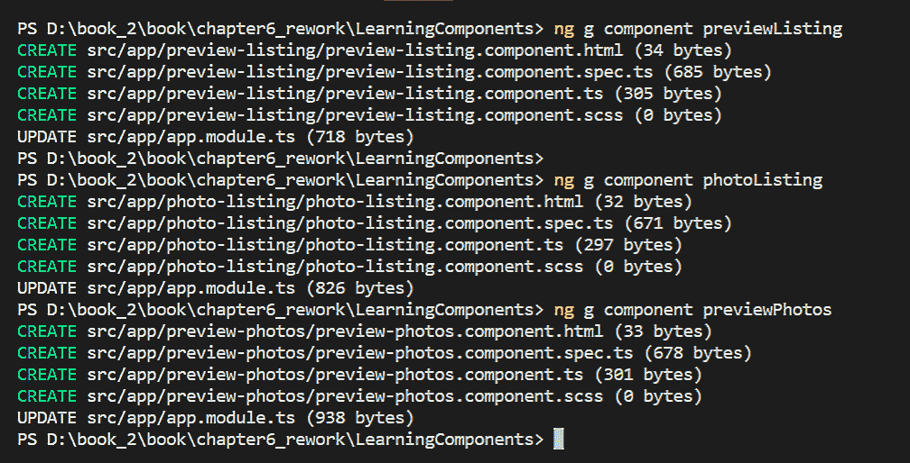
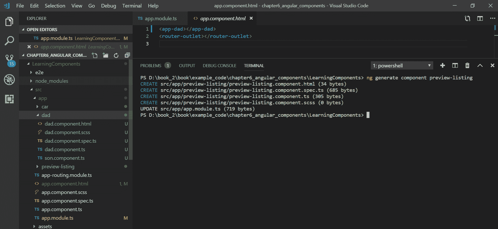

# 六、构建 Angular 组件


由于整个Angular是由几个相互关联的部分组成的，因此几乎不可能选择Angular的一部分比另一部分更重要。移除其中任何一个部分都会使整个系统变得毫无用处。话虽如此，如果我必须选择一个真正重要的部分，我会选择组件。关于组件有一些非常酷的事情，比如当我们构建组件时，我们基本上也在扩展 HTML，因为我们正在创建自定义 HTML 标记。组件是 TypeScript 类，我们将在本章后面看到，我们将代码链接到自定义 HTML 标记的方式是通过`@Component`注释。我还将在本章后面解释什么是注释。

关于从这一点开始使用的术语，我使用了*parts*一词，而不是*components*一词，以避免混淆，因为*component*一词是一个重载词，在不同的上下文中有不同的含义。此外，在谈到视图（即屏幕）时，我从传统 web 应用的Angular使用*页面*一词，而不是字面意义。

Angular应用包含单个根组件。但是，在讨论应用的屏幕或视图时，有必要提及作为该视图的根组件的其他组件。例如，注册屏幕有一个根组件。

下面是我们将一起讨论的主题要点列表：

*   作为组件树的Angular应用
*   `@Component`注释
*   `@Component`注释的属性
*   内容投影
*   生命周期挂钩
*   组件接口
*   实现与本章相关的三个线框所需的组件


# Angular 应用体系结构–组件树


Angular应用基本上是组件树。正如我们在前几章中了解到的，Angular 是一个 SPA 框架，因此有一个页面可用于显示其组件树。我们已经看到 Angular 有一个顶级组件，称为根组件，根据我们希望应用响应用户操作的方式，我们让根组件加载其他组件。这些其他组件（现在我们将它们称为*次根组件*）依次递归地呈现其他组件。我们在[第 4 章](04.html)*路由*中连接路由器的方式是，我们将 URL 映射到我们的*次根组件—*每个*页面*一个，当我们的用户点击导航（即菜单）链接时，它会弹出视图。

使这一切成为可能的是组件是可组合的。也就是说，我们的组件是由其他组件组成的，因此是嵌套的。我们可以将组件嵌套在任意深度的组件层次结构中，因此本节开头的语句，*Angular应用基本上是组件树*。

Angular 框架负责递归地加载和呈现我们的组件。


# 构建Angular应用


就像大多数工程项目一样，软件项目也需要有一个设计和架构应用的过程。典型的开始方式是将你正在构建的东西分解成单独的工作块。用 Angular 的话来说，这意味着我们需要将应用分解为单独的组件，每个组件负责某些事情，例如显示计算结果或接受用户输入。

一旦我们有了需要使用的组件列表（无论是第三方组件还是自定义组件），我们就需要将它们视为黑匣子或数学函数。让我解释一下我的意思。

当我说我们需要将组件视为黑匣子时，我的意思是我们不应该让我们的思想在这个阶段被它们的实现所消耗（也就是说，当我们仅仅列出它们时）。我们将在本章晚些时候关注构建组件，但现在，我们只需要将它们视为黑匣子。

当我说我们需要将组件视为数学函数时，我只是建议我们考虑输出是什么，以及函数（即我们的组件）需要什么输入。我们组件的输入和输出构成了它们的公共接口。在本章稍后的部分，我们将更详细地了解组件接口。


# 将组件分解为子组件


应用中的组件数量，甚至每页的组件数量，差别很大。它的范围从几个到几百个甚至更多。但是，有一个很好的经验法则，可以告诉你应该把一个组件（比如一个子组件，它是该特定页面的顶级组件）分解成多个子组件。如果您牢记组件的可重用性，那么在将组件分解为子组件时，您只需要问自己：“这个组件有两个或更多的部分可以在其他地方重用吗？”如果答案是肯定的，您可能会从进一步分解中受益。如果答案是否定的，那么就不需要再对组件进行分解了。

让我们考虑一个很快的例子，只是让它有点抽象。假设页面上有一个项目列表，每个项目一行，并且该项目是一个组件。我们还假设每个项目都有该项目的缩略图。如果缩略图可以在其他地方使用，可能在签出页面或项目详细信息页面上，那么该缩略图应该是它自己的组件和项目组件的子组件。

从项目列表示例中缩小一点，从页面视图开始，您可以采用以下方法来帮助您开始规划组件：

*   您的页眉是一个组件
*   您可能在页面的右侧有一个快速链接部分，这将是另一个组件
*   你有你的主要内容部分，占据了你屏幕的大部分，这也是一个组成部分
*   您的页脚也是一个组件

从前面的组件来看，除了主内容部分之外，所有组件都可能是可重用的。您可能希望您的页眉和页脚位于应用中的每个页面上，并且您可能希望在各个页面上重新显示“快速链接”部分。由于这些原因，这些组件可能不会有问题。无需进一步细分。您希望分解主要内容组件的原因是它不可重用，因为您不可能拥有同一页面的两个副本！


# 组成部分责任


构建的 Angular 应用将具有不仅可重用而且具有良好定义边界的组件。这就是说，他们有一个分离的关注点。每个组件都做一件事，而且做得很好。组件应该彼此分离，它们不应该知道彼此的细节（即实现）。他们应该相互了解的一件事是如何相互沟通。这是通过它们的公共接口实现的，我们将很快介绍这一点。

现在，您需要知道的是，在规划应用的组件时，应该列出它们的职责。也就是说，写下他们将要做的事情。精明的读者可能会看到用例图和组件职责列表之间的联系，因为组件是用户与应用交互的方式。


# 注释


注释是 TypeScript 的一个新特性。它们是符号，前缀为`@`符号，我们将其添加到代码中（也就是说，用于装饰我们的类）。注释可以出现在类声明的顶部，也可以出现在函数的顶部，甚至可以出现在类属性的顶部。一般来说，注释所做的是在附加的地方（即我们的类、函数或属性）注入样板代码。虽然我们不需要注释，因为我们可以选择自己编写样板代码，但我们最好利用它们，因为样板代码不必反复编写。此外，通过使用注释而不是手写样板代码，不仅消除了繁琐的工作，而且我们没有容易出错的代码要处理。我们将在本书的各个章节中看到更多注释，但让我们重点关注本章的[T1]和[T2]装饰。


# @组成部分


注释可以出现在类声明的顶部，或者函数的顶部，甚至类属性的顶部，而`@Component`注释将始终出现在组件的类声明的顶部。

为了使`@Component`注释对我们可用，我们必须像这样导入它：

```ts
import { Component } from '@angular/core';
```

让我们看一下这行代码。特别是 JavaScript，ES6。如果您回想一下[第 2 章](02.html)、*ECMAScript 和 TypeScript 速成课*，该语句的大括号部分是 ES6 中一个名为*destructuring*的新构造。此外，没有指向`@angular/core`模块的显式路径。我们让 CLI 和 TypeScript 编译器来确定模块的位置，以及应该如何加载模块并使其可用于类中的代码。


# @Component 装饰器的属性


`@Component`decorator 为我们提供了许多属性，用于配置我们的组件。让我们看看它们。


# 选择器


`selector`是`@Component`注释的一个属性，它的值（string 类型）是我们自定义 HTML 标记的名称。我喜欢汽车，下面是代码中的`car`组件示例，显示了它的注释、选择器和类名：

```ts
@Component({
 selector: 'car'
})
class CarComponent {
}
```

当 Angular 看到我们的自定义 HTML 标记`<car></car>`时，它会创建一个`CarComponent`的实例，并用浏览器实际理解的 HTML 替换我们的自定义标记。好的，但是在我们的组件类中，我们在哪里添加东西来给我们的组件带来幽灵般的光环呢？下一节是答案（即，`template`属性）。


# 模板和模板 URL


我们可怜的小部件还没有看得见的身体。这是因为 Angular 需要知道在呈现`car`组件时要添加哪些浏览器友好的 HTML，而我们只是还没有为 Angular 提供这些。提供的方法是使用`template`属性（类型为 string）保存 Angular 在创建`CarComponent`类的实例后为我们呈现的 HTML（任何时候它看到我们的自定义标记`<car></car>`）。让我们通过加强前面的`@Component`注释来纠正这个问题：

```ts
@Component({
  selector: 'car',
  template: '<h3>What production car has the fastest acceleration 
     time from 0 to 60?</h3><p>Tesla </p>'
})
class CarComponent {
}
```

如果我们的组件需要大量 HTML，会发生什么？这就是为什么我们有另一个可以使用的财产，`templateUrl`*。*该*`templateUrl`属性为我们提供了一种从组件类外部化组件的 HTML 并将其保存在单独文件中的方法。您的`template`财产看起来像这样：*

```ts
template: 'car.html'
```


# 样式和样式表


`styles`属性用于您希望用于向组件模板添加样式的内容。与[T1]属性一样，该值的类型为 string。此外，由于在多行之间隔开时最容易读取 CSS，我们将使用回勾字符（在 ES6 中是新的，因此在 TypeScript 中也可用），这使我们能够创建称为*模板文本*。让我们将[T2]参数添加到我们的[T3]类中，看看这是什么样子：

```ts
@Component({
 selector: 'car',
  template: '<h3>What production car has the fastest acceleration 
     time from 0 to 60?</h3><p>Tesla </p>',
  styles: [`
    .car {
      color: #008000;
      font-weight: bold; 
    }
  `]
})
class CarComponent {
}
```

这就是`styles`财产的全部内容。我打赌你能猜出`styleUrls`属性的作用。是的，它就像`templateUrl`属性一样工作。它为我们提供了一种从我们的组件类外部化组件的 CSS 并将其包含在外部化样式表中的方法。请注意，我提到了*文件*，与*文件*的复数形式相同。`styleUrls`属性接受字符串数组的值（与`templateUrl`属性的值为 String 类型不同）——因此，如果我们想*的话，我们可以将多个样式表传递给它。*

因此，通过使用模板、`templateUrl`、样式和`styleUrls`属性的组合，我们可以将 HTML（即我们的组件模板）和我们希望应用于模板的 CSS 封装在我们的组件类中，这要感谢`@Component`注释为我们提供的属性。由于`selector`属性，我们可以在组件的父模板中使用自定义 HTML 标记。你开始对所有这些东西是如何结合在一起的有了良好的感觉了吗？如果没有，不用担心，当我们开始实现示例应用的视图时，您很快就会看到。


# 视图封装


视图封装是一种非常方便、非常酷的东西，因为 Angular 中的大多数东西都用于配置 CSS 的范围

通常，当我们创建（或更改）CSS 类时，样式将应用于整个应用，而不限于特定的页面、组件等。Angular 允许我们将样式封装（即限制或包含）到包含给定样式表/CSS 的组件中，从而为我们提供了一定程度的控制。这是通过`@Component`注释的另一个属性`encapsulation`完成的。

我们可以将组件样式的封装设置为以下三个可能值之一：

*   `ViewEncapsulation.Emulated`：这是默认值，其效果是我们的样式将仅包含在我们的组件中。它们不会影响我们页面上的任何其他内容。但是，我们的组件仍将继承或访问应用全局可访问的样式。
*   `ViewEncapsulation.Native`：这与`ViewEncapsulation.Emulated`基本相同，只是我们要求 Angular 阻止或屏蔽我们的组件，使其不受任何全局定义样式的影响。其效果是，我们的组件将不受任何未分配给`@Component`注释的`styles`或`styleUrls`属性的样式的影响
*   `ViewEncapsulation.None`：如果我们根本不想控制 CSS 隔离的级别，我们会使用这个设置。换句话说，如果我们想让我们的组件的 CSS 影响其他页面资产，也希望我们的组件继承全局定义的 CSS 规则集，这就是我们要使用的设置。

这是不是很酷？这真是一个特色！仔细想想，这是使代码重用成为可能的因素之一，即使是在应用之间，而不仅仅是在同一个应用中。如果我们想保证我们的组件在不同Angular的应用中看起来是一样的，不管任何给定的应用的样式如何，我们可以将组件的`encapsulation`属性设置为`ViewEncapsulation.Native`，这样就可以了。


# 模块与 NG 模块


术语就是一切，因为它很容易混淆事物的语义。当主题中的语言/术语包含与主题一样多的词时，尤其如此。例如，我们已经看到，我们必须非常明确地说明*组件*和*页面*的含义。同样的道理也适用于*模块*，所以在我们继续之前，我想先澄清一下。

正如我们在[第 2 章](02.html)、*ECMAScript 和 TypeScript 速成课*中所看到的，模块的概念在 ES6 中是全新的。在 JavaScript 中，当我们谈论一个模块时，我们通常指的是一个代码文件，然后我们可以将其导入到执行脚本的上下文中，使其封装的函数可用于脚本。Angular模块或`NgModule`是由多个文件组成的模块，因此通常称为包。因为我们对待这个`NgModule`或包的方式与导入 JavaScript 模块的方式大致相同，所以我们通常认为它们是等价的，但事实并非如此。

本章的重点是组件，但我们也将在[第 11 章](11.html)、*依赖注入和服务*中构建我们自己的`NgModules`，将我们对后端 API 的调用封装在一个内聚包中。

在我们结束对`NgModule`的讨论之前，将进一步的讨论推迟到后面的章节，我想至少谈谈它的几个参数，因为`@NgModule`是我提到的另一个注释。


# @NgModule decorator 的属性


如果您查看我们在[第 4 章](04.html)、*路由*中开始构建的示例应用中的`app.module.ts`文件，您可以看到我们的`AppModule`类上的`@NgModule`注释中有四个参数。让我们快速浏览一下这四个和我们使用它们：

*   **声明**：这是我们在`NgModule`中列出需要打包的组件和指令的地方。
*   **进口**：这使得我们`NgModule`可以使用其他模块的出口申报。
*   **提供者**：我们在这里列出服务和值，以便**依赖注入**（**DI**知道它们。它们被添加到根作用域中，并被注入到将它们作为依赖项的其他服务或指令中。我们将在[第 12 章](12.html)*集成后端数据服务*中介绍 DI。
*   **Bootstrap**：这里列出了我们希望在应用启动时Bootstrap的组件。

在我们的应用中，只有一个`NgModule`可以使用 Bootstrap 参数，因为Bootstrap过程只从一个模块开始。


# 内容投影


内容投影的概念为组件开发人员提供了一种可以提高其可重用性的机制。特别是，我指的是数据的显示方式（即渲染）

这意味着，与其尝试创建一个具有各种可能方式的属性的组件，还可以更改其模板（这几乎是不可能的），以便使用该组件的开发人员可以更改这些属性的值以自定义其呈现方式。内容投影提供了一种不用太过拘谨就能实现这一点的方法

我们使用的机制是一对`ng-content`标签，如下所示：`<ng-content></ng-content>`。

我们将在照片列表页面中实际看到这一点，但现在让我向您展示一个人为的示例。让我们将`CarComponent`中的模板修改为以下代码段（添加一对`ng-content`标记）：

```ts
template: '<h3>What production car has the fastest acceleration time from 0 to 60?</h3><ng-content></ng-content>'
```

这样做是为了使 CarComponent 的父组件能够将内容投影到 CarComponent 的模板中，从而根据需要修改模板。我们假设不只是在一组`<p>`标记中显示汽车制造商，而是在一组`<strong>`标记中显示汽车制造商

以下是父组件的外观：

```ts
<car>
    <strong>Tesla</strong>
</car>
```

它看起来像前面的内容，而不是下面的内容：

```ts
<car></car>
```

同样，这是一个人为的例子。另外，Angular的关键是要有动态数据，但我们这里没有这样做。例如，我们将汽车问答数据绑定到组件模板中的元素，而不是硬编码（到*哪个生产汽车的加速时间最快，从 0 到 60？*和*特斯拉*，在本例中），我们简化的硬编码代码通过不动态化数据以最直接的方式说明了内容投影的概念，我们将在本书稍后的部分中这样做。


# 投影多个截面


可以包含多对`ng-content`标签。但是，由于 Angular 无法判断哪个投影内容替换了哪组`ng-content`标记，因此我们需要以某种方式标记`ng-content`标记，以消除它们之间的歧义

标签或标记`ng-content`标记的一种简单方法是通过类名识别元素，以便预期的投影内容替换所需的`ng-content`标记集。我们使用一个名为`select`的属性`ng-content`标记标签。让我们扩展我们设计的`CarComponent`示例，看看两对`ng-content`标签的外观：

```ts
template: '<ng-content select=".question"></ng-content><ng-content select=".answer"></ng-content>'
```

以下是父组件的外观：

```ts
<car>
    <h3 class="question">What production car has the fastest acceleration 
       time from 0 to 60?</h3>
    <span select="answer"><strong>Tesla</strong></span>
</car>
```

通过使用`ng-content`标记及其`select`属性，如果您有多个内容投影目标，您可以创建可由使用它们的开发人员自定义的组件


# 生命周期挂钩


与几乎所有活着的生物一样，从太阳系中的恒星到你可能买来装饰餐桌的鲜花，有Angular的组件也有一个生命周期——不同的阶段，从它们出现的那一刻到它们不存在的那一刻。

我们可以挂接到这些不同的阶段来运行任何代码，当我们的组件在这些阶段中移动时，我们可能希望为我们运行这些代码。这之所以成为可能，是因为 Angular 为我们提供了特殊的方法，Angular 为我们调用的组件生命周期的每个阶段提供了一种方法。我们所要做的就是提供我们想要运行的代码，我们这样做的方式就是向我们的组件类添加函数，这些函数与生命周期挂钩同名。

组件有一组生命周期挂钩，它的子组件（即子组件）也有一组生命周期挂钩。下表列出了最常见的方法：

| **生命周期挂钩** | **型** | **在。。。** |
| `constructor` | 组成部分 | Angular 在类上调用[T0]后创建一个组件。 |
| `ngOnInit` | 组成部分 | 组件已完全初始化。 |
| `ngOnChanges` | 组成部分 | 输入属性发生了更改（按机会调用一次）。 |
| `ngOnDestroy` | 组成部分 | Angular 将要破坏组件。 |
| `ngAfterContentInit` | 孩子 | 组件发生内容投影之后。 |
| `ngAfterContentChecked` | 孩子 | Angular 在内容上运行其更改检测算法。 |
| `ngAfterViewInit` | 孩子 | 组件的视图已完全初始化。 |
| `ngAfterViewChecked` | 孩子 | Angular 在视图上运行其更改检测算法。 |


# 最常见的生命周期挂钩


从前面的八个生命周期挂钩中，您最有可能只使用其中的三个（在大多数情况下）。所有三个都属于生命周期挂钩的组件类型：

*   `ngOnInit`：我们组件的初始化逻辑将显示在这里。您可能认为构造函数是添加初始化逻辑的地方，但是`ngOnInit`更可取，因为通过我们的接口（即输入属性）进行的任何数据绑定都已经完成。构造函数阶段并非如此
*   `ngOnChanges`：当我们想知道哪些输入属性发生了更改，以及它们被更改为什么时，我们可以在这里查看。
*   `ngOnDestroy`：这是我们为组件插入清理逻辑的地方（如果我们有任何需要清理的东西，我们不使用它）。

下面是一个我们如何钩住`ngOnInit`生命周期钩子的例子（我们将只向控制台写出一些输出）：

```ts
class CarComponent {
    ngOnInit()  {
        console.log('An instance of our CarComponent has 
            been fully initialized.');
    }
}
```


# 组件接口–输入和输出以及数据流


如果要在特定屏幕（即视图/页面）上创建组件图，并在它们之间绘制箭头以指示数据流，则箭头将指向从一个组件的输出到另一个组件的输入。

在代码中，我们将在后面的实现中看到，绑定输出和输入的方式在我们的组件模板中（即 HTML 中）。但是要在 HTML 中进行绑定，我们需要在代码中创建组件，并为它们提供接口。

让我们快速查看一个具体的例子，它将显示一个父组件如何将数据传递给它的子组件。为了演示这一点，我们首先创建两个组件。

这是我们的`DadComponent`，它将是父组件：

```ts
import {Component } from '@angular/core';
@Component({
    selector: 'dad',
    template: `<h1>Hello. {{message}}.</h1> <br/> 
        <son *ngFor="let name of arrSonNames" 
        [Name]="name">
        </son>
    `,
})
export class DadComponent { 
    message : string = "I'm a Dad";
    arrSonNames = ['Justin','','Brendan'];
}
```

这是我们的`SonComponent`，它将是子组件：

```ts
import { Component, Input, OnInit } from '@angular/core';
@Component({
    selector: 'son',
    template: `<h2>Hi. I'm a son, and my name is {{_name}}.</h2>`
})
export class SonComponent implements OnInit {
    _name: string;
    constructor() {
        console.log("The son component was just instantiated.");
    }
    ngOnInit(){
        console.log("The son component is now fully initialized.");
    }
    @Input()
    set Name(name : string ) {
        this._name = (name && name.trim()) || "I am a son."; 
    }
    get Name() {
        return this._name;
    }
}
```

这段代码中有很多内容。我不会描述在前面的代码块中发生了什么。相反，我想让你们研究几分钟，看看你们是否能弄清楚到底发生了什么。您应该从前面的章节中获得足够的信息，以及一些 JavaScript/TypeScript 的基本知识，并了解 getter 和 setter（正如许多语言一样）。我知道你能做到，试试看。我给你两个提示：1）`@Input()`是一个装饰器，在本例中，它创建了`SonComponent`的公共接口；2） `DadComponent`将创建`SonComponent`的三个实例。两个儿子会知道自己的名字，不幸的是，其中一个儿子不知道自己的名字。他怎么说？知道自己名字的儿子叫什么名字？你知道为什么会有三个儿子吗？您能猜到控制台将写入什么，以及写入多少次吗？

在我们的实现中，我们将看到很多这种模式，所以如果它看起来很奇怪，或者看起来有点复杂，并且您无法回答我提出的所有问题，请不要担心。这些东西在一段时间后会成为你的第二天性。是的，我将从现在开始解释我们的实现代码，不是非常详细，而是足够详细，让您理解手头的资料。现在，我只是想让您了解一下通过组件接口传递数据的情况。


# 我们的三页组件的实现


我们现在有足够的知识来实现（即，在代码中创建）示例应用的以下三页所需的组件：

*   预览列表
*   照片列表
*   预览照片

为了生成这些组件，我们将使用 Angular CLI 示意图。运行以下命令，我们将自动生成组件和所需文件：

```ts
ng generate component photo-listing
ng generate component preview-listing
ng generate component preview-photo
```

命令成功运行后，我们将看到输出，如以下屏幕截图所示：



在前面的屏幕截图中，我们可以注意到已经为组件生成了相应的文件，`app.module.ts`文件已经用生成的最新组件进行了更新。

到目前为止，我们应用的最终项目结构以及生成的组件如下所示：




# 总结


在本章中，我们已经介绍了很多方面。您可能还没有完全理解上一节中的一些代码，这是可以的，因为在我们一起实现示例应用的页面时，您将很好地掌握这些内容。因为本章是关于组件的，所以我只想向您展示如何设置父组件和子组件的一般结构，以及如何通过子组件的公共接口将数据从父组件传递给子组件。然而，您现在应该已经很好地理解了 Angular 应用如何只是一个组件树，将组件分解为子组件的经验法则是什么，以及什么是注释和装饰器。

我们还研究了`@Component`注释/装饰器是什么，它的属性是什么，以及如何配置它们。然后我们继续讨论`@NgModule`装饰器是什么，它的一些属性是什么，它们有什么用途。然后，我们研究了什么是内容投影，以及如何使用它来允许使用您的组件的其他开发人员自定义其呈现。

最后，我们研究了什么是生命周期挂钩，如何使用它们，以及为什么要使用它们。然后我们继续讨论组件接口以及如何创建它们。最后，我们研究了三个页面（预览列表、照片列表和预览照片）所需组件的实现

在下一章[第 7 章](07.html)*模板、指令和管道*中，我们将放大组件的模板部分，因为这是所有数据绑定和渲染的地方，将我们的Angular应用从一堆 0 和 1 带到屏幕上。

Angular 以指令和管道的形式提供了许多工具供我们使用，因此我们可以告诉它如何在画布上绘制。因此，翻过这一页，让我们了解如何开始在应用画布上绘制组件，使应用生动起来，我们将在三个页面上放置组件（预览列表、照片列表和预览照片）*