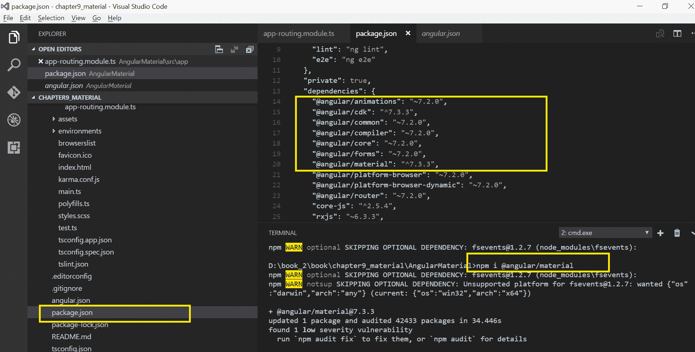
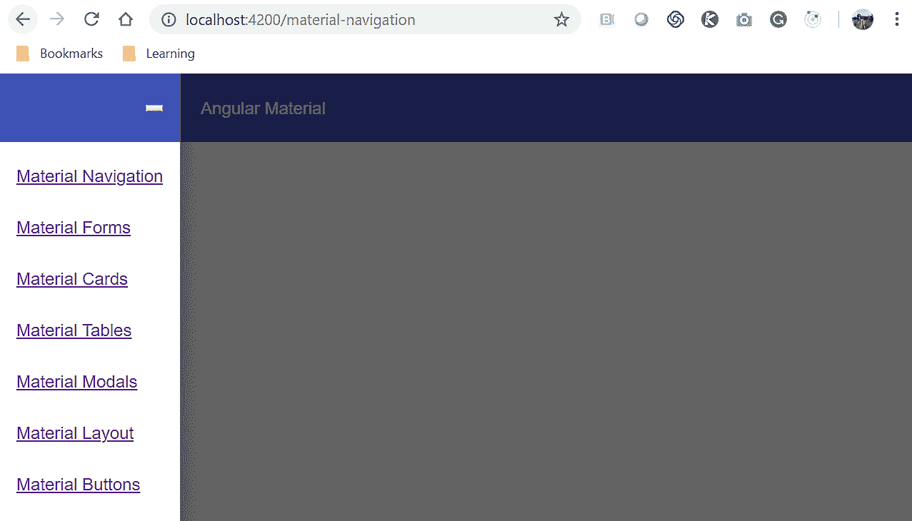
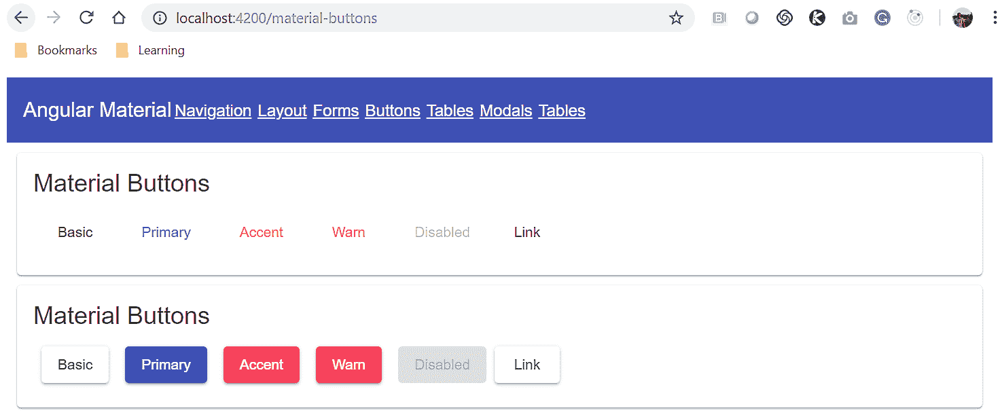
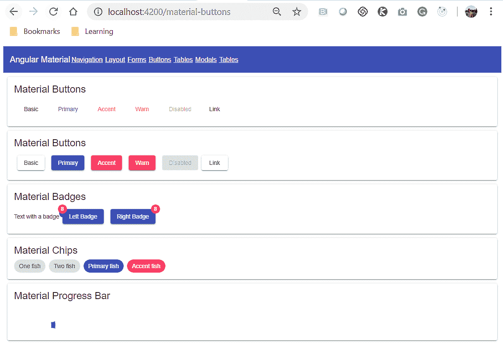

# 使用棱角材料


欢迎来到关于角材料的章节。我必须说，我印象深刻。统计数据显示，大多数购买科技书籍的人对这些书籍了解不多。你完成这本书的一半多一点——干得好，棱角分明的绝地武士！

这将是一个简短的章节，有几个原因。首先，本书主要用于构建应用程序，主要使用 Angular 和 Bootstrap。因此，请将本章视为对我们的额外奖励。另一个原因是本章仅旨在介绍一种替代的**用户界面**（**UI**）组件库，用于在使用 Angular 时引导。应该有一本单独的关于角度材料的书，但本章将涵盖大量基础知识，向您展示该库提供的功能和组件

我们将学习导航和菜单组件、布局组件、表单字段元素、按钮、对话框和弹出组件，以及许多您肯定会欣赏的有趣元素，并可能考虑下一个项目中的框架。

通过总结，我们将在本章中介绍的主题包括：

*   什么是角材料？
*   安装角材料
*   组件类别

好的，让我们从描述什么是角材料开始


# 什么是角材料？


Angular Material 是一个丰富的组件集合，可轻松插入 Angular 应用程序，也可用于 web、移动和桌面应用程序。材料设计来自 Angular 的制造商 Google，这基本上意味着对组件以及未来将推出的新组件进行了大量本地支持、优化和性能调整。下面的列表显示了当我们考虑在我们的应用中使用材料设计时，我们得到的一些好处：

*   UI 组件可以立即使用，无需任何额外的开发工作
*   我们可以选择性地选择单独使用组件，而不是被迫一次导入所有模块
*   组件的渲染速度非常快
*   通过双向或单向数据绑定功能，可以轻松地将数据插入组件，这是 Angular 的一个极其强大的功能
*   这些组件在 web、移动和桌面应用程序中具有相同的外观、感觉和行为，从而解决了许多跨浏览器和跨设备的问题
*   性能经过调整和优化，可与角度应用程序集成

You can find all the required documentation about Angular Material on the official website at: [http://material.angular.com](https://material.angular.io/).

在我们继续本章之前，让我们快速生成应用程序，在该应用程序中，我们将实现所有角度材质组件。运行以下`ng`命令以生成名为`AngularMaterial`的新应用程序：

```ts
ng new AngularMaterial
```

命令成功执行后，我们将看到以下屏幕截图中显示的输出：


现在我们的应用程序已经生成，让我们学习如何在项目中安装角度材质库


# 安装角材料


现在，你会有一种强烈的直觉，当我们想在 Angular 应用程序中安装任何东西时，我们有一个强大的**命令行界面**（**CLI**工具。我们将继续使用相同的 CLI，在`npm`的帮助下，我们将安装 Angular Material

You can also choose to install Angular Material via the YARN command—different packaging systems, same outcome.

Angular Material 有一个核心依赖项和安装两个软件包 CDK 和动画的先决条件。那么，让我们先安装这些，然后安装角材料：

```ts
npm i @angular/cdk --save

npm i @angular/animations --save

npm i @angular/material --save
```

成功运行上述命令后，我们将看到以下屏幕截图中显示的输出：



打开`package.json`文件；我们应该看到已经安装的软件包，以及相应的版本号。如果您看到我们最近安装的三个软件包，这意味着我们已经准备好开始使用角材料创建一些很棒的 UI 屏幕。

一旦我们安装了 Angle Material，我们将需要将所有需要的模块导入到我们的`app.module.ts`文件中。Material 提供了很多模块，每个模块都有特定的用途。例如，如果我们计划使用物料卡，我们将需要导入`MatCardModule`。同样，如果我们想在应用中使用材料芯片，我们需要进口`MatChipsModule`。虽然我们肯定只能将所需的模块导入`AppModule`，但在大多数使用 Material UI 的应用程序中，我们将需要所有模块。现在，让我们快速了解如何一次性导入所有模块。我们可以将所有模块导入一个通用模块，然后在`app.module.ts`文件中使用新创建的通用模块。首先，让我们在项目结构中创建一个文件，并将其命名为`material-module.ts`，然后我们可以添加以下代码，以便将所有模块导入该文件：

```ts
import {A11yModule} from '@angular/cdk/a11y';
import {DragDropModule} from '@angular/cdk/drag-drop';
import {ScrollingModule} from '@angular/cdk/scrolling';
import {CdkStepperModule} from '@angular/cdk/stepper';
import {CdkTableModule} from '@angular/cdk/table';
import {CdkTreeModule} from '@angular/cdk/tree';
import {NgModule} from '@angular/core';
import {
 MatAutocompleteModule,
 MatBadgeModule,
 MatBottomSheetModule,
 MatButtonModule,
 MatButtonToggleModule,
 MatCardModule,
 MatCheckboxModule,
 MatChipsModule,
 MatDatepickerModule,
 MatDialogModule,
 MatDividerModule,
 MatExpansionModule,
 MatGridListModule,
 MatIconModule,
 MatInputModule,
 MatListModule,
 MatMenuModule,
 MatNativeDateModule,
 MatPaginatorModule,
 MatProgressBarModule,
 MatProgressSpinnerModule,
 MatRadioModule,
 MatRippleModule,
 MatSelectModule,
 MatSidenavModule,
 MatSliderModule,
 MatSlideToggleModule,
 MatSnackBarModule,
 MatSortModule,
 MatStepperModule,
 MatTableModule,
 MatTabsModule,
 MatToolbarModule,
 MatTooltipModule,
 MatTreeModule,
} from '@angular/material';

@NgModule({
 exports: [
 A11yModule,
 CdkStepperModule,
 CdkTableModule,
 CdkTreeModule,
 DragDropModule,
 MatAutocompleteModule,
 MatBadgeModule,
 MatBottomSheetModule,
 MatButtonModule,
 MatButtonToggleModule,
 MatCardModule,
 MatCheckboxModule,
 MatChipsModule,
 MatStepperModule,
 MatDatepickerModule,
 MatDialogModule,
 MatDividerModule,
 MatExpansionModule,
 MatGridListModule, 
 MatIconModule,
 MatInputModule,
 MatListModule,
 MatMenuModule,
 MatNativeDateModule,
 MatPaginatorModule,
 MatProgressBarModule,
 MatProgressSpinnerModule,
 MatRadioModule,
 MatRippleModule,
 MatSelectModule,
 MatSidenavModule,
 MatSliderModule,
 MatSlideToggleModule,
 MatSnackBarModule,
 MatSortModule,
 MatTableModule,
 MatTabsModule,
 MatToolbarModule,
 MatTooltipModule,
 MatTreeModule,
 ScrollingModule,
] 
})
export class MaterialModule {}
```

在前面的代码中，我们将所有必需的模块导入到该文件中。现在还不用担心对前面列出的模块进行分类。当我们了解材料提供的组件时，我们就了解了模块。下一步很明显，我们需要将这个新创建的模块导入到我们的`app.module.ts`文件中：

```ts
import {MaterialModule} from './material-module';
```

导入模块后，别忘了将其添加到`AppModule`的导入中。就这样。我们都准备好开始学习和实现 Angular Material 提供的组件。

Did you know? Google has also released a lightweight CSS- and JavaScript-based, Lite library, Material Design Lite, which starts by using the components in the same way as in any other UI library. However, there may be some components that do not have full support. Learn more about it at [https://getmdl.io/](https://getmdl.io/).

让我们直接开始学习角材料的组成部分。


# 组件类别


作为前端开发人员，您将使用许多 UI 组件，或者更好的是，您可能在过去的项目中创建了自己的自定义组件。如前所述，Angular Material 提供了许多组件，可以方便地在我们的应用程序中使用。Angle Material 提供的 UI 组件可分为以下类别：

*   布局
*   材料卡片
*   窗体控件
*   航行
*   按钮和指示器
*   情态动词和弹出窗口
*   桌子

为这些类别中的每一个生成组件是一个好主意，这样当我们开始实现应用程序时，占位符就可以使用了。这些组件将以明确分类的方式承载所有组件，它们将成为一站式组件，您可以使用它们引用材质库中的任何组件实现。

首先，让我们为我们的类别生成组件。依次运行以下`ng`命令：

```ts
ng g component MaterialLayouts
ng g component MaterialCards
ng g component MaterialForm
ng g component MaterialNavigation
ng g component MaterialButtons
ng g component MaterialModals
ng g component MaterialTable
```

命令成功运行后，我们应该看到组件已生成并添加到我们的项目结构中，如以下屏幕截图所示：


伟大的我们已经生成了我们的应用程序；我们安装了角材料。我们还将所有需要的模块导入到我们的`AppModule`文件中，最后，我们在 Material 的 UI 组件中为每个类别生成了组件。在开始实施材质组件之前，我们需要做的最后一件事是为前面列出的每个类别添加管线。打开`app-routing.module.ts`文件，导入所有新创建的组件，并将路由添加到文件中：

```ts
import { NgModule } from '@angular/core';
import { Routes, RouterModule } from '@angular/router';
import { MaterialFormComponent } from './material-form/material-form.component';
import { MaterialNavigationComponent } from './material-navigation/material-navigation.component';
import { MaterialCardsComponent } from './material-cards/material-cards.component';
import { MaterialLayoutComponent } from './material-layout/material-layout.component';
import { MaterialTableComponent } from './material-table/material-table.component';
import { MaterialModalsComponent } from './material-modals/material-modals.component';
import { MaterialButtonsComponent } from './material-buttons/material-buttons.component';

const routes: Routes = [
 { path: 'material-forms', component: MaterialFormComponent },
 { path: 'material-tables', component: MaterialTableComponent },
 { path: 'material-cards', component: MaterialCardsComponent},
 { path: 'material-layouts', component: MaterialLayoutComponent},
 { path: 'material-modals', component: MaterialModalsComponent },
 { path: 'material-buttons', component: MaterialButtonsComponent },
 { path: 'material-navigation', component: MaterialNavigationComponent }
];

@NgModule({
 imports: [RouterModule.forRoot(routes)],
 exports: [RouterModule]
})
export class AppRoutingModule { }
```

在前面的代码中，我们导入了所有新创建的组件，并为每个组件创建了路由路径。到目前为止，一切顺利。现在，大舞台已经准备好了，可以开始摇晃了。让我们先从布局开始。


# 航行


任何 web 应用程序最常见和最基本的必需品之一是导航菜单或工具栏。Angular Material 为我们提供了多个选项，通过这些选项，我们可以选择最适合我们应用的菜单类型


# 使用示意图的导航部件


我们将从最简单、最快的方式开始，通过使用示意图将导航添加到我们的应用程序中。没错，我们只需要一个命令就可以启动并运行菜单。Angular CLI 提供了示意图，以获得广泛的组件。要在我们的应用程序中安装导航菜单，请在 Angular CLI 命令提示符中运行以下命令：

```ts
ng generate @angular/material:nav myMenu
```

在前面的命令中，我们使用 schematics 生成了一个名为`myMenu`的新菜单组件。成功运行命令后，我们将看到以下屏幕截图中显示的输出：


使用`ng serve`命令运行应用程序，我们会看到如下屏幕截图所示的输出：


这不是一个很酷的导航菜单吗？它带有一个顶部标题工具栏和一个可折叠的侧边栏菜单。该部件由示意图自动生成。如果你不太喜欢自动生成的组件，没关系，我们开发人员可以对这些事情挑剔。让我们看看如何创建自己的菜单


# 自定义材质菜单和导航


Angular Material 提供一个`MatMenuModule`模块，该模块提供指令`<mat-menu>`和`MatToolBarModule`。还提供了`<mat-toolbar>`，它将用于在我们的应用程序中实现菜单和标题。打开`material-navigation.component.html`文件并添加以下代码：

```ts
<mat-toolbar id="appToolbar" color="primary">
<h1 class="component-title">
 <a class="title-link">Angular Material</a>
 </h1>
 <span class="toolbar-filler"></span>
 <a href="#">Login</a>
 <a href="#">Logout</a>
</mat-toolbar>
```

在前面的代码中，我们使用`<mat-toolbar>`作为包装器实现了工具栏指令，并使用`<h1>`添加了标题标题。我们还添加了一些标题部分的链接。使用`ng serve`运行应用程序，我们会看到如下屏幕截图所示的输出：


太好了。让我们再加强一点。我们想在标题工具栏上添加一个下拉菜单。还记得我告诉过你我们有`MatMenuModule`模块提供的`<mat-menu>`指令吗？让我们在前面的代码中将 menu 指令添加到标题工具栏，如下所示：

```ts
<mat-toolbar id="appToolbar" color="primary">
<button md-icon-button (click)="sidenav.toggle()" class="md-icon-button sidenav-toggle-button" [hidden]="sidenav.opened">
<mat-icon aria-label="Menu" class="material-icons">menu</mat-icon>
</button>

<h1 class="component-title">
<a class="title-link">Angular Material</a>
</h1>
<span class="toolbar-filler"></span>

<button mat-button [matMenuTriggerFor]="menu" color="secondary">Menu</button>
<mat-menu #menu="matMenu" >
<button mat-menu-item>Item 1</button>
<button mat-menu-item>Item 2</button>
</mat-menu>

<a href="#">Login</a>
<a href="#">Logout</a>
</mat-toolbar>
```

请注意，我们使用`mat-button`属性添加了一个按钮，并绑定了`matMenuTriggerFor`属性。这将显示用`<mat-menu>`指令定义的下拉菜单。现在让我们使用`ng serve`命令运行应用程序，我们应该看到如下输出：


# 自定义侧边栏菜单


令人惊叹的所以，现在我们已经准备好了定制菜单。我知道你想要更多，不是吗？你想添加一个侧边栏吗？让我们做吧。为了将侧栏添加到我们的应用程序中，Angular Material 为我们提供了一个`MatSidenavModule`模块，它提供了我们可以在应用程序中使用的`<mat-sidenav>`指令。因此，让我们继续修改前面的代码，如下所示：

```ts
<mat-sidenav-container fullscreen>
 <mat-sidenav #sidenav mode="push" class="app-sidenav">
 <mat-toolbar color="primary">
 <span class="toolbar-filler"></span>
 <button md-icon-button (click)="sidenav.toggle()" class="md-icon-button 
   sidenav-toggle-button" [hidden]="!sidenav.opened">
 </button>
 </mat-toolbar>
</mat-sidenav>
<mat-toolbar id="appToolbar" color="primary">
 <button md-icon-button (click)="sidenav.toggle()" class="md-icon-button 
   sidenav-toggle-button" [hidden]="sidenav.opened">
 <mat-icon aria-label="Menu" class="material-icons">menu</mat-icon>
 </button>
 <h1 class="component-title">
 <a class="title-link">Angular Material</a>
 </h1>
 <span class="toolbar-filler"></span>
 <button mat-button [matMenuTriggerFor]="menu" 
   color="secondary">Menu</button>
 <mat-menu #menu="matMenu" >
 <button mat-menu-item>Item 1</button>
 <button mat-menu-item>Item 2</button>
 </mat-menu>
 <a href="#">Login</a>
 <a href="#">Logout</a>
 </mat-toolbar>
</mat-sidenav-container>
```

不要因为看到代码行数而害怕。我们刚刚做了一些更改，例如添加了`<mat-sidenav>`指令，该指令将包含侧边栏的内容。最后，我们将整个内容包装在`<mat-sidenav-container>`指令中；这很重要，因为侧边栏将覆盖在内容上。使用`ng serve`命令运行应用程序，我们会看到如下屏幕截图所示的输出：



如果您看到前面屏幕截图中显示的输出，请拍拍自己的背。荣誉你做得太棒了。因此，我们学习了在应用程序中实现导航和菜单的两种方法。我们可以使用示意图生成导航组件，也可以编写自定义菜单导航组件。无论哪种方式，**用户体验**（**用户体验**）获胜！ 

现在我们有了导航菜单组件，让我们了解一下“角度材质库”的其他组件。


# 卡片和布局


在本节中，我们将学习角度材质卡片和布局。角度材质的基本布局组件是卡片。卡片包装器布局组件还可以包括列表、手风琴或扩展面板、选项卡、步进器等


# 材料卡片


卡片是用于对单个主题的数据进行分组的文本、图像、链接和操作的内容容器。卡片可以有标题、正文、图像或链接，可以根据其可用性和功能向用户显示。Angle Material 提供一个名为`MatCardModule`的模块，该模块提供`<mat-card>`指令。我们将使用它对应用程序的内容进行分组。

创建卡片的基本示例如下所示：

```ts
<mat-card class="z-depth" >
 <mat-card-title><a href="" primary >Packt Books</a></mat-card-title>
 <mat-card-subtitle>Family of wonderful Authors and Readers
   </mat-card-subtitle>
 <mat-card-content>
 We are learning to create wonderful cards. Each card has some specific 
  data to be displayed to users.
 </mat-card-content>
<mat-card-actions> <button mat-raised-button>Tweet This</button>
  <button mat-raised-button>Share</button></mat-card-actions>
</mat-card>
```

在前面的代码中，我们使用了`MatCardModule`提供的指令。我们将使用`<mat-card>`作为包装器指令，以便对内容进行分组。通过使用`<mat-card-title>`指令，我们正在设置卡片的标题。我们正在`<mat-card>`指令中使用`<mat-card-subtitle>`指令设置字幕。在`<mat-card-content>`中，我们放置了所有需要向用户显示的内容。每张卡片可能都有我们希望用户执行的操作，如共享、编辑、批准等。我们可以使用`<mat-card-actions>`指令显示卡操作。

使用`ng serve`命令运行应用程序，我们会看到如下屏幕截图所示的输出：


请注意，我们在“角度材质”卡中添加了一些内容。你想知道卡片里面可以显示什么样的内容吗？你说吧，我们可以用它。我们可以添加链接、图像、列表、手风琴、步进器等。在下一节中，我们将学习如何将列表添加到卡中。


# 列表


列表是分组在一起的项的集合。在我们的应用程序中，可以是有序列表，也可以是无序列表。在本节中，我们将学习如何在卡片中添加不同类型的列表。查看以下示例代码：

```ts
<mat-card class="z-depth" >
 <mat-card-title>Material Lists</mat-card-title>
 <mat-card-content>
 <mat-list>
 <mat-list-item> New York City</mat-list-item>
 <mat-list-item> London</mat-list-item>
 <mat-list-item> Dallas</mat-list-item>
</mat-list>
 </mat-card-content>
</mat-card>
```

在前面的代码中，我们添加了几个城市的列表。我们使用`MatListModule`中提供的`<mat-list>`和`<mat-list-item>`指令来创建和显示卡片中的城市列表。上述代码的输出如下所示：


# 带分隔符的列表


我们还可以轻松地为列表项添加一个`divider`类，以便直观地将它们分隔成行。我们需要添加`<mat-divider>`指令以实现该功能。查看更新后的代码，如下所示：

```ts
<mat-card class="z-depth" >
 <mat-card-title>Material Lists with Divider</mat-card-title>
 <mat-card-content>
<mat-list>
 <mat-list-item> Home </mat-list-item>
 <mat-divider></mat-divider>
 <mat-list-item> About </mat-list-item>
 <mat-divider></mat-divider>
 <mat-list-item> Contact </mat-list-item>
 <mat-divider></mat-divider>
</mat-list>
</mat-card-content>
</mat-card>
```


# 导航列表


我们可以扩展列表，使其可点击，从而使其成为导航链接。要使列表项可点击，我们需要使用[T0]指令。查看示例代码，如下所示：

```ts
<mat-card class="z-depth" >
 <mat-card-title>Material Navigational Lists</mat-card-title>
 <mat-card-content>
<mat-nav-list>
 <a mat-list-item href="#" *ngFor="let nav of menuLinks"> {{ nav }} </a>
</mat-nav-list>
 </mat-card-content>
</mat-card>
```

在前面的代码中，我们使用`MatListModule`模块中提供的`<mat-nav-list>`和`<mat-list-item>`指令创建了一个导航类型的列表和卡中的列表项。上述代码的输出如下所示：


# 手风琴和扩展面板


另一个非常酷的 UI 组件是手风琴或扩展面板。当我们需要将数据分组在一起时，它非常方便。我们需要使用`MatExpansionModule`模块中提供的`<mat-accordion>`和`<mat-expansion-panel>`在我们的应用程序中实现手风琴功能。查看以下示例代码：

```ts
<mat-card class="z-depth" >
 <mat-card-title>Material Expansion Panels</mat-card-title>
 <mat-card-content>
<mat-accordion>
 <mat-expansion-panel>
 <mat-expansion-panel-header>
 <mat-panel-title>
 Personal Details
 </mat-panel-title>
 </mat-expansion-panel-header>
</mat-expansion-panel>
 <mat-expansion-panel >
 <mat-expansion-panel-header>
 <mat-panel-title>
 Professional Details
 </mat-panel-title>
 <mat-panel-description>
 </mat-panel-description>
 </mat-expansion-panel-header>
 <p>I'm visible because I am open</p>
 </mat-expansion-panel>
</mat-accordion>
 </mat-card-content>
</mat-card>
```

每个`<mat-expansion-panel>`都有一个`<mat-expansion-panel-header>`，我们可以在这里提供扩展面板的标题和说明，我们将内容放在`<mat-expansion-panel>`指令本身中。上述代码的输出如下所示：


在一些用例中，我们需要引导用户完成一系列步骤。这就是我们的下一个组成部分。这叫步进机。顾名思义，这将用于水平或垂直设计步骤，并将用户可以导航到的一系列步骤分组。


# 踏步机


与我们在*手风琴和扩展面板*一节中学习的内容类似，我们需要添加`wrapper`和`<mat-horizontal-stepper>`指令，并在其中创建`<mat-step>`指令。对于我们要添加的每个步骤，我们都需要为我们的应用程序创建一个新的`<mat-step>`指令。我们还可以创建一个垂直步进器。为此，我们将使用的`wrapper`类是`<mat-vertical-stepper>`指令。看看下面的代码；我们正在创建一个水平步进器：

```ts
<mat-card class="z-depth" >
<mat-card-title>Material Stepper</mat-card-title>
<mat-card-content>
<mat-horizontal-stepper [linear]="isLinear" #stepper>
<mat-step label="Personal Details">
Step #1
</mat-step>
<mat-step label="Professional Details">
Step #2
</mat-step>
<mat-step>
<ng-template matStepLabel>Done</ng-template>
You are now done.
<div>
<button mat-button matStepperPrevious>Back</button>
<button mat-button (click)="stepper.reset()">Reset</button>
</div>
</mat-step>
</mat-horizontal-stepper>
</mat-card-content>
</mat-card>
```

在前面的代码中，我们创建了一个带有三个步骤的水平步进器。为了定义步进器，我们使用了`<mat-horizontal-stepper>`，为了定义实际步骤，我们使用了`<mat-step>`指令。上述代码的输出如下所示：


# 标签


我们要学习的最后一个布局组件是选项卡。Angular Material 提供了一个名为`MatTabsModule`的模块，该模块提供了`<mat-tab-group>`和`<mat-tab>`指令，因此我们可以在应用程序中轻松创建选项卡组件。查看以下示例代码：

```ts
<mat-card class="z-depth" >
 <mat-card-title>Material Tabs</mat-card-title>
 <mat-card-content>
 <mat-tab-group>
 <mat-tab label="Personal"> This is a Personal Tab </mat-tab>
 <mat-tab label="Professional"> This is a Professional tab </mat-tab>
 <mat-tab label="Contact"> This is Contacts Tab </mat-tab>
</mat-tab-group>
</mat-card-content>
</mat-card>
```

在前面的代码中，我们使用了`<mat-tab-group>`包装器指令，在这段代码中，我们对每个特定选项卡使用`<mat-tab>`指令。每个选项卡的顶部都会显示一个标签。在`<mat-tab>`内，我们将显示每个选项卡的内容。在下面的屏幕截图中查看前面代码的输出：


在下一节中，我们将学习角度材质形式。继续读下去。


# 窗体控件


表单是任何交互式和动态应用程序的主要组成部分。Angular Material 本机支持可以轻松集成到我们的应用程序中的表单和表单控件。在本节中，我们将学习如何使用角材质组合表单。

一般来说，表单在 UX/UI 方面已经有了很大的发展。Angular Material 支持包含文本字段、文本区域、下拉选择选项、单选按钮和复选框元素的基本表单字段元素。Angular Material 还提供高级表单元素，如自动完成、日期选择器、幻灯片切换等。我们将学习如何将所有这些添加到我们的表单中，并通过我们的实践示例进行操作。

Angular Material 提供了许多与表单和表单字段元素相关的模块，包括以下列出的模块：

*   `MatFormFieldModule`
*   `MatInputField`
*   `MatRadioModule`
*   `MatChipModule`
*   `MatProgressBarModule`
*   `MatSelectModule`
*   `MatSlideModule`
*   `MatSlideToggleModule`
*   ``MatListModule``
*   `MatDatePickerModule`
*   `MatAutocompleteModule`
*   `MatCheckboxModule`

如前所述，我们可以单独导入这些内容，也可以一次性导入所有内容，就像我们在`MaterialModule`文件的前一节中所做的那样。我们在`AppModule`中导入了我们的模块；我们可以开始在表单中实现表单字段。我们将在`<mat-form-field>`包装器指令中包装`input`和`textarea`表单元素。为了实现输入文本框，我们将使用`matInput`属性以及`HTML`输入标记：

```ts
<mat-form-field>
<input matInput placeholder="Enter Email Address" value="">
</mat-form-field>
```

这是非常简单和直接的，对吗？当然是。现在，类似地，我们可以很容易地在表单中添加一个`textarea`字段：

```ts
<mat-form-field class="example-full-width">
<textarea matInput placeholder="Enter your comments here"></textarea>
</mat-form-field>
```

好的，所以添加`Input`和`Textarea`形式元素不是火箭科学。接下来，我们将实现单选按钮和复选框字段元素：

```ts
 <mat-radio-group>
 <p>Select your Gender</p>
 <mat-radio-button>Male</mat-radio-button>
 <mat-radio-button>Female</mat-radio-button>
 </mat-radio-group>
```

要在表单中实现单选按钮，我们将使用[T0]指令。在大多数情况下，我们还将使用多个单选按钮以提供不同的选项。这就是我们将使用`<mat-radio-group>`包装器指令的地方。与单选按钮类似，Material 提供了一个指令，我们可以轻松使用它将复选框集成到应用程序中。我们将使用`<mat-checkbox>`指令如下：

```ts
<mat-checkbox>
    Agree to Terms and Conditions
</mat-checkbox>
```

该指令由`MatCheckboxModule`模块提供，并提供了许多可用于扩展或处理数据的属性。

为了在表单中实现下拉选项，我们需要使用 HTML`<select>`和`<option>`标记。材料库提供了我们可以轻松使用的指令，以我们的形式扩展 is 功能：

```ts
<mat-form-field>
Select City
<mat-select matNativeControl required>
 <mat-option value="newyork">New York City</mat-option>
 <mat-option value="london">London</mat-option>
 <mat-option value="bangalore">Bangalore</mat-option>
 <mat-option value="dallas">Dallas</mat-option>
</mat-select>
</mat-form-field>
```

在前面的代码中，对于使用`<select>`和`<option>`标记，我们将使用`<mat-select>`和`<mat-option>`指令。我们在这方面取得了很好的进展。让我们保持动力。我们要实现的下一个表单字段元素是滑块组件。

当用户想要指定开始值和结束值时，滑块非常有用。当用户可以开始滚动整个范围，并根据所选范围过滤数据时，它可以改善用户的体验。要在表单中添加滑块，我们需要添加[T0]指令：

```ts
<mat-form-field>
Select Range
<mat-slider></mat-slider>
</mat-form-field>
```

这很简单。`MatSliderModule`API 提供了许多选项，可以以许多有用的方式扩展和使用该指令。我们可以指定最大和最小范围。我们可以设置区间值，等等。说到 UI 中的滑块功能，我们可以使用一个组件，称为滑块切换。我们可以使用`<mat-slide-toggle>`指令实现滑动切换：

```ts
 <mat-slide-toggle>Save Preferences</mat-slide-toggle>
```

我们使用了`MatSlideToggleModule`模块提供的`<mat-slide-toggle>`指令。API 提供了很多属性，如`dragChange`、`toggleChange`、根据需要设置颜色或验证等

现在，我们已经将模板文件中前面的所有表单字段元素放在一起，让我们运行应用程序来查看输出。使用`ng serve`命令运行应用程序，我们会看到如下屏幕截图所示的输出：


在下一节中，我们将了解由 Angular Material 提供的按钮和指示器组件。


# 按钮和指示器


这里简单介绍一下你见过没有任何按钮的网站或应用程序吗？如果有，请写信给我。

就我的经验而言，按钮是 web 应用程序不可或缺的一部分。在本节中，我们将学习有关按钮、按钮组和指示器的所有内容

角度材质提供了许多有用且简单的属性，我们可以将这些属性附加到按钮标签上，瞧。奇迹发生了。开始使用角度材质按钮的最简单方法是在`<button>`标记中添加`mat-button`属性：

```ts
<div>
<button mat-button>Simple Button</button>
<button mat-button color="primary">Primary Button</button>
<button mat-button color="accent">Accent Button</button>
<button mat-button color="warn">Warn Button</button>
<button mat-button disabled>Disabled</button>
<a mat-button routerLink=".">Link</a>
</div>
```

在前面的代码中，我们将`mat-button`属性添加到我们添加到`material-button.component.html`模板文件的所有按钮中。我们还使用`color`和`disabled`等属性定制了按钮的外观、感觉和行为。上述代码的输出显示如下：


前面屏幕截图中的按钮看起来更像链接，而不是按钮，对吗？让我们自定义它们，使它们看起来更像按钮。我们可以通过添加`mat-raised-button`属性轻松实现这一点。注意，在上一个示例中，我们使用了`mat-button`属性，在这个示例中，我们添加了`mat-raised-button`。更新后的代码如下：

```ts
<div>
  <button mat-raised-button>Basic Button</button>
  <button mat-raised-button color="primary">Primary Button</button>
  <button mat-raised-button color="accent">Accent Button</button>
  <button mat-raised-button color="warn">Warn Button</button>
  <button mat-raised-button disabled>Disabled Button</button>
  <a mat-raised-button routerLink=".">Link</a>
</div>
```

前面代码的输出如下所示。请注意，添加了新属性后，按钮的外观和感觉有所不同：



它们是漂亮的纽扣！使用预定义属性允许我们在整个应用程序中保持按钮的一致性。

接下来，我们将探索 Angular Material 提供的指示器。我们将学习徽章和进度条组件作为指示器组件的一部分。

徽章是突出显示某些数据和其他 UI 元素的一种方式。我们可能会遇到这样的用例，即我们希望将徽章与按钮一起使用。你一定已经在想，我们是否也可以为按钮添加一些用户体验来设计一些功能？是的，我们可以！

Angular Material 提供了一个名为`MatBadgeModule`的模块，该模块具有`matBadge`、`matBadgePosition`和`matBadgeColor`属性的实现，可轻松用于为按钮设置徽章。查看以下示例代码：

```ts
<button mat-raised-button color="primary"
 matBadge="10" matBadgePosition="before" matBadgeColor="accent">
 Left Badge
</button>
```

在前面的代码中，我们添加了一个 button 元素，并指定了属性，如`matBadge`、`matBadgePosition`和`matBadgeColor`。上述代码的输出如下所示：


这是一个带徽章的纽扣。还有另一个 UI 组件叫做 chips。我们可以很容易地使用它们来增强用户体验。在您之前使用过的任何其他应用程序中，将材料芯片视为*标签*。我们可以很容易地将`<mat-chip-list>`和`MatChipModule`模块集成到我们的应用程序中。查看以下示例代码：

```ts
<mat-chip-list>
<mat-chip color="primary" selected>New York</mat-chip>
<mat-chip>London</mat-chip>
<mat-chip>Dallas</mat-chip>
<mat-chip>Accent fish</mat-chip>
</mat-chip-list>
```

在前面的代码中，我们使用了来自`MatChipModule`的指令，以及来自组合标签的指令。上述代码的输出如下所示：


那很好。我们将学习实施的下一个指标是一个非常重要的指标；进度条。我们需要向用户显示并告知正在后台执行的操作，或者显示处理某些用户数据的进度。在这种情况下，我们需要使用进度条清楚地显示这一点。

Angular Material 提供了名为`MatProgressBarModule`和`MatProgressSpinnerModule`的模块，使用这些模块，我们可以轻松地向 web 应用程序添加加载图标或微调器。使用 API 属性和事件，我们也可以轻松地捕获和处理数据。查看以下示例代码：

```ts
<mat-spinner></mat-spinner>
```

就这样？真正地我们在开玩笑吗？不，我们不是。通过使用这个模块，我们应该可以在应用程序中看到旋转的轮子。请看前面代码的输出：



在下一节中，我们将学习 Angular Material 提供的所有模态和对话框窗口。


# 弹出窗口和情态动词


现代 web 应用程序引入了许多创新的 UX 特性和功能。一个真正突出的特性是模态窗口。以任何主要的 web 应用程序为例；它将有一些在其中实现的模式窗口的风格。角度材质库也为我们提供了实现模态或对话框弹出窗口的简单方法

Angular Material 有一个名为`MatDialogModule`的模块，它提供了我们可以在组件类中使用的各种类。与其他 UI 组件不同，模板文件中没有可直接使用的指令；相反，我们需要以编程方式实现此功能。在我们开始创建对话框窗口实现之前，我们需要一个可以存储模式窗口内容的组件。运行以下命令并生成一个组件。我们称之为`addDialog`组件：

```ts
ng g c addDialog
```

当命令成功执行时，我们应该看到以下屏幕截图中显示的输出：


现在，打开新创建的`add-dialog.component.html`文件，添加一些内容。即使是*Hello World*目前也还不错

接下来，我们开始修改`MaterialModalComponent`类，并在其中添加以下代码：

```ts
import { Component, OnInit, Inject} from '@angular/core';
import { VERSION, MatDialogRef, MatDialog} from '@angular/material';
import {AddDialogComponent} from '../add-dialog/add-dialog.component';

@Component({
 selector: 'app-material-modals',
 templateUrl: './material-modals.component.html',
 styleUrls: ['./material-modals.component.scss']
})
export class MaterialModalsComponent implements OnInit {

constructor(private dialog: MatDialog) { }

ngOnInit() { }

openDialog() {
 const dialogRef = this.dialog.open(AddDialogComponent);
 }
}
```

让我们分析前面的代码。我们将所有必需的模块导入到该文件中。然后我们将`VERSION`、`MatDialogRef`和`MatDialog`导入到我们的组件类中。我们还导入了`AddNewComponent`，希望在模式窗口中显示。由于我们将`MatDialog`导入到类中，我们需要将其注入构造函数方法中，然后创建其实例。然后我们将创建另一个名为`openDialog`的方法。在这个方法中，我们使用`MatDialog`实例调用该方法，并将`AddNewComponent`作为参数传递。我们已经实现了模态窗口的功能，但是在我们真正调用`openDialog`方法之前，这是行不通的。

那么，让我们打开我们的`material-modal.component.html`模板文件，并在其中添加以下行：

```ts
<button mat-raised-button (click)="openDialog()">Pick one</button>
```

这里没有什么可描述的。我们只是添加了一个按钮并附加了一个`onclick`事件，以便调用`openDialog`方法：简单而甜蜜。让我们使用`ng serve`命令运行应用程序，我们应该看到以下输出：


在我的`AddDialogComponent`中，我添加了一些文本和一个按钮。您也可以添加或设计自己的模板。API 提供了许多属性和事件，我们可以将它们与对话框窗口相关联。

在下一节中，我们将学习 Angular Material 提供的数据表功能。


# 数据表


表是设计复杂的登录屏幕功能背后的一个关键方面。我说在登录屏幕后面，因为那样的话，搜索引擎优化的争论就不会进入画面。传统表的问题是，我们需要自己映射数据、行和列，同时实现分页和响应。多亏了有角度的材质，我们现在只需一行命令就可以为我们生成所有这些。没错，当我们使用示意图时，您只需一个命令就可以正确地阅读它。运行以下命令，我们应该立即准备好数据表：

```ts
ng generate @angular/material:table issueList
```

我们使用`ng`命令指定要使用其从角度材质生成表格的示意图，并在名为`issueList`的新组件中创建该表格。成功运行命令后，我们将看到以下屏幕截图中显示的输出：


使用`ng serve`命令运行应用程序，并导航到表的路径。我们应该在下面的屏幕截图中看到输出：


瞧！我们现在已经准备好使用动态表了。只需使用`component`类中的配置，我们就可以自定义显示和更新分页所需的数据源值和列。去试试吧。


# 总结


本章首先为 UI 组件的每个主要类别创建占位符组件。组件在各种类别布局、材质卡、表单控件、导航、按钮和指示器、模态和弹出窗口以及表格下进行分类

我们从创建导航菜单组件开始。我们学习了如何使用示意图自动生成导航菜单组件。然后，我们还学习了如何为我们的应用程序实现自定义菜单。接下来，我们开始学习和实现由 Angular Material 提供的布局组件。在布局组件中，我们学习了材质卡。我们学习了如何在材料卡片中包含各种内容。我们了解了材料支持的各种列表。我们学习了带分隔符的列表和导航列表。我们还学习了如何实现手风琴和扩展面板，以便更好地分组和安排数据。我们还探讨了如何使用 stepper 组件，这在为需要各种步骤的数据设计 UX 时非常有用。按照同样的思路，我们学习了如何使用标签对事物进行分组。

接下来，我们探索了材质表单，并学习了如何实现表单字段元素，包括输入、文本区域、单选按钮和复选框按钮、滑块和幻灯片切换。我们还学习了不同类型的按钮和指示器，包括材质提供的徽章和标签。然后，我们学习并实现了 Angular Material 提供的模态和弹出窗口。

最后，我们学习了数据表，以及原理图如何帮助我们在应用程序中快速设置数据表。

若我们想涵盖棱角材料组件的每个角落和钩子，则需要一本单独的书。我们试图给你一个概述不同的组件可用，以及为什么你可以考虑材料在你的下一个项目时，它是有意义的这样做，适合你/你的客户。