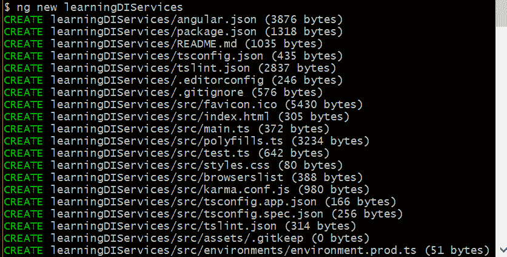

# 十一、依赖注入和服务


在本章中，我们将了解**依赖注入**（**DI**）。虽然 DI 不是您必须直接在 Angular 中编程的东西（因为 Angular 为我们处理所有 DI 管道），但理解它仍然是非常有用的。这是因为 Angular 在管理其服务时大量使用 DI，以及在创建 Angular 应用时可能编写的任何自定义服务

我们将在下一章[第 12 章](12.html)*集成后端数据服务*中介绍 Angular 最重要的内置服务之一，即其 HTTP 服务。如果没有 HTTP 服务，我们的应用将非常无聊，因为它们将无法向外部源（包括我们自己的后端 API）发送数据或从外部源接收数据。因此，本章将帮助我们更好地理解 Angular 是如何将 HTTP 服务等服务注入到我们的应用中供我们使用的。此外，本主题是进入下一章的完美序曲。

以下是我们将在本章中介绍的主题列表：

*   什么是 DI？
*   它解决了什么问题？
*   使用 DI 的其他优点
*   揭示 Angular 用来让一切正常运转的魔力
*   我们如何防止代码缩减（以及为什么需要）

在本章结束时，您将牢牢掌握这种经常被误解的软件设计模式是什么，更重要的是，它是如何工作的。我敢说，你甚至可能开始觉得自己比大多数同龄人在技术上更先进。许多开发人员有时甚至很难定义 DI，因为它确实需要一些努力来让您的思想围绕它。

不用再多说了，让我们开始并通过*向我们的头脑中注入*更多的软件设计知识来发现 DI 到底是什么


# 什么是 DI？


切入正题，DI 是**控制反转**（**IoC**设计模式的一个特例。

为了理解 DI 甚至 IoC 的这种高级定义，我们首先需要快速定义设计模式。设计模式是软件设计中常见问题的可重用解决方案。软件设计模式有几十种，通常分为以下三个高级类别：

*   创作模式
*   结构模式
*   行为模式

在我们的案例中，为了简洁起见，我们可以安全地忽略设计模式的创意和结构类别，因为 DI 是一种行为设计模式，就在我们研究 IoC 设计模式之前（我知道，我们需要知道很多定义和概念，作为真正理解 DI 的先决条件），让我们描述一下行为设计模式是什么

简言之，行为设计模式关注对象之间的通信方式。其中一种模式被称为观察者设计模式，它基本上阐述了当对象的状态发生变化时，如何通知其从属对象的方法。

另一种行为设计模式称为发布-订阅设计模式，这是一种消息传递模式，类似于观察者模式，但有点古怪。另一种行为设计模式是模板方法。此设计模式的目的是将算法的精确实现推迟到子类。所有这些设计模式背后的总体思想是它们彼此之间的通信方式（即消息）

有了模板方法的定义，我们就更接近 DI 的意义了，但就在我们这么做之前，我们还需要定义最后一个设计模式。你猜它是国际奥委会的设计模式。请记住，DI 是 IoC 模式的一个特例，因此我们确实需要快速了解它是什么

国际奥委会颠覆了程序性或命令性代码的典型流程。它不是让一个自定义对象的代码通过实例化另一个对象然后调用一个或多个新实例化的对象的方法来控制程序流，而是将实例化推迟到一个框架是的，一个框架，而不仅仅是另一个对象来完成。这些都将在几分钟内变得有意义。作为一个有趣的小道消息，这有时被戏称为*不要打电话给我们，我们会打电话给你*。

我们将很快看一个这样的例子，以便所有这些都有意义。但是，我需要定义我所说的执行依赖对象实例化的框架的含义。你不喜欢我们需要知道的所有术语和概念吗？（咧嘴笑）。此框架通常称为 IoC 容器。这些容器足够智能，能够检查自定义代码，找出它所依赖的其他对象，实例化这些对象，并将它们传递到自定义对象的构造函数中。这与在自定义对象本身中实例化对象的依赖关系的传统方式相反。相反，IoC 容器为其执行这些职责。稍后，我将把这一点与 Angular 联系起来，并向大家介绍 IoC 模式提供的几个非常重要的优势，但我们最后将从 DI 的Angular讨论它！

好啊让我们尝试将这一切联系起来，并提供一个示例场景或用例。Angular 框架提供了 IoC 容器的功能以及它提供的所有其他功能。由于 Angular 是一个模块化框架，封装了它在隔离服务中的大部分功能，因此它的 IoC 功能也封装在它的一个服务中是有意义的，事实上，就是这样

负责 DI 的 Angular 服务是其 injector 服务，其名称恰当，因为它在实例化自定义类的依赖项之后将它们注入到类的构造函数中。不仅如此，它还将您的自定义方法调用回我前面提到的，*不要打电话给我们，我们会打电话给您*。我们需要做的就是在自定义类的构造函数签名中列出依赖项的名称。

从这一点开始，我将不再提及国际奥委会，因为我们再次谈论国际直接投资，从技术上讲，这不是国际奥委会，而是它的一个特例。我之所以提到这一点，是因为许多开发人员将术语 IoC 和 DI 同义使用

所以，让我们问几个问题：既然 DI 是一种设计模式，而设计模式解决了常见的软件设计问题，那么 DI 解决了什么问题？DI 的优点是什么？这些都是很好的问题，我相信我可以在下面两段中一下子回答它们。

即使是面向对象的代码在很长一段时间内也存在一个问题，即依赖于其他类的类（这是面向对象的全部要点，因为我们不希望一个类完成所有工作）有代码在其自身内实例化这些依赖项，因此，其中至少包含一些相互交织的逻辑。这被称为紧密耦合的代码。紧耦合代码有两个问题：首先，植入逻辑通常封装在类中，这是我们不想要的。我们不希望一个对象知道其他对象的内部工作。例如，如果我们想更改依赖类中算法的实现，我们可能还必须更改调用它的类中的代码。由此产生的另一个问题是，该代码很难测试。我们的类耦合得越紧密，就越难在它们上运行单元测试，这个问题已经存在了很久。

好啊那么 DI 如何解决这些问题呢？我们将讨论一个特定的用例，以使我们的头脑更加清晰，但让我们首先描述一下 DI 给我们带来的几个优势。DI 原理的第一个优点是它迫使我们编写解耦的代码。我们通过让我们所依赖的类（对于它们的抽象实现）实现接口来做到这一点，我们这样做是为了让我们的调用类所需要做的就是调用这些对象上的接口方法，而不关心底层类方法背后的实现细节。当我们以这种方式编写代码时，我们可以将我们所依赖的具有特定实现的类替换为具有另一个实现的另一个类，而无需更改任何调用代码（因为我们的代码调用这些类实现的接口方法）。这有时也称为接口编码。这里还有另一个有趣的小贴士：这种技术也用于一种称为面向方面编程（aspect-oriented programming，简称 AOP）的编程风格。

通过遵循 DI 设计原则，我们可以免费获得一个非常有用的东西，那就是我们可以非常轻松地测试代码，而不是无法轻松地测试代码，或者根本无法测试代码，就像我们拥有紧密耦合的代码时一样。我们如何做到这一点？通过编写存根和/或模拟类，这些存根和/或模拟类也实现了调用类调用的相同接口

作为旁注，存根和模拟之间有一个重要的区别。存根是哑类，通常只返回一个简单的值（通常是硬编码的）。另一方面，模拟对象通常具有完整的实现，以便可以测试诸如边缘情况之类的内容，以及执行数据库操作或进行 RESTful API 调用。mock 可以用于执行测试要求的任何操作。因此，存根是哑的，而 mock 是聪明的。然而，它们的共同点是，它们通过具有相同的对象消息传递模式（即，通过接口调用它们的方法）来帮助我们对调用类的代码进行单元测试。

唷！理论部分我们做完了！你睡着了还是还在和我在一起？啊，你醒了，很好。现在所有这些理论都被忽略了，让我们来看一个例子，DI 可以用于前面提到的所有原因，这样我们就可以将这些概念融入我们的头脑中。

假设我们正在为一家在线商店构建一个电子商务应用，在那里我们销售自制啤酒。我们的应用将需要有一个购物车，我们还必须有至少一个商户帐户（这是一个管道，称为支付处理网关，因此我们可以向客户的信用卡收费）。因此，在这种情况下，我们有两个备用账户，一个是备用账户，一个是备用账户。

在实现购物车时，如果需要，我们希望能够在不更改购物车类中的代码的情况下，将一个商户帐户换成另一个。我们不想更改任何代码的原因是，我们可能会意外地在应用（在线商店）中引入 bug，这对客户来说并不好。你可能会说-*嘿，我测试了我的代码，让 bug 变得更加充实*-如果你这么说，你就正好看到了在我们的应用中使用 DI 的下一个好处，那就是我们可以通过编写测试类轻松地测试我们的应用记住存根和模拟？是的，我们编写存根和模拟，以便测试代码。再一次感谢 DI，我们不必改变我们的购物车类就可以做到这一点。我们让存根和模拟实现接口。我们将银行的 API（即，我们由第三方编写的商户账户类）封装在一个实现我们接口的自定义类中，这样所有这些类（即，存根、模拟和包装的真实银行对象）都可以以完全相同的方式调用。

凉的因此，作为一个补充，让我们快速看看Angular如何知道我们的类需要什么，以及它如何调用我们的类的构造函数方法。嗯，这不是魔法，但它很巧妙。然而，Angular 确实需要我们的一些前期帮助。当我们为我们的应用创建自定义类时，我们通常将它们包装为 Angular 服务（我们将在下一章[第 12 章](12.html)、*集成后端数据服务*中介绍服务）。Angular 请求我们向它注册这些服务，您马上就会明白为什么我们需要这样做。

Angular 的注入器服务扫描我们的代码，特别是类的构造函数签名，并计算出它的参数。因为我们的参数是我们的类需要的服务，所以它知道这些参数是服务。然后，它将服务名称的文本与它自己的服务以及我们自己编写的任何自定义服务的清单相匹配，当找到匹配项时，它将实例化该服务对象。它之所以能够这样做，是因为它知道自己的服务，它知道我们编写了什么服务，因为我们必须向 Angular 注册它们。

Angular 一旦拥有这些实例化的服务对象，接下来要做的就是调用类的构造函数，将对象作为参数传入。这就是 Angular 的喷油器服务所做的喷油过程。再来一次，跟我说：*别打电话给我们，我们会打电话给你*。就像那样，Angular 所做的事情背后的魔力已经被解释掉了。不过，这很酷，我们应该向 Angular 开发团队致敬。


# 生成服务和接口


现在我们已经了解了 DI 和设计模式，在本节中，我们将学习创建我们的服务。Angular CLI 为我们提供了在项目中生成服务的最快、最简单的方法。我们将通过运行以下命令创建一个名为`LearningDIServices`的示例项目：

```ts
ng new LearningDIServices
```

我们正在使用`ng`命令创建一个新的Angular项目，并将该项目命名为`LearningDIServices`。成功执行命令后，我们将看到以下屏幕截图中显示的输出：



现在我们已经使用 Angular CLI 创建了项目目录，我们将生成一些服务和接口。我们将创建一个名为`Photos`的服务。运行以下命令，我们将看到服务添加到项目目录中：

```ts
ng generate service photos
```

成功执行后，我们将看到以下屏幕截图中显示的输出：


我们可以看到生成了两个新文件。一个是服务文件，另一个是规范文件，用于为服务编写测试。让我们更仔细地查看包含自动生成代码的文件。

```ts
import { Injectable } from '@angular/core';

@Injectable({
 providedIn: 'root'
})

export class PhotosService {
 constructor() { }
}
```

在前面的代码中，我们可以看到`Injectable`类需要从`angular/core`库中导入。`Injectable`类允许我们将服务注入到各种组件类中，以便我们可以重用这些方法。通过使用可注入的装饰器，我们明确地提到需要在根目录中注入服务。最后，我们将导出我们的`PhotosService`类，该类将包含构造函数方法和我们将创建的其他方法，具体到我们的应用

Unlike the Angular components, there is no need to update `app.module.ts` file with an entry of the service.

在前面的部分中，我们了解了接口的概述。现在，让我们快速了解如何在应用中生成接口的使用。使用 Angular CLI，我们还可以快速创建接口：

```ts
ng generate interface photo
```

在前面的命令中，我们已经生成了一个名为`photo`的接口，一旦前面的命令成功执行，我们将看到以下输出：


让我们仔细看看生成的接口文件。以下是生成的默认代码：

```ts
export interface Photo {
}
```

我们可以看到它是空的。由于接口用于定义实体或模型类，因此在应用中创建的每个接口都是唯一的，并且特定于每个应用。现在，如果我们想为照片创建一个界面，我们必须按如下方式定义它：

```ts
export interface Photo {
 photoId: number;
 photoURL: string;
 photoOwner: string;
 isActive: boolean;
}
```

在前面的示例代码中，我们为具有某些属性及其数据类型的照片创建了一个接口。这将允许我们为照片创建严格类型化的对象。

在本节中，我们学习了如何创建Angular服务和接口。即使有些概念不是很清楚，也不要担心，我的朋友。我们有一整章专门介绍如何在我们的应用中生成和实现服务。在下一章中，我们将学习如何实现和使用它们，并将它们集成到我们的组件中。


# 防止代码缩减


最后一件事我想很快地介绍一下，那就是代码缩减以及我们如何防范它。代码缩减是通过删除空白以及用非常短的符号替换变量名来压缩代码的过程。这是在我们编译 Angular 应用时完成的，这样它就变成了一个更小的包，用户必须下载（一旦我们部署了应用）来检索我们的应用。但这确实给我们带来了一个问题。它可以通过更改参数名称来破坏我们的一天，然后再也无法根据服务清单匹配这些名称。幸运的是，有一个简单的解决方案。如果我们在参数名周围加上单引号，我们可以防止代码缩小。怎样好的，在服务名称周围加上引号会将它们转换为文字字符串，而缩小过程不会压缩或更改字符串，而是保持字符串不变。这是因为文字字符串的含义超出了语法，而不是代码。缩小只是缩小代码（即变量名、函数名和空格）。这就是保护代码不受代码缩减影响的全部知识。


# 总结


您现在应该对 DI 是什么以及它解决了什么问题感到满意。您还应该能够列出一些优点，从而能够解释为什么 DI 是我们在设计应用时要遵循的一个好原则。你也应该轻松地解释一下 Angular 在让一切都开箱即用方面所表现出的看似神奇的功绩。最后，您现在还应该知道如何保护 DI 代码，防止代码缩小。

有了这些 DI 知识，我们现在可以继续我们的旅程，在[第 12 章](12.html)*集成后端数据服务*中发现 Angular 最有用的服务之一，它的 HTTP 服务。完成下一章后，您将准备编写代码，将 Angular 应用与任何 RESTful API 兼容的应用和/或授权与您的应用对话的服务集成起来。听起来你应该很兴奋！如果是这样，那就翻开新的一页，继续你的启蒙之旅。